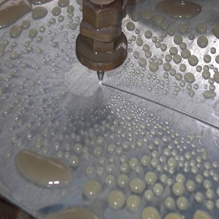

.. _myoBone-assembly-monolithic-t-slot-legacy:

MyoBone 'Monolithic' - T-Slot Profile Fraunhofer
-------------------------------------------------

Profile
~~~~~~~~~~~~~~~~~~

Step 1: Cut profiles to the desired length
++++++++++++++++++++++++++++++++++++++++++++++

.. _D3.4_image64:
.. figure:: images/image64.jpg
    :align: center

Tips:

-	Using circular saw creates a suitable cut and provides a good surface

Step 2: Thread the holes at both ends of the profile
+++++++++++++++++++++++++++++++++++++++++++++++++++++

.. _D3.4_image65:

•	Drill first the holes with a ∅ 4,2 mm bit
•	Thread with a M5 tap

Adaptor
~~~~~~~~~~~~~~~~~~

Step 1: Order water-jet cut parts
++++++++++++++++++++++++++++++++++++++++++++++

.. _D3.4_image66:

Order water-jet cut part shape.

Step 2: Countersinking of holes
++++++++++++++++++++++++++++++++++++++++++++++

.. _D3.4_image67:

Countersink the M5 clearance holes for the fixation to the profile.

Assembly
~~~~~~~~~~~~~~~~~~

.. _D3.4_image68:

**Material needed**

1X       Aluminum profile with threaded ends

2X       Adaptor

8X       M5 countersunk head screw (DIN 965)

2X       SB flange plates

8X       M3x25 countersunk head screw (DIN 7991)

8X       M3 thin nut (DIN 31)

8X       M3 spring washer (DIN 6798)

Step 1: Assemble profile and adaptors
++++++++++++++++++++++++++++++++++++++++++++++

.. _D3.4_image69:
.. figure:: images/image69.png
    :align: center

Screw the adaptors at the end of the profile with the M5 screws.

Step 2: Attach the SB flange plates
++++++++++++++++++++++++++++++++++++++++++++++

.. _D3.4_image70:
.. figure:: images/image70.png
   :align: center

Screw the SB flange plates to the adaptors with the M3 screws and nuts.

Tips:

-	Use the small spring washers together with the M3 nuts (backside)

Step 3: Drill the profile for electric cables outlet (if necessary)
+++++++++++++++++++++++++++++++++++++++++++++++++++++++++++++++++++++

.. _D3.4_image71:

Drill an outlet for the electric cables at the suitable position.
