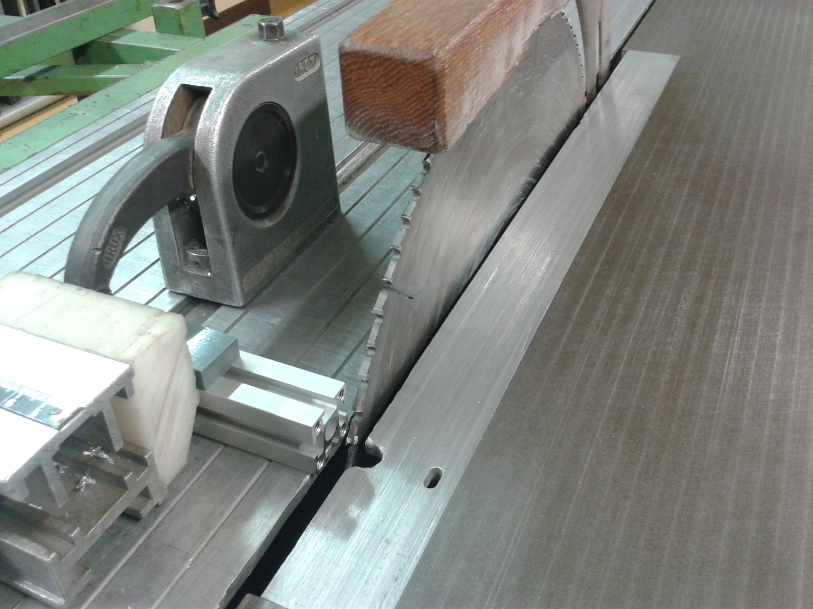

.. _myoBone-assembly-monolithic-giMod:

MyoBone '20mm bone' Monolithic Profile - GI Mod
################################################

The '20mm bone' is a newly developed monolithic bone for affordable and robust MYO robots.
It uses a 6mm groove, 20mm aluminium profile (i.e. Bosch Rexroth, Easy Systemprofile, etc.) as the base and adds laser sintered PA components for mounting muscles and joints.

.. _bamgimod_assembledBone.jpg:

  Visualisation of assembled 20mm bone with mounted muscle and symmetric joint.

Parts List
------------

The parts list is maintained at `roboy.open-aligni.com <https://roboy.open-aligni.com/part/show/480#tab_part-list>`_.

External users can access it using the following credentials:

- user: roboy
- password: roboy

.. csv-table:: Partslist of 20mm MyoBone
  :header: "Level","Manufacturer P/N","Manufacturer Name","Part Type","Description","Quantity","Designator"
  :file: MyoBoneRexroth20mm.csv

Profiles
---------

Step 1: Cut profiles to the desired length
++++++++++++++++++++++++++++++++++++++++++++++

.. _bamgimod_image64:

Tips:

-	Using circular saw creates a suitable cut and provides a good surface

Optional Step 2: Cut a (longitudal) thread into the core of the profile
++++++++++++++++++++++++++++++++++++++++++++++++++++++++++++++++++++++++

Cut a M6 thread into the end pieces of the profile.

Adaptor
---------

Step 1: Print or order flanges
++++++++++++++++++++++++++++++++++++++++++++++

The bone requires 2 `A11 conical flange plate mod für Boschprofil <https://roboy.open-aligni.com/part/show/474?revision_id=563>`_ as the end caps and interfaces to joints.
These connections are secured using the `A11 clamping half ring mod of the Myo Clamping Ring Set <https://roboy.open-aligni.com/part/show/481?revision_id=586#tab_part-list>`_.

Parts can be printed using services such as shapeways.com or virtually any SLS printer.

.. _bamgimod_image66:

    A11 conical flange plate mod für Boschprofil

Assembly
---------

Step 1: Mount flanges
++++++++++++++++++++++++++++++++++++++++++++++

Place the flanges

Step 2: Attach the SB flange plates
++++++++++++++++++++++++++++++++++++++++++++++

.. _bamgimod_image70:
.. figure:: images/image70.png
   :align: center

Screw the SB flange plates to the adaptors with the M3 screws and nuts.

Tips:

-	Use the small spring washers together with the M3 nuts (backside)

Step 3: Drill the profile for electric cables outlet (if necessary)
+++++++++++++++++++++++++++++++++++++++++++++++++++++++++++++++++++++

.. _bamgimod_image71:
.. figure:: images/image71.jpg
   :align: center

Drill an outlet for the electric cables at the suitable position.
