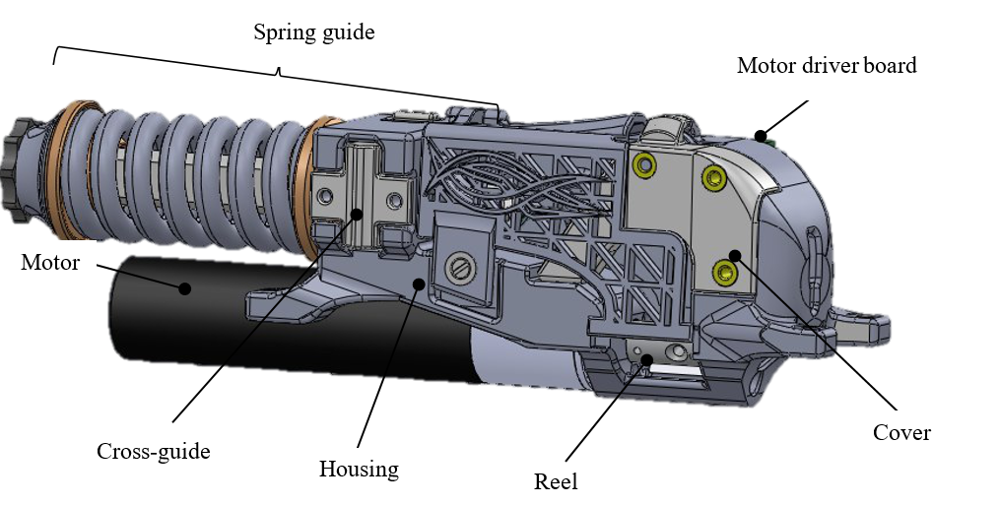
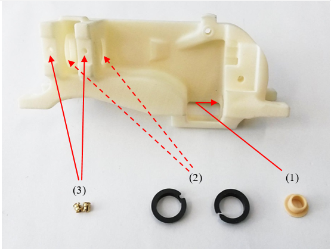
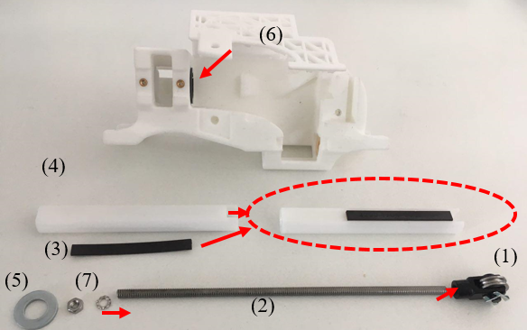
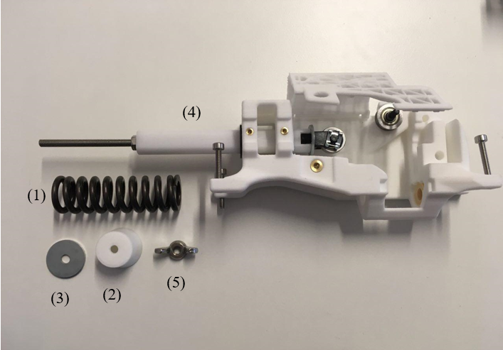
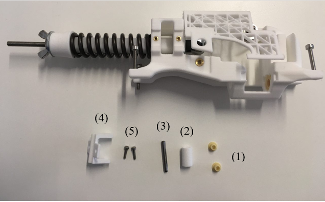
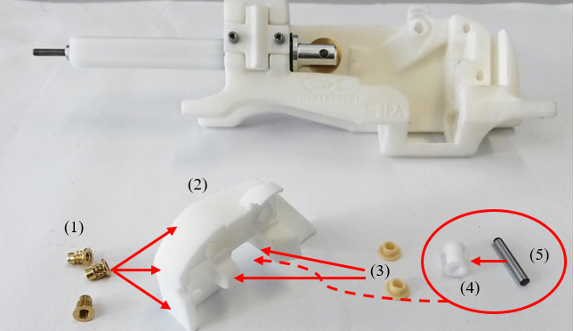
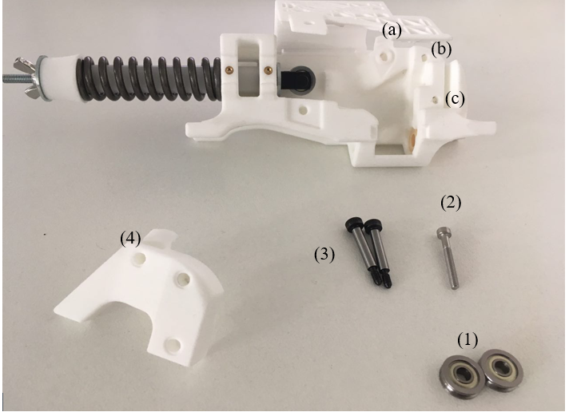
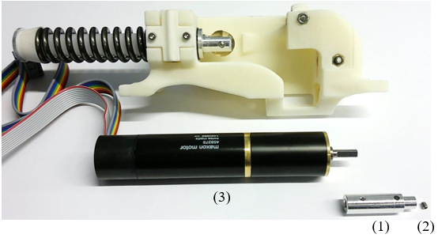
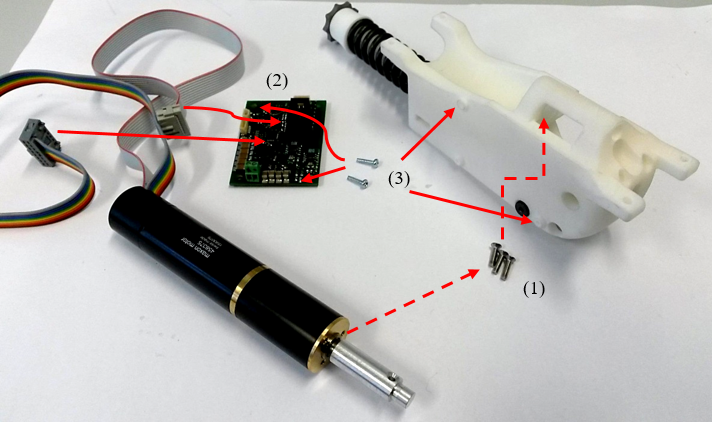
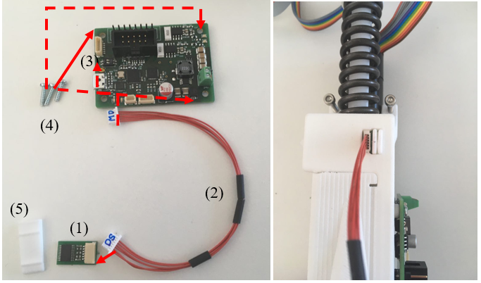

.. _myomuscle-assembly-mod-nonce:

Muscle Mod Non-CE
--------------------

These muscles are not CE conform due to the missing protecting bar covering the spring.

Parts List
~~~~~~~~~~~~~

The parts list is maintained at `roboy.open-aligni.com <https://roboy.open-aligni.com/part/show/361#tab_part-list>`_.

External users can access it using the following credentials:

- user: roboy
- password: roboy

.. csv-table:: MyoMuscle Parts List
  :header: "Level","Manufacturer P/N","Manufacturer Name","Part Type","Description","Quantity","Designator"
  :file: 20170406-Muscle-12.csv

.. _mmnonce_image137:

    Visualisation of a fully assembled muscle unit.

Step 1: Mount the plain bearings into the housing
~~~~~~~~~~~~~~~~~~~~~~~~~~~~~~~~~~~~~~~~~~~~~~~~~~~~~~

.. _mmnonce_image138:

    Install the gliding bearings into the muscle housing.

Put the **plain bearing (1)** and the **clip plain bearings (2)** into the housing.

Put the two **M2** **inserts (3)** in the holes of the housing.

Step 2: Assemble the pulley yoke and the spring guide shaft
~~~~~~~~~~~~~~~~~~~~~~~~~~~~~~~~~~~~~~~~~~~~~~~~~~~~~~~~~~~~~~~~

.. _mmnonce_image139:

    Assemble the pulley yoke and displacement or spring guide shaft

Put screw glue into the screw thread of the **pulley yoke** **(1)** and connect it with the **threaded rod (2).**

Stick the **magnetic strip (3)** in the longitudinal groove in the **spring guide shaft (4)**. The magnetic strip should be as near as possible to the pulley yoke as you can see in the example.

Slide the **washer (5)** down the threaded rod to the pulley yoke.

Slide the pulley yoke with the threaded rod from the right through the **clip plain bearings (6)** and put it in position.

Slide the spring guide shaft from the left through the clip plain bearings so that the threaded rod passes in its middle. Fix the rod on the shaft with the **nut and washer (7)**.

Step 3: Mount the spring
~~~~~~~~~~~~~~~~~~~~~~~~~~~~~

.. _mmnonce_image140:

    Mount the spring.

Slide first the **spring (1)** then the **spacer sleeve (2)** from the left over the **spring guide shaft (4)** axle.

Use the **washer (3)** to push the spacer sleeve until it starts to preload the spring.

Then fix in place with the **wing nut (5)**.

Step 4: Assemble the cross-guide
~~~~~~~~~~~~~~~~~~~~~~~~~~~~~~~~~~~~~

.. _mmnonce_image141:

    Assemble the cross guide of the displacement shaft.

Insert the **plain bearings (1)** into the **guide-roller (2)** and insert the **cylindrical pin (3)**.

Insert this assembly into the **cross-guide (4)**.

Mount the **cross-guide (4)** into the housing.

Then screw in the two **screws (5)** to hold it in place.

Step 5: Assemble the cover
~~~~~~~~~~~~~~~~~~~~~~~~~~~~~~~

.. _mmnonce_image142:

    Assemble the muscle cover and tendon guide.

Press the three **M3 inserts (1)** into the **cover (2)**.

Insert the **plain bearings (3)** in the cover and place the printed **pulley (4**) between the plain bearings.

Fix the printed pulley to the cover by inserting the **cylindrical pin (5)** through both the pulley and the plain bearing. The pin must be pressed in the pulley.

Step 6: Mount the cover and the pulleys on the housing
~~~~~~~~~~~~~~~~~~~~~~~~~~~~~~~~~~~~~~~~~~~~~~~~~~~~~~~~~~~

.. _mmnonce_image143:

    Placement of guiding pulleys in muscle housing.

Insert the **screws (2) and (3)** from the back of the housing in holes (a), (b) and (c). One **black screw (3)** must be in hole (a).

The other **black screw (3)** goes in hole (c) as an axle for one of the **bearings (1)** and other black screw in hole (a) acts as another axle for the other **bearing (1)**.

Mount the **cover (4)** on the housing and tighten all screws. Make sure that the brass pulley can still rotate freely.

Step 7: Mount the reel on the motor shaft
~~~~~~~~~~~~~~~~~~~~~~~~~~~~~~~~~~~~~~~~~~~~~~

.. _mmnonce_image144:

    Fixing tendon reel on motor shaft.

Put screw glue on the **setscrew (2)**.

Mount the **reel (1)** using the setscrew on the shaft of the **motor (3)**.

Step 8: Mount the motor and the motor driver board
~~~~~~~~~~~~~~~~~~~~~~~~~~~~~~~~~~~~~~~~~~~~~~~~~~~~~~~

.. _mmnonce_image145:

    Mounting motor and driver board to muscle housing

Use the three **screws (1)** to mount the motor to the housing.

Connect the motor to the **motor driver board** **(2)**.

Mount the board with the **screws** **(3)** to the housing.

Step 9: Connect to the dispacement sensor to the Motor board
~~~~~~~~~~~~~~~~~~~~~~~~~~~~~~~~~~~~~~~~~~~~~~~~~~~~~~~~~~~~~~~~~

.. _mmnonce_image146:

    Mounting of the displacement sensor on the muscle unit and cabling to the motor driver board.

The **motor board (3)** should already be attached by the screws in previous step.

Insert the DS header (displacement sensor pins) on :ref:`wire (2) <eaess-sds-cs>` into the **displacement sensor (1)**.

Then the MD header (motor driver board pins) on :ref:`wire (2) <eaess-sds-cs>` into the motor board.

Then place the **displacement sensor (1)** into the slot on top of the housing unit and secure it using the **wedge (4)** as shown in the photo on the right.

The side of the displacement sensor shown :numref:`mmnonce_image146` should be on the inside of the muscle houseing, close to the magnetic strip on the displacement shaft.
