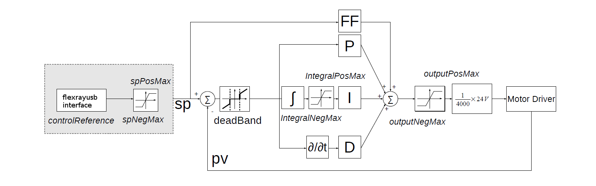
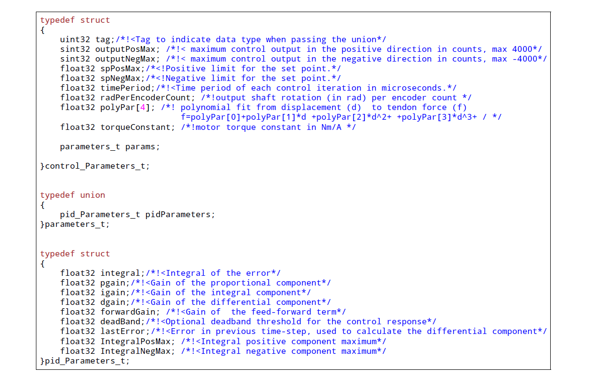
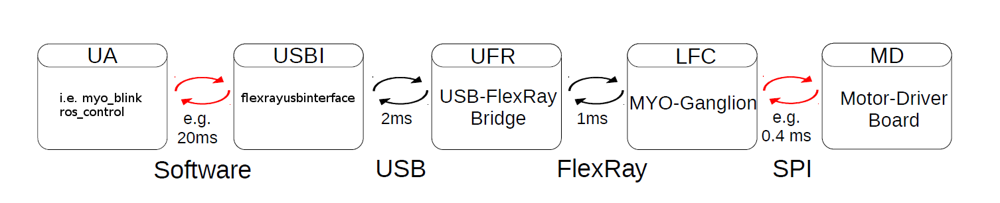

Firmware, FlexrayUSBInterface
==================================

The MYO-Ganglion implements the linear-feedback controllers for the
MYO-Muscles. Currently, five control modes are possible: *raw, position,
velocity, force* and *torque*. In the raw mode, no feedback controller
is enabled. Rather, the muscle is driven in an open-loop mode where the
motor supply voltage can be varied between :math:`\pm 100\%`. The
remaining four control modes use the freely configurable linear-feedback
control topology depicted in :numref:`EAESS_fifth-figure`.

.. _EAESS_fifth-figure:

    The linear feedback controller topology: the controller is freely configurable within
    the flexrayusbinterface and runs on the MYO-Ganglion. Four motor controllers run in parallel, controlling
    the four MYO-Muscles. The control frequency is currently limited to a maximum of 2.5kHz
    and is also configurable.

To be clear, these controllers run on the MYO-Ganglion autonomously.
They are configured via flexrayusbinterface (control parameters, cycle time, etc)
during the start-up phase of the user’s high-level controller running
within flexrayusbinterface. By default, the gains are all set to zero, so no control
action is issued. During run-time, flexrayusbinterface sends the reference values to
the controllers which can happen at any point in time and with arbitrary
update rates. Furthermore, the control parameters can also be changed
during runtime. Note, however, that the control parameters are not
stored on the MYO-Ganglion. Following reset, all the controllers need to
be re-configured.

.. _EAESS_sixth-section:

Configuring a Controller
------------------------

The flexrayusbinterface interface (internally as well as externally) makes heavy use of `mapbox variants <https://github.com/mapbox/variant>`_ and one should be familiar with the concept to use the library, as well as develop it.

Below are step by step explanations of how to use the interface.
See the complete example at the `Roboy/flexrayusbinterface repo <https://github.com/Roboy/myo_blink/blob/master/src/myo_blink.cpp#L204>`_

Parsing the parameters
++++++++++++++++++++++++++++
Flexrayusbinterface takes a FlexRayBus object generated from a configuration yaml using the provided `yaml-cpp <https://github.com/jbeder/yaml-cpp>`_ based parser.
This yaml file contains all parameters required to instantiate the controllers.
An example configuration file can be found here: :download:`RobotDescription.yaml`

.. code-block:: cpp
  :emphasize-lines: 4

  #include "flexrayusbinterface/Parsers.hpp"
  auto node = YAML::Load("/path/to/yaml/file");
  node = node["FlexRay"];
  FlexRayBus fbus = node.as<FlexRayBus>();

Instantiate the interface / connect to the flexray
+++++++++++++++++++++++++++++++++++++++++++++++++++

Using the FlexRayBus object we can try to instantiate the 'FlexRayHardwareInterface'.
This interface returns a variant:

- It will return the FlexRayHardwareInterface upon successful instantiation or
- return a std::pair<FlexRayBus, FtResult>.

.. code-block:: cpp
   :emphasize-lines: 3,4,10

   FlexRayBus fbus = node.as<FlexRayBus>();
   while (FlexRayHardwareInterface::connect(std::move(fbus))
              .match(
                  [&](FlexRayHardwareInterface &flex) {
                    ROS_INFO_STREAM("Connected");
                    MyoMotor motor{std::move(flex)};
                    blink(motor); // do something with the motors
                    return false;
                  },
                  [&](std::pair<FlexRayBus, FtResult> &result) {
                    ROS_ERROR_STREAM("Could not connect to the myo motor: "
                                     << result.second.str());
                    fbus = std::move(result.first);
                    return true;
                  }))

Use the interface
+++++++++++++++++++

FlexRayHardwareInterface provides an interface to the individual motors, allowing to read their state, activate different controllers and program the setpoints.

It spins an additional thread in the background, that will exchange data (thereby reading the state of the motors) with the flexraybus at the update rate specified in the yaml file.

The interface offers 3 control modes as enumerated with 'ControlMode':

- Position
- Velocity
- Force

Which can be used to 'set' a command as shown in the ROS service definition below:

.. code-block:: cpp
   :emphasize-lines: 9,12,15

   class MyoMotor {
   public:
     /*
     * Implements the service to move the motors.
     */
     bool moveMotor(myo_blink::moveMotor::Request &req,
                    myo_blink::moveMotor::Response &res) {
       if (req.action == "move to") {
         flexray.set(req.muscle, ControlMode::Position, req.setpoint);
         res.is_success = true;
       } else if (req.action == "move with") {
         flexray.set(req.muscle, ControlMode::Velocity, req.setpoint);
         res.is_success = true;
       } else if (req.action == "keep") {
         flexray.set(req.muscle, ControlMode::Force, req.setpoint);
         res.is_success = true;
       } else {
         res.is_success = false;
       }
       return true;
     }

     FlexRayHardwareInterface flexray;

     MyoMotor(FlexRayHardwareInterface &&flexray) : flexray{std::move(flexray)} {}
   };

The four parameter array ``constant, linear, quadratic, cubic`` describe the
non-linear mapping of the spring displacement measurement to a force.

.. _EAESS_sixth-figure:

    The internal structures required to configure a local (firmware) muscle controller. This shows an example from the old MYODE code.

Communication Timing
--------------------

Before a snippet of example code is presented, let us briefly consider
the timing behaviour of this (partly) asynchronous communication
system. In principle, four different timing cycles can be
distinguished and they are illustrated in :numref:`EAESS_seventh-figure`.
At the highest level is the **user application (UA)**.
Typically, the cycle time of this control loop is in the tens of milliseconds range
(e.g. :math:`20ms`) and is set by the user. Since a standard Ubuntu
installation is used, it is important to note that the cycle time of
the UA is not ‘hard real-time’ and some variance on the timing is to
be expected. In the UA, data from the Myorobot is read, such as motor
velocity or joint angles, or set in the case of tendon force and motor
position.

.. _EAESS_seventh-figure:

    The cycle and communication times of the complete Myorobotics communication
    chain. Red arrows indicate that this communication parameter is user congurable. From
    left to right, the user application (UA), the USB interface (UI), the USB-FlexRay bridge
    (UFR) the linear-feedback controller (LFC) and the motor-driver board(MD) are illustrated,
    including the implementation and communication media.

Data is exchanged with the Myorobot via a thread that is hidden from
the user by the FlexRayHardwareInterface and sometimes called USBI. It exchanges the data from the UA with the FlexRay2USB Adapter. The USBI
also runs as a ‘soft real-time’ system with a nominal update rate of
500Hz.
In other words, data exchange between the UA (via the USBI) and
the Myorobot is also limited to a minimum update rate of 2ms.

The next level of communication is realised with the **USB-FlexRay
bridge (UFR)** (aka Flexray2USB Adapter) (see :numref:`EAESS-forth-section`). Here, the USB data is
exchanged with the ‘hard real-time’ FlexRay bus that forms the
communication backbone of the Myorobot, allowing the exchange of data
between the UFR and the MYO-Ganglions in a fully synchronous and
time-trigger fashion at a rate of 1kHz.

The lowest level in this communication chain is formed by the
**linear-feedback controllers (LFC)**\  (see :numref:`EAESS_fifth-figure`)
running on the MYO-Ganglions. The controllers run in a ‘hard real-time’
loop on the MYO-Ganglion and exchange data with the FlexRay bus and the
motor driver boards (**MD**); see :numref:`EAESS_fifth-section`. As
explained above, the cycle time of the linear-feedback controllers is
user configurable by setting the ``float32 timePeriod`` variable of the
structure ``control_Parameters_t``. The minimum cycle
time is :math:`400\mu s` representing an update rate of :math:`2.5kHz`.
