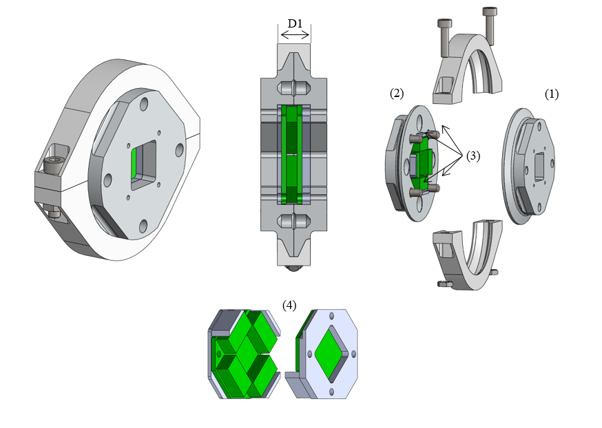
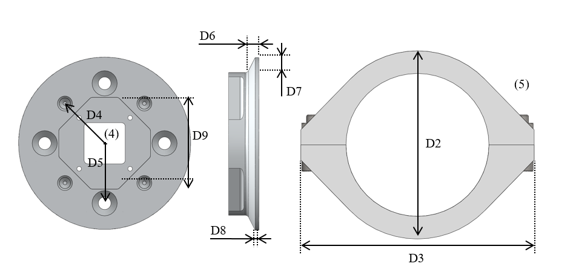
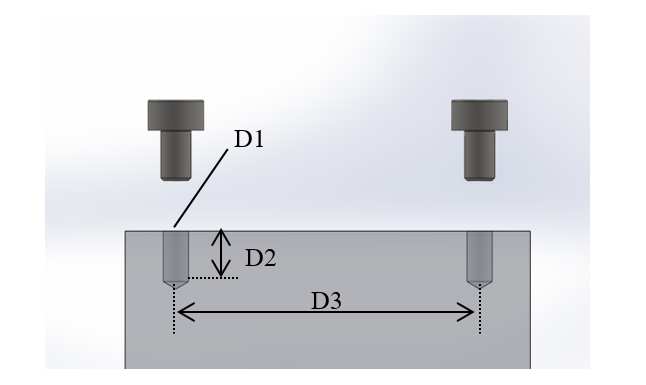
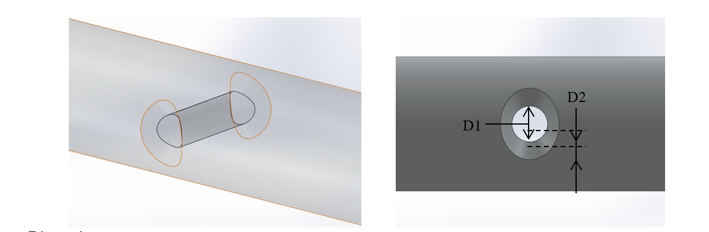
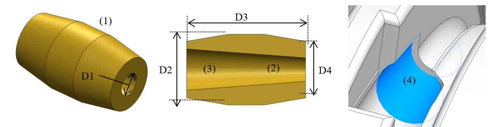

Accessories
############

Structural Bond
===============

Type 1: Flange clamp with conical flange
----------------------------------------

The structural bond is made of the following elements:

-  Two *flange plates* which include the conical flanges. The side-plates can be integrated in the bone or joint, on one or both sides.

-  One *clamp ring* which clamps the two flange plates together.

-  An *electrical interface* with spring contacts.

Variety 1: Screwed Half Clamps
~~~~~~~~~~~~~~~~~~~~~~~~~~~~~~

In this implementation, the clamp ring is implemented in two parts. The
pressure of the clamp ring on the conical flanges is ensured by two
screws.

Illustrations

Overview:

.. _D3.4_image25:

Individual elements:

.. _D3.4_image26:

**Dimensions**

D1 Distance between the outer faces of the clamp ring

D2 Diameter of the clamp ring along its short axis

D3 Diameter of the clamp ring along its long axis

D4 Radius of the square pattern of the pins

D5 Radius of the square pattern of the screws

D6 Total thickness of the flange (conical and cylindrical section)

D7 Width of the flange, i.e. difference between the outer and inner flange radius

D8 Thickness of the cylindrical section of the flange

D9 Diameter of the central hole of the flange plates

**Implemented instances:**

+--------------------------+----------------+--------+--------+
| Reference                | SB-SC2-T1-V1                     |
+==========================+================+========+========+
| Corresponding DP-Class   | II                               |
+--------------------------+----------------+--------+--------+
|                          | D1             | 8      | [mm]   |
+                          +----------------+--------+--------+
|                          | D2             | 50     | [mm]   |
+                          +----------------+--------+--------+
|                          | D3             | 62     | [mm]   |
+                          +----------------+--------+--------+
|                          | D4             | 15     | [mm]   |
+                          +----------------+--------+--------+
|        Dimensions        | D5             | 16     | [mm]   |
+                          +----------------+--------+--------+
|                          | D6             | 3      | [mm]   |
+                          +----------------+--------+--------+
|                          | D7             | 4      | [mm]   |
+                          +----------------+--------+--------+
|                          | D8             | 1      | [mm]   |
+                          +----------------+--------+--------+
|                          | D9             | 24,5   | [mm]   |
+--------------------------+----------------+--------+--------+

**Features:**

*Flange plates:*

1) The flange plates are fixed to the joint or bone assembly using a square screw pattern.

2) The flange plates can also be integrated in the bone or joint construction.

3) The two flange plates are additionally connected via a set of up to four pins. They prevent the relative rotation of the flange plates along the longitudinal axis and contribute to transmit the torsion moment.

4) The flange plates have an octagon in their centre to fix the electronic interface in it.

*Clamp ring:*

5) The clamp ring is made of two parts, joined together by two screws.

**Material and fabrication**

+----------------+-----------------+-------------------------+
| Element name   | Material        | Fabrication processes   |
+================+=================+=========================+
|                | aluminium       | -  machining            |
+  flange plate  +-----------------+-------------------------+
|                | polyamid (PA)   | -  laser sintering      |
+----------------+-----------------+-------------------------+
| clamp ring     | polyamid (PA)   | -  laser sintering      |
+----------------+-----------------+-------------------------+

**Integration of the electronics**

In order to implement power (24V) and communication (FlexRay)
connectivity, PCBs with spring loaded contacts are integrated into the
structural bonds. These circuit boards have a reverse polarity
protection and were tested on their current carrying capability and can
perform up to 20A.

.. _D3.4_image32:
.. figure:: images/image32.png
    :align: center

    Structural Bond with electronic interface

Anchor – Fastener
=================

Type 1: Screw Fasteners
-----------------------

This basic type of anchor-fastener is simply made of a set of threads
placed on a DP, on which another DP can be attached using screws.

Variety 1: Pair of Screws
~~~~~~~~~~~~~~~~~~~~~~~~~

This variety uses two screw-thread pairs, whose openings are coplanar.

Illustrations
++++++++++++++++++++++++++++++++++++++++++++++

.. _D3.4_image33:

**Dimensions**

D1 Screw diameter

D2 Depth of the screw hole

D3 Distance between the screw hole

**Implemented instances**

+--------------------------+----------------+------+--------+
| Reference                | AF-SC2-T1-V1                   |
+==========================+================+======+========+
| Corresponding DP-Class   | II                             |
+--------------------------+----------------+------+--------+
|                          | D1             | M3   |        |
+                          +----------------+------+--------+
|        Dimensions        | D2             | 5    | [mm]   |
+                          +----------------+------+--------+
|                          | D3             | 30   | [mm]   |
+--------------------------+----------------+------+--------+

Cable attachment
================

Type 1: Through hole
--------------------

Overview

.. _D3.4_image34:

**Dimensions**

D1 Cable diameter

D2 Hole chamfer distance

D3 Hole chamfer angle

**Implemented instances**

+--------------------------+-------------+-------+--------+
| Reference                | CA-SC2-T1                    |
+==========================+=============+=======+========+
| Corresponding DP-Class   | II                           |
+--------------------------+-------------+-------+--------+
|                          | D1          | 1.6   | [mm]   |
+                          +-------------+-------+--------+
|        Dimensions        | D2          | 1     | [mm]   |
+                          +-------------+-------+--------+
|                          | D3          | 45    | [°]    |
+--------------------------+-------------+-------+--------+

Type 2: Conical socket
----------------------

In this type, the cable-end and the corresponding socket, have a conical
shape.

Overview
-----------------
.. _D3.4_image35:

**Dimensions**

D1 Cable diameter

D2 End connector maximum diameter

D3 End connector length

D4 End connector minimum diameter

**Implemented instances**

+--------------------------+-------------+-------+--------+
| Reference                | CA-SC2-T2                    |
+==========================+=============+=======+========+
| Corresponding DP-Class   | II                           |
+--------------------------+-------------+-------+--------+
|                          | D1          | 2     | [mm]   |
+                          +-------------+-------+--------+
|                          | D2          | 6     | [mm]   |
+        Dimensions        +-------------+-------+--------+
|                          | D3          | 10    | [mm]   |
+                          +-------------+-------+--------+
|                          | D4          | 4,8   | [mm]   |
+--------------------------+-------------+-------+--------+

**Features**

1) The cable-end has a conical shape to allow a better distribution of the transmitted force.

2) The cable runs through the cylindrical channel of the cable-end.

3) To fix the cable to the cable-end, a knot is made at the end of the cable, which is melted to prevent the knot to loosen. This knot is larger than the cylindrical channel and therefore applies the cable force on the internal cylindrical surface of the cable-end.

4) The conical cable-end can be secured in a cylindrical socket built in one of the Design Primitives.

**Material and fabrication**

+----------------+----------------------+------------------------------------+
| Element name   | Material             | Fabrication processes              |
+================+======================+====================================+
| cable-end      | aluminium or brass   | -  standard component, machining   |
+----------------+----------------------+------------------------------------+

.. _D3.4_image36:
.. figure:: images/image36.png
    :align: center

    Conical socket with HPPE cable
