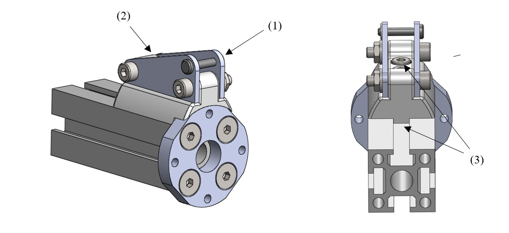

Type 2 – Monolithic core
------------------------

This bone type implements the design principle “Monolithic core”. The
bone is designed as a solid aluminium profile with an *end adaptor* on
each side of the bone.

Bone Variety 1 – T-slot profile
~~~~~~~~~~~~~~~~~~~~~~~~~~~~~~~~~

In this variant, a T-slot profile is used, enabling the easy fixation of
design primitives or accessories on the MYO-Bone structure using nuts
fitting in the T-slot.

.. _D3.4_image60:
.. figure:: images/image60.png
    :align: center

**Dimensions**

D1 Width of the profile section

D2 Diameter of the centre hole

**Implemented instances**

+--------------------------+------------------+-------+--------+
| Reference                | BONE-SC2-T2-V1                    |
+==========================+==================+=======+========+
| Corresponding DP-Class   | II                                |
+--------------------------+------------------+-------+--------+
|                          | D1               | 25    | [mm]   |
+                          +------------------+-------+--------+
|        Dimensions        | D2               | 8.5   | [mm]   |
+                          +------------------+-------+--------+
|                          | M                | 255   | [g]    |
+--------------------------+------------------+-------+--------+

**Features**

Aluminium profile:

1) The profile is standard aluminium T-slot profile with a square section. According to the shape of profile, it is possible to fix the muscle in any place along the profile.

2) The profile has a high stiffness against torsion and bending.

3) The channel in the centre of the profile can host the electric cables running through the bone. A hole must be drilled at the desired position to let the electrical cables in and out.

Adaptor:

1) The end adaptor is screwed to the aluminium profile using the four peripheral holes that can easily be threaded.

2) The end adaptor has a central hole to let the electric cables run through it.

3) The end adaptor has a screw pattern to attach one side of a SB.

**Material and fabrication**

+------------------+-------------+---------------------------------+
| Element name     | Material    | Fabrication processes           |
+==================+=============+=================================+
| T-slot profile   | aluminium   | -  purchase                     |
|                  |             |                                 |
|                  |             | -  cut to length                |
+------------------+-------------+---------------------------------+
| End adaptor      | aluminium   | -  water-jet cutting            |
|                  |             |                                 |
|                  |             | -  post-processing: machining   |
+------------------+-------------+---------------------------------+

**Accessories**

*MYO-Muscle Adaptor*

.. _D3.4_image61:
.. figure:: images/image61.png
    :align: center

Features:

1) Each adaptor implements one anchor point of type AF-SCX-T1-V1.

2) Two adaptors are required to attach one MYO-Muscle.

3) Each adaptor is attached with two screws on one of the four sides of the T-Slot profile.

*Pulley module*

.. _D3.4_image62:
.. figure:: images/image62.png
    :align: center

Features:

1) The pulley module includes a closed profile to keep the cable in place.

2) The guide sleeve has a shape that aligns the cable. Additionally its supporting shaft has two ball bearings to minimize the friction.

3) The pulley module is shaped to allow a fast attachment with one screw to the profile.

*Cable attachment*

.. _D3.4_image63:

Features:

1) The end of the tendon cable is secured with a pin that can be quickly mounted or unmounted.

2) The construction includes two aluminium plates that can be easily exchanged to adjust the pin position with respect to the end of the MYO-Bone.

3) The cable attachment is shaped to allow a fast attachment with two screws to the profile.
