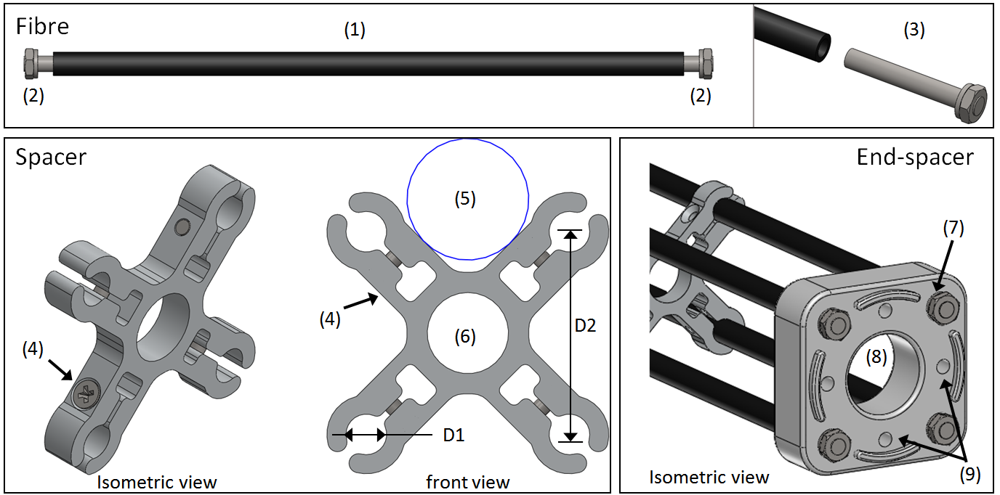
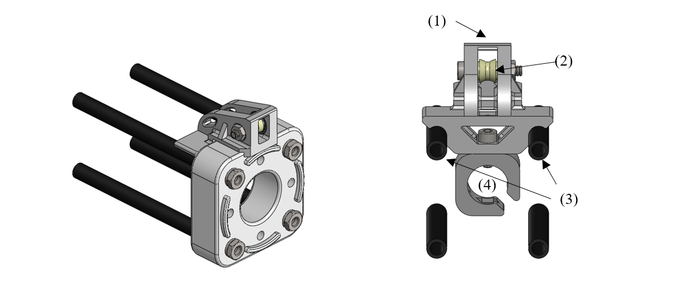
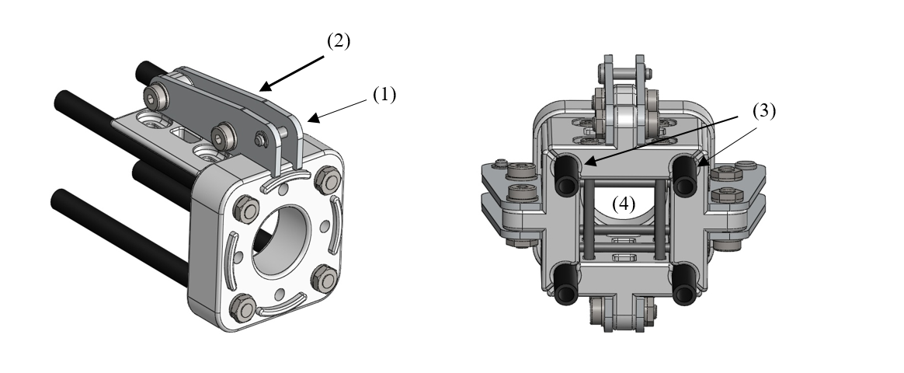

MYO-Bone
========

Type 1: Parallel Assemblies
---------------------------

This bone type implements the design principle “Parallel assemblies”.
The bone is designed as an assembly made of three types of elements (see
:numref:`D3.4_image37`):

-  Elongated structural profiles, hereafter called *fibres*, form the main structural element.

-  Transverse *spacers* bind the fibres together and increase the assembly stiffness and strength. The spacers are shaped to allow the compact integration of other DPs and the electric cabling.

-  *End-spacers* are spacers placed on each end of the bone, which provide additional interfaces.

Together, the fibres and the spacers are making up the bone
core, while the end-spacers play the role of the bone ends.

.. _D3.4_image37:
.. figure:: images/image37.png
    :align: center

    Illustration of the bone construction Type 1 – “Parallel Assemblies”

.. _D3.4_BONE:

Bone Variety 1: Four Round Tube Fibres
~~~~~~~~~~~~~~~~~~~~~~~~~~~~~~~~~~~~~~~

This variety takes inspiration of the *ThorLabs Cage System*
[Web-ThorLabs]. A rigid cage system used to align optical components
along a common optical axis. Four tubes with round cross sections are
used as fibres and they are placed so that the intersections of the
fibre longitudinal axes with the transverse plane are located at the
vertex of a square.

Illustrations
+++++++++++++++++++

Overview:

.. _D3.4_image38:
.. figure:: images/image38.png
    :align: center

.. _D3.4_image39:
.. figure:: images/image39.png
    :align: center

Individual elements:

.. _D3.4_image40:

Dimensions
+++++++++++++++++++

D1 Diameter of the round tubes

D2 Distance between two adjacent fibres

D3 Distance between two successive spacers

Implemented instances
++++++++++++++++++++++++++++++++++++++

+--------------------------+------------------+-------+--------+
| Reference                | BONE-SC2-T1-V1                    |
+==========================+==================+=======+========+
| Corresponding DP-Class   | II                                |
+--------------------------+------------------+-------+--------+
|                          | D1               | 6     | [mm]   |
+                          +------------------+-------+--------+
|                          | D2               | 30    | [mm]   |
+       Dimensions         +------------------+-------+--------+
|                          | D3               | 50    | [mm]   |
+                          +------------------+-------+--------+
|                          | M                | 188   | [g]    |
+--------------------------+------------------+-------+--------+

Features
+++++++++++++++++++

Fibres:

1) The fibres are implemented with standard tubes with a round section.

2) Each fibre is terminated with two inserts equipped with screw threads.

3) The inserts are glued to or pressed in each of the tube.

Spacers:

4) The spacers are attached to the fibres using flexure clamps.

5) The spacers are shaped to allow the integration of the muscle, close to the central axis on the four lateral sides of the bone.

6) The spacers have a central hole to let the electric cables run through them.

End-spacers:

7) The fixation of the fibres to the end-spacers is achieved via a screw connection.

8) The end-spacers also have a central hole to let the electric cables run through them.

Attachment points:

9) Each end-spacer has a screw pattern to attach one side of a SB.

10) Each section of fibre between two successive spacers can be used to attach one or more anchor carriers (see Accessories).

Material and fabrication
++++++++++++++++++++++++++++++++++++++

**Production and assembly instructions are found in :numref:`myoBone-assembly-fourRoundTubeFibres`**

+----------------+----------------------+------------------------------------+
| Element name   | Material             | Fabrication processes              |
+================+======================+====================================+
| tube           | steel or composite   | -  purchase (standard component)   |
|                |                      |                                    |
|                |                      | -  cut to length                   |
+----------------+----------------------+------------------------------------+
| insert         | steel                | -  standard component              |
+----------------+----------------------+------------------------------------+
|                | aluminium            | -  water-jet cutting               |
|                |                      |                                    |
|    spacers     |                      | -  machining                       |
|                |                      |                                    |
|                | PA                   | -  laser sintering                 |
+----------------+----------------------+------------------------------------+
| end-spacers    | PA                   | -  laser sintering                 |
+----------------+----------------------+------------------------------------+

Accessories
~~~~~~~~~~~~

MYO-Muscle adaptor
+++++++++++++++++++++

.. _D3.4_image41:
.. figure:: images/image41.png
    :align: center

Features:

1) The adaptor implements four anchor points of type AF-SCX-T1-V1, one on each of the four sides of the bone core.

2) The four parts making up the carrier are fixed to each other with screws.

3) Like the spacers, the carrier is shaped to allow the compact integration of the muscles and has a hole in the middle to let the electric cables run through.

Pulley module
+++++++++++++++++++

.. _D3.4_image42:

Features:

1) The pulley module includes a closed profile to keep the cable in place.

2) The guide sleeve has a shape that aligns the cable. Additionally its supporting shaft has two ball bearings to minimize the friction.

3) The pulley is shaped to allow a fast attachment to the parallel fibres.

4) The connector allows a secure lock of up to four pulleys. It has a hole in the middle to let the electric cables run through and an opening to allow an easy insertion.

Cable attachment
+++++++++++++++++++

.. _D3.4_image43:

Features:

1) The end of the tendon cable is secured with a pin that can be quickly mounted or unmounted.

2) The construction includes two aluminium plates that can be easily exchanged to adjust the pin position with respect to the end of the MYO-Bone.

3) The cable attachment is shaped to allow a fast mounting to the parallel fibres and is fixed to them by clamping (using another cable attachment on the opposite side of the MYO-Bone).

4) Up to four cable attachments can be mounted at the end of the MYO-Bone, while leaving sufficient space in the middle to let the electric cables run through.
