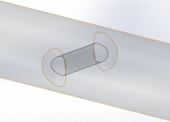
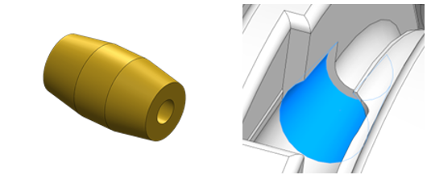
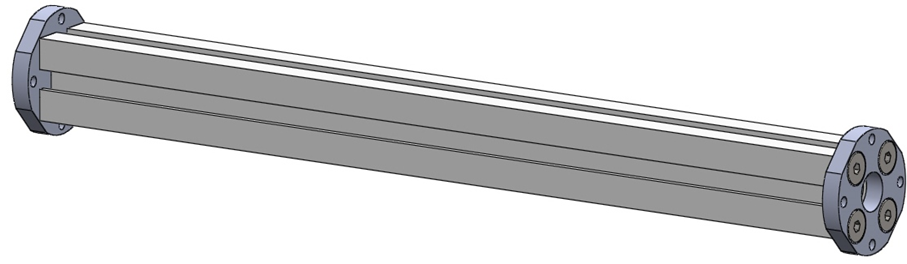
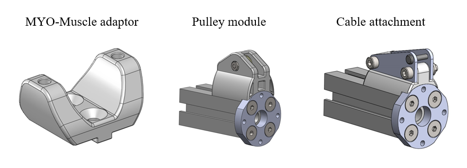
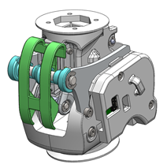
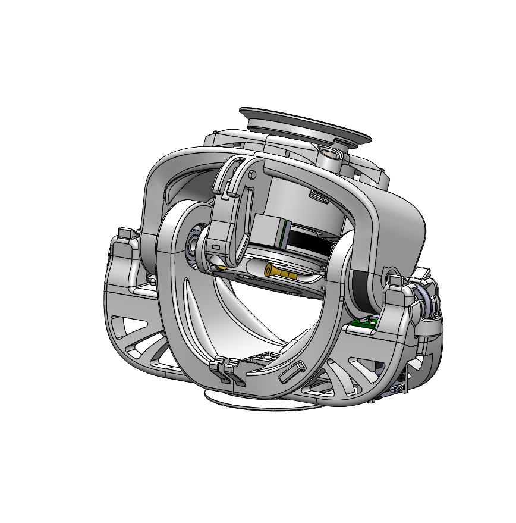
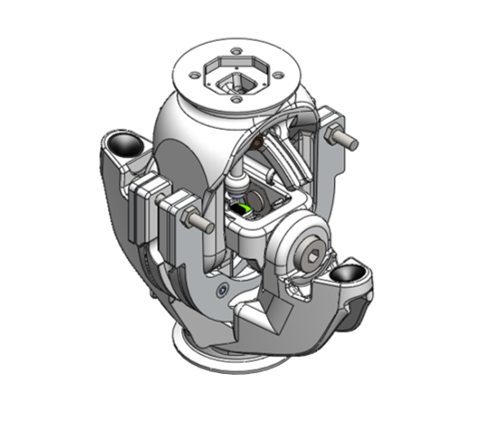
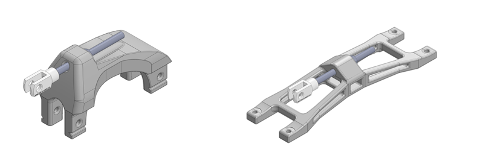
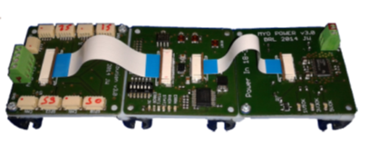

Content of the design primitive library
=======================================

Organization and description of the library elements
----------------------------------------------------

To simplify the presentation of the library elements and provide a
framework for future extensions, the developed hardware elements are
organized, for each DP functional category, using the following
hierarchical classification:

Types        (T)    are used to distinguish the hardware elements on the basis of their design principle.

Varieties    (V)    are used, if needed, to distinguish the hardware elements based on the same design principles, on the basis of the technical implementation.

The description of each variety follows the following structure:

+----------------------------------+--------------------------------------------------------------------------------------------------------------------------------+
| Illustrations                    | regroup figure and graphics illustrating the library element and its main features                                             |
+==================================+================================================================================================================================+
| Dimensions                       | list the element’s most important dimensions                                                                                   |
+----------------------------------+--------------------------------------------------------------------------------------------------------------------------------+
| Features                         | provide a textual explanation of the element’s main features                                                                   |
+----------------------------------+--------------------------------------------------------------------------------------------------------------------------------+
| Material and fabrication         | detail the materials and fabrication methods foreseen for the various parts of the library element                             |
+----------------------------------+--------------------------------------------------------------------------------------------------------------------------------+
| Integration of the electronics   | if needed, provides more details about the embedded electronic component and their integration in the hardware element         |
+----------------------------------+--------------------------------------------------------------------------------------------------------------------------------+
| Accessories                      | lists the additional pieces of hardware usable with the library element, if any                                                |
+----------------------------------+--------------------------------------------------------------------------------------------------------------------------------+
| Implemented instances            | list the instances of the hardware elements that have been implemented so far, with their corresponding names and dimensions   |
+----------------------------------+--------------------------------------------------------------------------------------------------------------------------------+

Overview of the implemented library elements
--------------------------------------------

Mechanical couplings
~~~~~~~~~~~~~~~~~~~~

Structural Bond
++++++++++++++++++++++++++++++++++++++++++++++
.. _D3.4_image1:
.. figure:: images/image1.png
   :align: center

   Type 1: Flange clamp with conical flange

Anchor Fastener
++++++++++++++++++++++++++++++++++++++++++++++

.. _D3.4_image3:
.. figure:: images/image3.png
    :align: center

    Type 1: Screw Fasteners

Cable attachment
++++++++++++++++++++++++++++++++++++++++++++++

.. _D3.4_image4:

    Type 1: Through hole

.. _D3.4_image5:

    Type 2: Conical socket

Design Primitives
~~~~~~~~~~~~~~~~~

MYO-Bones
++++++++++++++++++++++++++++++++++++++++++++++

.. _D3.4_image7:
.. figure:: images/image7.png
    :align: center

    Type 1: Parallel Assemblies - Four Round Tubes Fibres

.. _D3.4_image8:
.. figure:: images/image8.png
    :align: center

    Accessories

.. _D3.4_image11:

    Type 2: Monolithic core - T-slot profile

.. _D3.4_image12:

    Accessories

MYO-Joints
++++++++++++++++++++++++++++++++++++++++++++++

.. _D3.4_image15:
.. figure:: images/image15.png
    :align: center

    Type 1: Symmetric Hinge

.. _D3.4_image16:
.. figure:: images/image16.png
    :align: center

    Type 2: Asymmetric Hinge

.. _D3.4_image17:

    Type 2: Revised Asymmetric Hinge

.. _D3.4_image18:
.. figure:: images/image18.png
    :align: center

    Type 3: Pivot

.. _D3.4_image19:

    Type 4: Hinge-Pivot

.. _D3.4_image20:

    Type 5: Hinge-Hinge

MYO-Muscles
++++++++++++++++++++++++++++++++++++++++++++++

.. _D3.4_image21:

    Type 0: Passive Muscle - Simple spring

.. _D3.4_image23:
.. figure:: images/image23.png
    :align: center

    Type 1: Unilateral Series Elastic Actuator - Compression spring

MYO-Ganglion
++++++++++++++++++++++++++++++++++++++++++++++

.. _D3.4_image24:

    Type 1: ECU with FlexRay bus
