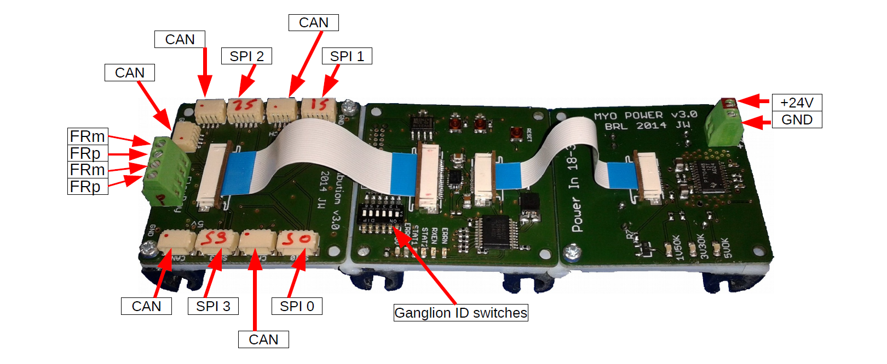
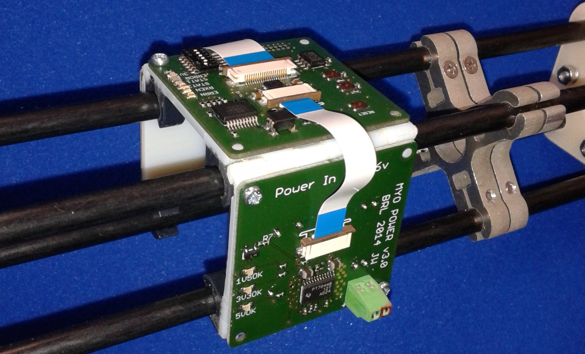

MYO-Ganglion
============

The MYO-Ganglion comprises three printed circuit boards (PCB). The PCBs of this set are linked using 2 ribbon cables, the ganglion is powered with up to 24V from simple stripped wires and there are 2 sets of Flexray connectors to connect to the FlexrayBus and daisy-chain other devices: (:numref:`EAESS_her-figure`).

The ganglion can be mounted in 3 different ways:

- 'MyoRobotics carrier' for the MyoBone - see (:numref:`EAESS_her-figure`)
- 'Ganglion stack' (:numref:`EAESS_g-stack`)
- 'Ganglion mount' 'spider' (:numref:`EAESS_g-mount`)

The centre board features the main
floating-point processor, the TMS570LS20216 from Texas Instruments
running at 140MHz. Adjacent to the processor board are the power supply
and distribution boards, respectively.

.. _EAESS_your-figure:

   The MYO-Ganglion PCB assembly: distribution board with CAN and SPI
   connections is shown on the left, the centre board is equipped with the main DSP
   (TMS570LS20216 on bottom side , not visible), the power supply board (24V) is mounted
   on the right side of the carrier.

.. _EAESS_her-figure:

   The MYO-Ganglion mounted on bone before cables are attached.

.. _EAESS_g-stack:
.. figure:: images/GanglionStack.*
   :align: center

   The ganglion stack allows for stacking all 3 parts of the ganglion into a tightly integrated package.
   It is designed to be mounted on the side of a `groove 6 aluminium profile`_.

.. _groove 6 aluminium profile: https://roboy.open-aligni.com/part/show/478?revision_id=439

.. _EAESS_g-mount:
.. figure:: images/GanglionMount.*
   :align: center

   Three (3) ganglion mounts are required to mount a ganglion to a `groove 6 aluminium profile`_.
   The ganglion mounts can be integrated into complex structures such as bones.

Addressing
----------

A Myorobot can have up to six MYO-Ganglions sharing the FlexRay bus.
Each Ganglion has a unique address which is configured using the
DIP-switches 1 to 6. In order to enable the Ganglion, one (and only one)
of the DIP switches has to be in the ON position. All others have to be
in the OFF position. If more than one DIP switch is in the ON position
the Ganglion will not participate in the FlexRay communication.
Similarly, if none of the switches are in the ON position, the Ganglion
will not participate in the FlexRay communication. This provides a
convenient way to temporarily disable a Ganglion that is not required
(see also :numref:`EAESS_mytable`).

.. _EAESS_mytable:

.. table:: MYO-Ganglion addressing scheme

    +-------+-------+-------+-------+-------+-------+-----------------------+
    | SW1   | SW2   | SW3   | SW4   | SW5   | SW6   | Address / C++ index   |
    +=======+=======+=======+=======+=======+=======+=======================+
    | 1     | 0     | 0     | 0     | 0     | 0     | [0]                   |
    +-------+-------+-------+-------+-------+-------+-----------------------+
    | 0     | 1     | 0     | 0     | 0     | 0     | [1]                   |
    +-------+-------+-------+-------+-------+-------+-----------------------+
    | 0     | 0     | 1     | 0     | 0     | 0     | [2]                   |
    +-------+-------+-------+-------+-------+-------+-----------------------+
    | 0     | 0     | 0     | 1     | 0     | 0     | [3]                   |
    +-------+-------+-------+-------+-------+-------+-----------------------+
    | 0     | 0     | 0     | 0     | 1     | 0     | [4]                   |
    +-------+-------+-------+-------+-------+-------+-----------------------+
    | 0     | 0     | 0     | 0     | 0     | 1     | [5]                   |
    +-------+-------+-------+-------+-------+-------+-----------------------+
    |             any other combination             |invalid / not connected|
    +-------+-------+-------+-------+-------+-------+-----------------------+
