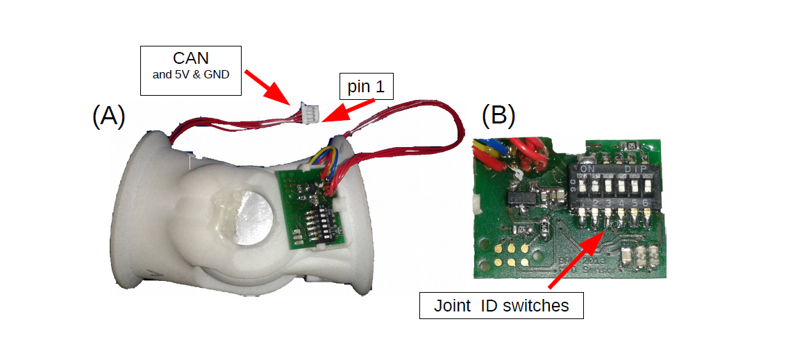
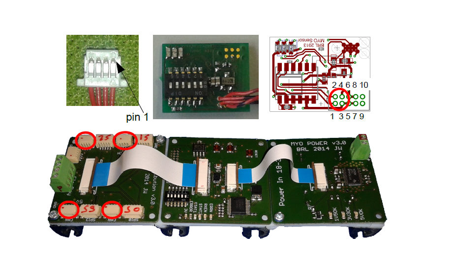
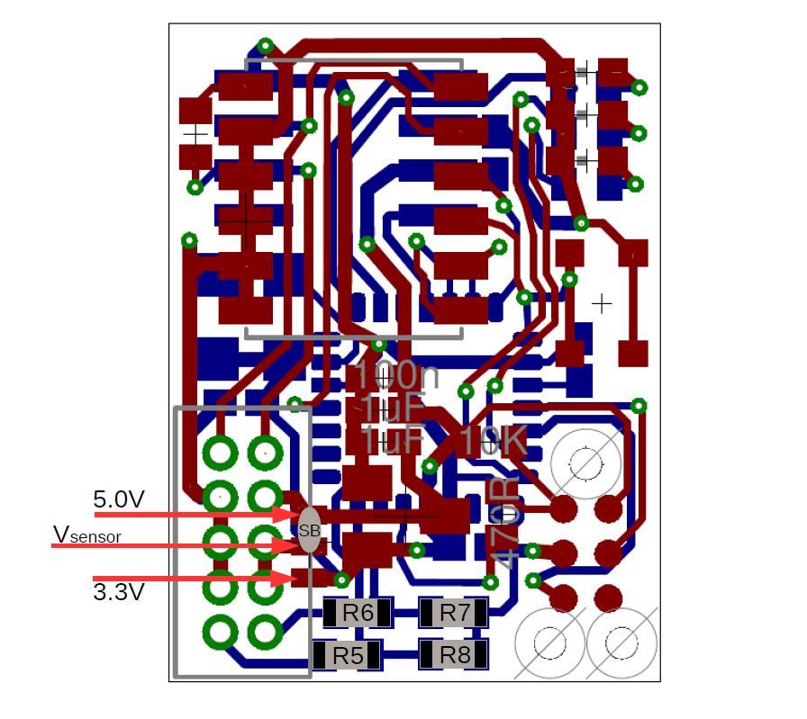

Joint Sensor Board
==================

The MYO-Joints are equiped with absolute position sensors. An
interface board (joint sensor board) is mounted on each joint as shown
in :numref:`EAESS_second-figure`. The joint position is sent to
the MYO-Ganglion via CAN. The joint sensor board reads the magnetic
joint sensor (within the joint) at a rate of 16kHz. A filtered value of
this joint position (moving average filter) is sent to the MYO-Ganglion
at a rate of 1kHz. Up to 4 joint sensors can be connected to the
MYO-Ganglion on a shared CAN bus. The DIP-switches on the joint sensor
board are required to configure the CAN message ID (communication
address). The DIP switches (S1, S2 and S3) are read after power-on
reset. Manipulation of the switches during operation has no effect. For
a 1DOF joint DIP switches 1 and 2 are used to set the address (0b00,
0b01, 0b10 or 0b11). Switches 3, 4 and 5 must be in the off
position [3]_. Switch 6 enables a CAN termination resistor. One (and
only one) of the joint sensor boards connected to a MYO-Ganglion must
have the termination resistor enabled (i.e. switch 6 ON). In general,
CAN requires two :math:`120\Omega` termination resistors. One of them is
present on the MYO-Ganglion board and therefore only one of the joint
sensors should have its termination resistor enabled.

.. _EAESS_second-figure:

    The MYO-Joint (A) with a close-up (B) of the joint angle sensor board

Connectivity
------------

The joint sensor board is supplied with a 4-pin [4]_ JST connector and
should be directly connected to the MYO-Ganglion using any of the 5
available CAN connectors. The address of the joint is subject to the
address of the joint sensor board, using DIP switches 1 and 2 as shown
in :numref:`EAESS_yourtable`.

During 1DOF operation, only one CAN message with the MsgID indicated by
switches S1 and S2 is sent. For 2DOF operation two CAN messages are
sent, the first one has the MsgID indicated by switches S1 and S2, the
second CAN message has the ID indicated with switches S1 and S2 plus 1.

.. _EAESS_ourtable:

.. table:: CAN message IDs of the sensor board as a function of the DIP Switches S1,S2 and S3. S6 (not shown in the table) is used to switch the CAN termination on and o, S4 is for calibration and needs to be set to o during operation. S5 is currently reserved.

    +------+------+------+---------------------+
    | S1   | S2   | S3   | messageIDs on bus   |
    +======+======+======+=====================+
    | 0    | 0    | 0    | 0x50                |
    +------+------+------+---------------------+
    | 0    | 0    | 1    | 0x50 and 0x51       |
    +------+------+------+---------------------+
    | 0    | 1    | 0    | 0x51                |
    +------+------+------+---------------------+
    | 0    | 1    | 1    | 0x51 and 0x52       |
    +------+------+------+---------------------+
    | 1    | 0    | 0    | 0x52                |
    +------+------+------+---------------------+
    | 1    | 0    | 1    | 0x52 and 0x53       |
    +------+------+------+---------------------+
    | 1    | 1    | 0    | 0x53                |
    +------+------+------+---------------------+
    | 1    | 1    | 1    | 0x53                |
    +------+------+------+---------------------+

.. _EAESS_yourtable:

.. table:: Joint sensor addressing scheme for 1DOF operation. In the 2DOF configuration two consecutive indices are valid, i.e. either 0 and 1, 1 and 2, or 2 and 3. The joint addresses have to be selected in such a manner that never more than one joints sends a given CAN message ID. Refer to :numref:`EAESS_ourtable` for details on CAN addresses.

    +------+------+-----------------------+
    | S1   | S2   | Address / C++ index   |
    +======+======+=======================+
    | 0    | 0    | [0]                   |
    +------+------+-----------------------+
    | 0    | 1    | [1]                   |
    +------+------+-----------------------+
    | 1    | 0    | [2]                   |
    +------+------+-----------------------+
    | 1    | 1    | [3]                   |
    +------+------+-----------------------+

Wiring Scheme: Joint Angle Sensor Board - Ganglion Distribution Board
~~~~~~~~~~~~~~~~~~~~~~~~~~~~~~~~~~~~~~~~~~~~~~~~~~~~~~~~~~~~~~~~~~~~~~~~~~~~~~~~~~~~~~~~~~~~~~~

+------------------------------------------+---------+---------+-------+-------+
| **Signal Name**                          | CAN-H   | CAN-L   | Gnd   | +5V   |
+==========================================+=========+=========+=======+=======+
| **Sensor board, pad #**                  | 1       | 2       | 3     | 4     |
+------------------------------------------+---------+---------+-------+-------+
| **Ganglion Distribution Board, pin #**   | 3       | 2       | 1     | 4     |
+------------------------------------------+---------+---------+-------+-------+

.. _EAESS_third-figure:

    Cables and connectors to connect the joint angle sensor board to the
    ganglion distribution board; red circles mark the applicable
    connectors on the printed circuit boards.

Wiring Scheme: Analogue joint sensor - Joint Angle Sensor Board
~~~~~~~~~~~~~~~~~~~~~~~~~~~~~~~~~~~~~~~~~~~~~~~~~~~~~~~~~~~~~~~~~~~~~~~~~~~~~~~~~~~~~~~~~

The analogue joint sensor are soldered straight into the soldering pad
on the joint angle sensor boards. The joint angle sensor board can
output 5V or 3.3V on pins 6 and 8, depending on the components
configured onto the joint angle sensor board.

+---------------------------+-------+-------+------------+------------+-------+-------+
| **Signal Name**           | Gnd   | Gnd   | +5V/3.3V   | +5V/3.3V   | AN0   | AN1   |
+===========================+=======+=======+============+============+=======+=======+
| **Sensor board, pad #**   | 5     | 7     | 6          | 8          | 9     | 10    |
+---------------------------+-------+-------+------------+------------+-------+-------+

Wiring Scheme: 5V and 3.3V configuration
~~~~~~~~~~~~~~~~~~~~~~~~~~~~~~~~~~~~~~~~

The joint angle sensor board can operate with 5V or 3.3V sensors,
depending on the resistors populated and solder-bridges made. Details
can be seen in :numref:`EAESS_fourth-figure`. Resistors
R5,R6,R7 and R8 are required to divide down the sensor output, in case
of the 5V configuration, to the 3.3 analogue input voltage range of the
micro-controller on the sensor board. One, and only one, solder-bridge
(SB) between the 5V pad or 3.3V pad and the :math:`V_{supply}` pad is
required to supply the sensor with the appropriate voltage. For 3.3V
operations resistors R7 and R8 should be removed and R5 and R6 replaced
with a 0\ :math:`\Omega` resistor.

.. _EAESS_fourth-figure:

    PCB with components for 5V operation:
    :math:`R5=5k\Omega,R6=5k\Omega,R7=10k\Omega,R8=10k\Omega` and
    solder-bridge (SB) implementing the connection between +5V and the
    sensor supply voltage :math:`V_{sensor}`. For 3.3V operation the
    solder-bridge is required between the 3.3V pad and
    :math:`V_{senosr}`. Importantly, the SB between +5V and
    :math:`V_{sensor}` needs then be removed. In 3.3V operation R7 and R8
    should be removed and R5 and R6 replaced with a :math:`0\Omega`
    resistor (or a resistance :math:`<10\Omega`). Red tracks/pads mark
    the PCB top, blue tracks/pads are on the bottom side of the PCB.

Calibration Procedure
---------------------

The joints should be calibrated before the first operation. This makes
sure that the digital outputs of the sensor board map symmetrically to
the physical range of the analogue sensors. A calibrated sensor will
broadcast a value of :math:`2048_{dec}` in the centre position and a
value between 0 and :math:`2048_{dec}` at the physical negative end-stop
(depending on range). The value at the positive end-stop will be between
:math:`2048_{dec}` and :math:`4095_{dec}`, again depending on the
physical range. The calibration only needs to be performed once when
connecting the sensor board to the physical joint and sensor, the
calibration data is stored permanently in the flash memory of the joint
angle sensor board. However, the procedure can be repeated if mistakes
were made during calibration or if he sensor board is mounted onto
another joint. The calibration data is agnostic to the to the joint
address in principle. However, it is easiest to perform the calibration
when joint ID zero (S0=0, S1=2) is selected. The calibration works for
1DOF and 2DOF operation. The following procedure will lead to a
successful calibration:

-  S0 and S1 are set to 0 (off), S4 is off, S3 off in 1DOF operation or S3 on for 2DOF operation

-  power up joint angle sensor board

-  set S4 to on

-  move joint to negative position, hold there

-  flick S0 on and off again

-  move joint to positive position, hold there

-  flick S1 on and off again

-  set S4 to off

-  calibration has been performed

.. [3]
  Switches 3,4 are required to choose between 1DOF and 2DOF operation
  (S3) or to calibrate the joint (S4). Switch 5 is reserved

.. [4]
  The 4-way JST SH series connectors are available from Farnell
  Components, Farnell-number 1679110; connecting wires with pre-crimped
  connectors are available via RS components (300mm RS-number 311-6675,
  150mm RS-number 311-6653).
