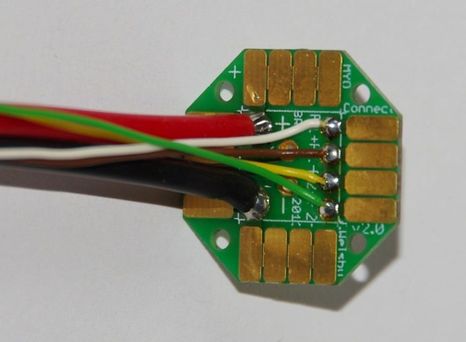

MYO-Joint
=========

Type 1: Symmetric Hinge
-----------------------

This joint type provides 1 DoF of rotation along an axis parallel to the
joint end planes. The provided angular range of rotation is *symmetric*
with respect to the axis perpendicular to its interface plane provided
by the structural bond. This DoF is provided by a combination of axle
and rotational bearings. The basic structure of the joint is illustrated
in :numref:`D3.4_image72`.

Both joint ends are shaped as forks (the *upper-* and *under joint*
*forks*) and provide an interface for the structural bond. The
electrical interfaces on both joint ends are embedded in the structural
bonds and the space between the upper and under fork is used for the
electrical cabling. The attachment and guidance for the cable
transmission are placed centrally for a symmetrical application of the
force on the bearings.

.. _D3.4_image72:

    Illustration of the joint construction for Type 1

Variety 1
~~~~~~~~~

This implementation uses two axles placed on each side of the joint,
supported by ball bearings to reduce the friction and increase the
efficiency of the joint. Between the two axles, a disk-like structure is
used to guide the cable while insuring a constant lever arm with respect
to the joint rotation axis. The absolute position of the joint is
measured using a Hall-effect sensor, comprising a magnet embedded in one
of the axles and an electronic board located inside the joint. The
corresponding sensor interface module (SIM) is located on the outside of
the joint to be easily accessible for configuration purpose.

Illustrations
++++++++++++++++++++++++++++++++++++++++++++++

.. _D3.4_image73:

.. _D3.4_image74:

**Dimensions**

H Distance between joint end planes

W Maximal width of the joint

T Maximal thickness of the joint

X Height of the tilt axis

Θ Motion range of the joint

**Implemented instances**

+--------------------------+-------------------+-------+--------+
| Reference                | JOINT-SC2-T1-V1                    |
+==========================+===================+=======+========+
| Corresponding DP-Class   | II                                 |
+--------------------------+-------------------+-------+--------+
|                          | H                 | 60    | [mm]   |
+                          +-------------------+-------+--------+
|                          | W                 | 55    | [mm]   |
+                          +-------------------+-------+--------+
|                          | T                 | 36    | [mm]   |
+        Dimensions        +-------------------+-------+--------+
|                          | X                 | 29    | [mm]   |
+                          +-------------------+-------+--------+
|                          | Θ                 | 140   | [°]    |
+                          +-------------------+-------+--------+
|                          | M                 | 70    | [g]    |
+--------------------------+-------------------+-------+--------+

**Features**

*Under joint fork:*

1) Both bearings are implemented in the under joint fork.

2) Two mechanical stoppers limit the motion range of the joint.

3) The structural bond (SB) is integrated on the under joint fork.

4) The topology of the force transmitting volume from the SB to the joint axis is optimised.

5) A holding device allows attaching a SIM-board on the side.

*Upper joint fork:*

6) Two cable attachments (CA-SC2-T2), allowing the bidirectional actuation of the joint, and a continuous guide for the cables are implemented.

7) The SB is integrated on the upper joint fork.

8) The topology of the force transmitting volume from the SB to the joint axis is optimised.

9) The “neck” of the upper joint fork features a location to add an extension, providing if necessary additional CA on the joint.

10) Both shafts of the joint are implemented with interference fit.

*Sensor and electrical interfaces:*

11) The sensor board and its protection cap can be easily fixed on the under joint fork.

12) To measure the movement between the joint parts, the magnet element of the sensor is mounted in the shaft.

13) The electrical interfaces are small PCBs which are embedded in the structural bonds.

14) Openings and cable channels are implemented to enable the electrical cabling between sensor and SIM-board and between the electrical interfaces of the structural bonds on both sides of the joint.

**Material and fabrication**

+--------------------+------------------+------------------------------------+
| Element name       | Material         | Fabrication processes              |
+====================+==================+====================================+
| Upper hinge part   | Polyamide (PA)   | -  laser sintering                 |
|                    |                  |                                    |
| Lower hinge part   |                  |                                    |
|                    |                  |                                    |
| Sensor cap         |                  |                                    |
+--------------------+------------------+------------------------------------+
| Shaft              | Aluminium        | -  machining                       |
+--------------------+------------------+------------------------------------+
| Bearing            | Steel            | -  purchase (standard component)   |
+--------------------+------------------+------------------------------------+

Assembly Procedure
++++++++++++++++++++++++++++++++++++++++++++++

.. _D3.4_image75:
.. figure:: images/image75.png
    :align: center

Material needed:

1 x Upper hinge part

1 x Lower hinge part

1 x Sensor cap

2 Bearings 625 5x16x5 mm

1 x shaft left side

1 x shaft sensor side

4 data wires 0,25 mm\ :sup:`2`

2 power wires highly flexible silicon 1,5 mm\ :sup:`2`

2 x connector boards, four spring contacts

8 x M1,6 x 6

Step 1: Mount sensor board
++++++++++++++++++++++++++++++++++++++++++++++

.. _D3.4_image76:

Push the sensor cables through the cable channel.
Place the sensor board on the pins and glue on two points.

Tips:

-	for pre fixation of the board melt the plastic pins with a soldering iron

Step 2: Glue sensor cap
++++++++++++++++++++++++++++++++++++++++++++++

.. _D3.4_image77:
.. figure:: images/image77.png
    :align: center

Put glue on the sensor cap and screw it on the housing.

Tips:

-	just a small amount of glue is needed

Step 3: Mount Ball Bearings
++++++++++++++++++++++++++++++++++++++++++++++

.. _D3.4_image78:

Put the ball bearings in the housing on both sides.

Step 4: Assemble upper and under hinge part
++++++++++++++++++++++++++++++++++++++++++++++

.. _D3.4_image79:

Assemble the upper and under hinge part.

Plug in the shafts to fix the joint parts.

Tips:

- The shaft with magnet must on the sensor side

- For better fixation put lock tide on the shafts

Step 5: Connect cables to the board
++++++++++++++++++++++++++++++++++++++++++++++

.. _D3.4_image80:

Prepare cable tree on connector boards.

Cut on 15 cm length:

4 data wires 0,25 mm\ :sup:`2`

2 power wires highly flexible silicon 1,5 mm\ :sup:`2`

Connector side:

.. _D3.4_image80A:

Pin colour code:

F1+ white

F1 - brown

F2 + yellow

F2 - green

Step 6: Cabling
++++++++++++++++++++++++++++++++++++++++++++++

.. _D3.4_image81:

Place PCB carrier in SB.

Carrier orientation:

.. _D3.4_image81A:

Push cable tree through the joint.

Step 7: Connect cables to the second board
++++++++++++++++++++++++++++++++++++++++++++++

.. _D3.4_image82:

Skinning all cables long till the SB-pocket.

Pull cables through connector board and solder from top. Screw both connector boards to joint with four M1,6 screws.

Connector side:

.. _D3.4_image82A:

Pin colour code:

F1+ white

F1 - brown

F2 + yellow

F2 - green

Tips:

-	Turn Joint in the position of the longest cable path!

-	Avoid cable crossovers by connecting to board

Type 2: Asymmetric Hinge
------------------------

This joint type provides 1 DoF of rotation along an axis parallel to the
joint end planes. In contrast to the symmetric hinge, the provided
angular range of rotation is *asymmetric* with respect to the axis
perpendicular to its interface plane provided by the structural bond.
Following Principle II, this DoF is provided by a combination of axle
and rotational bearings. The basic structure of the joint is illustrated
in :numref:`D3.4_image72`.

Both joint ends are shaped as forks (the *upper-* and *under joint*
*forks*) and provide an interface for the structural bond. The
electrical interfaces on both joint ends are embedded in the structural
bonds and the space between the upper and under fork is used for the
electrical cabling. The attachment and guidance for the cable
transmission are placed centrally for a symmetrical application of the
force on the bearings.

.. _D3.4_image83:

    Illustration of the joint construction

Variety 1 [obsolete]
~~~~~~~~~~~~~~~~~~~~

This implementation uses a joint axle to the under joint fork and
supported on each side by ball bearings mounted on the upper joint fork
and secured with side covers. The absolute position of the joint is
measured using a Hall-effect sensor, comprising a magnet embedded in the
joint axle and an electronic board located on the side of the joint,
together with its corresponding sensor interface module (SIM). The
electronic boards are integrated in one of the side covers.

.. _D3.4_image84:

    Illustration of the joint construction

Given the constraint of asymmetric angular range, it was not possible to
use the same mechanism for cable guidance as for the symmetric hinge
joint, while preserving a compact joint design. Instead, the cable of
the extension muscle is redirected by a guiding pulley (located on the
under joint fork) towards the cable attachment (located on the upper
joint fork) implemented using a pin mounted transversally to the cable
direction.

This cable guidance implementation does not insure a constant lever arm
length, which significantly decreases as the joint flexes, as shown in
:numref:`D3.4_image85`. Tests performed by ETH showed that this pronounced decrease of
the lever arm length was prejudicial in applications. For that reason
another asymmetric hinge variety was developed, which is described in
the next section.

.. _D3.4_image85:

    Lever arm length variation of the extensor muscle cable (red line) as the
    asymmetric hinge joint (variety 1) flexes from 0° to 140°

Variety 2
~~~~~~~~~~

This variety has the same basic construction as variety 1 regarding the
joint axle and bearing, as well as the implementation and location of
the absolute position sensing.

The main difference with variety 1 lies in the implementation of the
cable guidance. The guiding pulley and the cable attachment are both
mounted on two metal sheets attached to the sides of the under and upper
joint forks respectively. This construction has two benefits: (1) the
decrease of the lever arm length as the joint flexes can be
significantly reduced and (2) the lever arm length can be easily
adjusted by exchanging the metal sheets. On the other hand, this
configuration increases the risk that the cable jumps out of the guiding
pulley. To prevent this, two mechanisms were devised to centre the cable
attachment (cable centring mechanism) and to keep the cable running on
the pulley (cable catching mechanisms).

.. _D3.4_image86:

    Illustration of the joint construction

.. _D3.4_image87:

    Lever arm length variation of the extensor and flexor muscles cables
    (resp. red and green lines) as the asymmetric hinge joint (variety 2) flexes from 0° to 140°

Illustrations
++++++++++++++++++++++++++++++++++++++++++++++

.. _D3.4_image88:

**Dimensions**

H	Distance between joint end planes

W	Maximal width of the joint

T	Maximal thickness of the joint

X	Height of the rotation axis

Θ	Angular range of the joint

.. _D3.4_image89:

.. _D3.4_image90:

**Implemented instances**

+--------------------------+-------------------+---------+--------+
| Reference                | JOINT-SC2-T2-V2                      |
+==========================+===================+=========+========+
| Corresponding DP-Class   | II                                   |
+--------------------------+-------------------+---------+--------+
|                          | H                 | 80      | [mm]   |
+                          +-------------------+---------+--------+
|                          | W                 | 66,25   | [mm]   |
+                          +-------------------+---------+--------+
|                          | T                 | 84      | [mm]   |
+        Dimensions        +-------------------+---------+--------+
|                          | X                 | 40      | [mm]   |
+                          +-------------------+---------+--------+
|                          | Θ                 | 140     | [°]    |
+                          +-------------------+---------+--------+
|                          | M                 | 224     | [g]    |
+--------------------------+-------------------+---------+--------+

**Features**

*Under joint fork:*

1) The joint axle is pressed through the under joint fork, while relative rotation is prevented via a chamfer.

2) The axle is axially secured with one circlip on each of its sides.

3) Two mechanical stoppers on each side of the under joint fork limit the extension of the joint.

4) The structural bond (SB) is integrated on the under joint fork.

5) M2 brass inserts are embedded in the under joint fork as fixation points for the metal sheets holding the guiding pulley.

6) A M2 brass insert is embedded in the top part of the under joint fork as fixation point for the cable catching mechanism.

*Upper joint fork:*

7) The ball bearings are mounted in the upper joint fork.

8) The bearings are axially secured on the medial side by the upper joint fork itself and on the lateral side by the two side covers screwed on the upper joint fork.

9) Two mechanical stoppers on each side of the upper joint fork limit the flexion of the joint.

10) The SB is integrated on the under joint fork.

11) M2 brass inserts are embedded in the upper joint fork as fixation points for the metal sheets holding the cable attachment for the extensor muscle cable.

*Flexor muscle cable guidance and attachment:*

12) The cable attachment is implemented as a transversal parallel pin around which the end of the cable is attached. The pin is pressed in the upper joint fork.

13) A pulley equipped with ball bearing is fixed on the under joint fork to guide the cable when the joint is close to most extended position.

*Extensor muscle cable guidance and attachment:*

14) The cable attachment is implemented as a transversal parallel pin around which the end of the cable is attached. The pin is supported by the two metal sheets inserted in the upper joint fork structure and additionally fixed to it with four screws.

15) To prevent that the cable slides laterally, a part (“cable centring clip”) is clipped on the pin to constraint the position of the cable to its centre.

16) The cable guidance is implemented as a roller born by a transversal parallel pin supported by the two metal sheets screwed to the under joint fork.

17) A part (“cable catching mechanism”) is fixed to top part of the under joint fork to prevent the cable to jump out of the roller when the joint extends while there is no tension in the cable. This part is shaped so as to deform in order to let the cable attachment pin pass under it and close afterwards when the joint extends or closes.

*Sensor and electrical interfaces:*

18) A magnet is glued to the joint axle.

19) The rotation of the magnet is measured by a Hall-effect sensor implemented in an IC mounted on the sensor board.

20) The signal provided by the sensor board is conditioned and transmitted by the SIM-board. Both boards are housed in one of the side covers.

21) Openings and cable channels are implemented to enable the electrical cabling between sensor and SIM-board and between the electrical interfaces of the structural bonds on both sides of the joint.

**Material and fabrication**

+-----------------------------------------------------+------------------+---------------------------------+
| Element name                                        | Material         | Fabrication processes           |
+=====================================================+==================+=================================+
| Upper joint fork                                    | Polyamide (PA)   | laser sintering                 |
|                                                     |                  |                                 |
| Under joint fork                                    |                  |                                 |
|                                                     |                  |                                 |
| Side covers                                         |                  |                                 |
|                                                     |                  |                                 |
| Guiding pulleys                                     |                  |                                 |
|                                                     |                  |                                 |
| Cable centering clip                                |                  |                                 |
|                                                     |                  |                                 |
| Cable catching mechanism                            |                  |                                 |
+-----------------------------------------------------+------------------+---------------------------------+
| Shaft                                               | Aluminium        | machining                       |
+-----------------------------------------------------+------------------+---------------------------------+
| Bearings                                            | Steel            | purchase (standard component)   |
+-----------------------------------------------------+------------------+---------------------------------+
| Metal sheets                                        | Aluminium        | water jet cutting               |
+-----------------------------------------------------+------------------+---------------------------------+
| Parallel pins (cable attachment and pulley axles)   | Steel            | purchase (standard component)   |
+-----------------------------------------------------+------------------+---------------------------------+

Type 3 – Pivot
--------------

This joint type provides 1 DoF of rotation along an axis perpendicular
to the joint end planes. Following Principle II, this DoF is provided by
a combination of axle and rotational bearings. The basic structure of
the joint is illustrated in :numref:`D3.4_image112`. One side of the joint includes
the joint axle and is called the *pivot shaft*. This part includes the
cable attachments. The other side of the joint carries one or multiple
bearings and is made of a *barrel-shaped housing* and a *lid*. The pivot
shaft and the lid have each an interface for a structural bond. The
electrical interfaces on both joint ends are embedded in the structural
bonds and the electric cabling joining them is guided through the joint.

.. _D3.4_image112:

    Illustration of the joint construction for Type 2

Variety 1
~~~~~~~~~

This implementation provides a large symmetrical range of rotation of
the joint. To reduce the friction and increase the efficiency of the
joint, two ball bearings are used to support the joint axle.

.. _D3.4_image113:
.. figure:: images/image113.png
    :align: center

.. _D3.4_image114:

**Dimensions**

H	Distance between joint end planes

W	Maximal width of the joint

T	Maximal thickness of the joint

Θ	Motion range of the joint

**Implemented instances**

+--------------------------+-------------------+--------+--------+
| Reference                | JOINT-SC2-T3-V1                     |
+==========================+===================+========+========+
| Corresponding DP-Class   | II                                  |
+--------------------------+-------------------+--------+--------+
|                          | H                 | 65     | [mm]   |
+                          +-------------------+--------+--------+
|                          | W                 | 66,8   | [mm]   |
+                          +-------------------+--------+--------+
|       Dimensions         | T                 | 50     | [mm]   |
+                          +-------------------+--------+--------+
|                          | Θ                 | 164    | [°]    |
+                          +-------------------+--------+--------+
|                          | M                 | 115    | [g]    |
+--------------------------+-------------------+--------+--------+

**Features**

*Barrel-shaped housing:*

1) The barrel-shaped housing contains a reservoir for the electrical cables, into which the electric cable can freely move when the joint is rotating.

2) On the outside of the housing, two holding devices are embedded for the pulleys redirecting the cable transmission.

3) A holding bay in the housing allows attaching a SIM-board on the side.

4) Two mechanical stoppers limit the motion range of the joint.

*Pivot shaft:*

5) The bearing on the extremity of the shaft is fixed by a nut screwed on the pivot shaft.

6) Two cable attachments (CA-SC2-T2), allowing the bidirectional actuation of the joint, and a continuous guide are implemented on the pivot shaft.

7) The SB is integrated on the pivot shaft.

8) To measure the rotation of the joint, an magnetic absolute position sensor is integrated in the joint. Its magnet element is mounted in the shaft.

*Lid:*

9) The lid is screwed to the barrel-shaped housing and its position secured by four pins.

10) The SB is integrated on the screw-on lid.

11) The position sensor board is fixed on the inside of the lid.

**Material and fabrication**

+-------------------------+------------------+------------------------------------+
| Element name            | Material         | Fabrication processes              |
+=========================+==================+====================================+
| Barrel-shaped housing   | Polyamide (PA)   | -  laser sintering                 |
|                         |                  |                                    |
| Lid                     |                  |                                    |
|                         |                  |                                    |
| Pivot shaft             |                  |                                    |
+-------------------------+------------------+------------------------------------+
| Bearing                 | Steel            | -  purchase (standard component)   |
|                         |                  |                                    |
| Securing pins           |                  |                                    |
|                         |                  |                                    |
| Shaft screw             |                  |                                    |
+-------------------------+------------------+------------------------------------+
| Pulleys                 | Polymer          | -  purchase (standard component)   |
+-------------------------+------------------+------------------------------------+

Assembly Procedure
++++++++++++++++++++++++++++++++++++++++++++++

.. _D3.4_image115:

Material needed:

1 x Barrel-shaped housing

1x Lid; 1x Pivot shaft

2x Bearings 3802 15x24x7 mm

2x Securing pins 3mm x 8 mm

1 x Flat shaft screw M12 x 1

4 data wires 0,25 mm2

2 power wires highly flexible silicon 1,5 mm2

2 x connector boards, four spring contacts

8 x M1,6 x 6

Step 1: Mount sensor board
++++++++++++++++++++++++++++++++++++++++++++++

.. _D3.4_image116:

(1) Push the sensor cables through the cable channel.
(2) Place the sensor board on the pins and glue on two points.

Tips:

-	for pre fixation of the board melt the plastic pins with a soldering iron

Step 2: Mount pulleys and magnet
++++++++++++++++++++++++++++++++++++++++++++++

.. _D3.4_image117:

(1)	Put in the two pulleys.
(2)	Fix them with the pins.
(3)	Glue the magnet into the pivot shaft.

Step 3: Place the bearings into the housing
++++++++++++++++++++++++++++++++++++++++++++++

.. _D3.4_image118:

Place the two bearings into the barrel-shaped housing from below.

Step 4: screw the pivot shaft into the housing
++++++++++++++++++++++++++++++++++++++++++++++

.. _D3.4_image119:

Put the pivot shaft into the barrel-shaped housing and tighten the nut.

Step 5: screw lid on barrel-shaped housing
++++++++++++++++++++++++++++++++++++++++++++++

.. _D3.4_image120:

Screw the lid on the barrel-shaped housing and put in the security pin.

Step 6: Solder cables to the board
++++++++++++++++++++++++++++++++++++++++++++++

.. _D3.4_image121:
.. figure:: images/image121.jpg
    :align: center

Prepare cable tree on connector boards.

Cut on 15 cm length:

4 data wires 0,25 mm\ :sup:`2`

2 power wires highly flexible silicon 1,5 mm\ :sup:`2`

Connector side:

.. _D3.4_image121A:

Pin colour code:

F1+ white

F1 - brown

F2 + yellow

F2 - green

Step 7: Cable and solder cables to the second board
++++++++++++++++++++++++++++++++++++++++++++++++++++

.. _D3.4_image122:

Place PCB carrier in SB

Solder cables to the second board (from below)

Carrier orientation:

.. _D3.4_image122A:

Pin colour code:

F1+ white

F1 - brown

F2 + yellow

F2 - green

Push cable tree through the joint.

Screw both connector boards to joint with four M1,6 screws.

Type 4: Hinge-Pivot
-------------------

This joint type provides 2 DoFs of rotation: one along an axis parallel
to the proximal joint end plane (hinge) and one along an axis
perpendicular to the distal joint end plane (pivot). The angular range
of rotation of the hinge is symmetric with respect to the axis
perpendicular to the structural bond. Both DoFs are implemented using a
combination of axles and rotational bearings.

Variety 1
~~~~~~~~~

This implementation uses ball bearings for the hinge and pivot to reduce
the friction and increase the efficiency of the joint. The tendon cables
actuating the pivot part (in red hereunder) are running through the
centre of the axles of the hinge part. The absolute joint angles are
measured using Hall-effect sensors and magnet rings.

Illustrations
++++++++++++++++++++++++++++++++++++++++++++++

.. _D3.4_image123:

    Illustration of the Hinge-Pivot joint construction

.. _D3.4_image124:

.. _D3.4_image125:

**Dimensions**

H	Distance between joint end planes

W	Maximal width of the joint

T	Maximal thickness of the joint

X Height of the hinge rotation axis

Θ\ :sub:`hinge`	Motion range of the joint

Θ\ :sub:`pivot`	Motion range of the pivot

**Implemented instances**

+--------------------------+-------------------+--------+--------+
| Reference                | JOINT-SC2-T4-V1                     |
+==========================+===================+========+========+
| Corresponding DP-Class   | II                                  |
+--------------------------+-------------------+--------+--------+
|                          | H                 | 95     | [mm]   |
+                          +-------------------+--------+--------+
|                          | W                 | 142    | [mm]   |
+                          +-------------------+--------+--------+
|                          | T                 | 78,5   | [mm]   |
+                          +-------------------+--------+--------+
|        Dimensions        | X                 | 47,5   | [mm]   |
+                          +-------------------+--------+--------+
|                          | Θ\ :sub:`hinge`   | 140    | [°]    |
+                          +-------------------+--------+--------+
|                          | Θ\ :sub:`pivot`   | 180    | [°]    |
+                          +-------------------+--------+--------+
|                          | M                 | ~300   | [g]    |
+--------------------------+-------------------+--------+--------+

**Features**

*Base:*

1) It holds the bearings for the hinge.

2) Two mechanical stoppers limit the motion range of the hinge by contacting the ring mount.

3) The structural bond (SB) is integrated on the proximal side of the base.

4) It provides a fixation point on each side to screw a pulley-support.

*Pulley-support:*

5) This part holds a pulley redirecting one of the tendon cables actuating the pivot through the hinge axle.

*Ring mount:*

6) Two cable attachments (CA-SC2-T2) are provided, allowing the bidirectional actuation of the hinge.

7) It holds two angular ball bearings for the pivot.

8) It holds two pulleys that guide the tendon-cables for the pivot actuation towards the cable winch.

9) It holds the two axles of the hinge, which are inserted with interference fit.

10) The shafts are axially secured with steel sheets.

11) Each steel sheet is secured with a cover clipped on the ring mount.

12) A half magnet is mounted on its right side for the measurement of the hinge absolute position.

13) The electronic board with the sensor measuring the absolute position of the pivot is mounted on its back.

*Cable winch:*

14) Two tendon cable attachments are provided for the bidirectional actuation of the pivot and the round shape of the cable insures a constant lever arm.

15) A magnet ring is mounted on the cable winch to measure the pivot absolute position.

*Output shaft:*

16) The output shaft is mounted in the two angular ball bearings.

17) The structural bond (SB) is integrated on the distal end of the output shaft.

18) The cable winch is fixed to the output shaft with a screw with inner hole, allowing the passage of the electric cables.

*Bearing cover:*

19) The bearing cover covers the two angular ball bearings.

20) A mechanical stopper limits the motion range of the pivot.

21) It is assembled with four screws on the ring mount.

*Sensor and electrical interfaces:*

22) The sensor board for the hinge is attached on a pulley-support.

23) The sensor board for the pivot movement is attached on the HX-ring mount.

24) The cables routing (for the sensors) is supported by mounting clamps.

25) The cables between the electrical interfaces of the structural bonds are guided through the output shaft.

**Material and fabrication**

+--------------------------+------------------+------------------------------------+
| Element name             | Material         | Fabrication processes              |
+==========================+==================+====================================+
| proximal base            | Polyamide (PA)   | -  laser sintering                 |
|                          |                  |                                    |
| ring mount               |                  |                                    |
|                          |                  |                                    |
| distal output shaft      |                  |                                    |
|                          |                  |                                    |
| cable winch              |                  |                                    |
|                          |                  |                                    |
| bearing cover            |                  |                                    |
|                          |                  |                                    |
| pulley support           |                  |                                    |
|                          |                  |                                    |
| axle cover               |                  |                                    |
|                          |                  |                                    |
| safety cable cover       |                  |                                    |
|                          |                  |                                    |
| cable cover              |                  |                                    |
|                          |                  |                                    |
| pulley external          |                  |                                    |
|                          |                  |                                    |
| pulley internal          |                  |                                    |
+--------------------------+------------------+------------------------------------+
| axle                     | Aluminium        | -  machining                       |
+--------------------------+------------------+------------------------------------+
| Sheet metal axle cover   | Steel            | -  water jet cutting               |
+--------------------------+------------------+------------------------------------+
| Bearing                  | Steel            | -  purchase (standard component)   |
+--------------------------+------------------+------------------------------------+
| screws                   | Steel            | -  purchase (standard component)   |
+--------------------------+------------------+------------------------------------+
| Parallel pins            | Steel            | -  purchase (standard component)   |
+--------------------------+------------------+------------------------------------+

Type 5: Hinge-Hinge
-------------------

The joint type is a combination of two hinge joints using a combination
of axle and rotational bearing (principle II). It is provides 2 DoFs of
rotation along two axes: the first parallel to the proximal joint end
plane (proximal axis), the second parallel to the distal joint end plane
(distal axis).

Variety 1: Universal Joint
~~~~~~~~~~~~~~~~~~~~~~~~~~

The two rotation axes intersect and are perpendicular. The joint is
composed of three load carrying components: the proximal, middle and
distal parts. The proximal and distal parts can be mounted to other
toolkit elements via the modular structural bond. The middle part
connects both sides and defines the plane for both axes. Each rotation
axis is implemented using two symmetrical axles, which are made up of a
screw, a plain washer, a nut and a bearing. The rotation around the
proximal axis is actuated by two tendon cables fixed to screws on the
middle part. The tendon cables that actuate the distal axis are guided
by two ceramic bushes placed on each sides of the proximal part and
their ends are attached on the distal part. Both rotations can be
actuated independently and each tendon cable has an almost constant
lever arm with respect to the rotation axis it actuates. The two
absolute angles are measured with a position sensor located in the
intersection point of both axes.

.. _D3.4_image126:

**Illustrations:**

*Overview:*

.. _D3.4_image127:

.. _D3.4_image128:

*Individual elements:*

.. _D3.4_image129:

.. _D3.4_image130:

**Dimensions:**

H Distance between joint end planes

W Maximal width of the joint

T Maximal thickness of the joint

X Height of the proximal axis

Θ\ :sub:`prox` Motion range of proximal rotation

Θ\ :sub:`dist` Motion range of distal rotation

**Implemented instances:**

+--------------------------+-------------------+---------+--------+
| Reference                | JOINT-SC2-T5-V1                      |
+==========================+===================+=========+========+
| Corresponding DP-Class   | II                                   |
+--------------------------+-------------------+---------+--------+
|                          | H                 | 115     | [mm]   |
+                          +-------------------+---------+--------+
|                          | W                 | 131,2   | [mm]   |
+                          +-------------------+---------+--------+
|                          | T                 | 86      | [mm]   |
+                          +-------------------+---------+--------+
|        Dimensions        | X                 | 55      | [mm]   |
+                          +-------------------+---------+--------+
|                          | Θ\ :sub:`prox`    | 140     | [°]    |
+                          +-------------------+---------+--------+
|                          | Θ\ :sub:`dist`    | 110     | [°]    |
+                          +-------------------+---------+--------+
|                          | M                 | ~320    | [g]    |
+--------------------------+-------------------+---------+--------+

**Features:**

*Proximal part:*

1)  Two bearings and two screws are implemented in the proximal part.

2)  Two ceramic bushes are implemented on the proximal axis of the proximal part.

3)  The proximal structural bond (SB) is integrated on the proximal part.

4)  The topology of the part from the SB to the joint axis and the ceramic bushes is optimized to the expected loads.

5)  A bridge for attaching the position sensor (originally a joystick sensor) is located in the center of both rotation axes.

6)  The cables coming from the proximal SB connection board are guided through a tunnel to the center of the joint.

7)  The cables from the sensor are guided through a tunnel to the SIM board.

8)  The part includes an emplacement on the side to attach the SIM board.

9)  Mechanical stoppers, which collide with (17), limit the motion of range of the proximal rotation.

10) Mechanical stoppers, which collide with (23), limit the motion of range of the distal rotation.

*Middle part:*

11) The middle part holds the four axles (implemented using screws) together.

12) Hexagonal openings allow the insertion of nuts to screw the axles in place.

13) Cable attachments for the tendon cables actuating the rotation around the proximal axis are provided on the middle part, in the form of screws around which the tendon cables can be knotted.

14) The tendon cables are guided on a circular arc centered on the proximal axis with a constant lever arm to the MYO-Muscle.

15) Two aluminum sheets on each side of the circular arc reinforce the middle part, so that it is able to cope with the high forces applied by the tendon cables. Two distance spacers embedded in the middle part are used to screw the aluminum sheets.

16) Rings and walls inside the middle part guide the electric cables from the proximal part to the distal part

17) Mechanical stoppers, which collide with (9), limit the motion of range of the proximal rotation.

*Distal Part:*

18) Two bearings and two screws are implemented in the distal part.

19) The distal structural bond (SB) is integrated on the distal part.

20) A bar directed towards the center of the joint allows the attachment of the magnet used with the position sensor. The distance between the magnet and position sensor is constant.

21) Two cable attachments (CA-T2-DPX), allowing the bidirectional actuation of the rotation around the distal axis, and guides for the tendon cables are implemented.

22) Rings and tunnels guide the electric cables coming from the middle part to distal SB connection board.

23) Mechanical stoppers, which collide with (10), limit the motion of range of the distal rotation.

**Material and fabrication:**

+--------------------+------------------------------+-------------------------------------+
| Element name       | Material                     | Fabrication processes               |
+====================+==============================+=====================================+
| Proximal part      | Polyamid (PA)                |     laser sintering                 |
|                    |                              |                                     |
| Middle part        |                              |                                     |
|                    |                              |                                     |
| Distal part        |                              |                                     |
+--------------------+------------------------------+-------------------------------------+
| Aluminium sheets   | Aluminium                    |     water-jet cutting               |
+--------------------+------------------------------+-------------------------------------+
| Bearing            | Stainless Steel              |     purchase (standard component)   |
|                    |                              |                                     |
| Screw              |                              |                                     |
|                    |                              |                                     |
| Nut                |                              |                                     |
|                    |                              |                                     |
| Plain washer       |                              |                                     |
+--------------------+------------------------------+-------------------------------------+
| Ceramic bush       | Ceramic (polished surface)   |     purchased                       |
+--------------------+------------------------------+-------------------------------------+
| Position sensor    |                              |     purchased                       |
| Magnet             |                              |                                     |
|                    |                              |                                     |
+--------------------+------------------------------+-------------------------------------+
