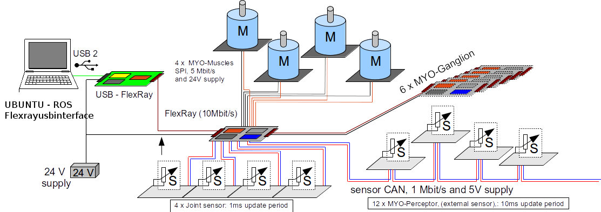

Introduction
============

The control of highly coupled and compliant musculoskeletal systems is
a complex task. In contrast to the well established control concepts
of stiff robots widely used in industry, control strategies and
algorithms for musculoskeletal systems are still areas of active
research. In order to experiment with advanced control algorithms, it
is desirable to have a set of simple linear controllers to control the
muscle state. This baseline system fulfils two purposes; it provides a
benchmark against which more advance control schemes can be tested
and, perhaps more importantly, it provides a control interface that
can be utilised by advanced and higher level control algorithms.

In order to run a range of linear (feedback) controllers on the
MYO-Muscles, a control environment for sensing, processing and
actuation is required. Due to the modular nature of the Myorobotic
system, a heterogeneous and distributed control infrastructure has
been devised. It allows the Myorobotics developers and users to test
and control their Myorobot through the MYO-Muscles. In the following
document, the main components of the control system are described from
both a hardware and software perspective.

Overview
========

An overview of the distributed control system is presented in :numref:`EAESS_my-figure`.
The Myorobotics system consists of:

- a PC (Ubuntu 16.04 or newer with a working installation of the Robot Operating System - ROS),
- a Flexray2USB adapter board
- up to 6 ganglia (intermediary controller boards)
- up to 4 'motors with driver boards' per connected ganglion

.. _EAESS_my-figure:

   Overview of the Myorobotics distributed control infrastructure.

   The PC communicates with the Flexray2USB adapter via a USB 2.0
   interface.
   The Flexray2USB board establishes the link between the FlexRay bus (the main Myorobotics communication system) and the PC.
   All ganglia are connected to the same Flexray bus, which is controlled by the Flexray2USB board.
   Each ganglion can control up to 4 motor driver boards and their motors via an SPI interface.

A Myrobotics system consists of up to 6 MYO-Ganglions, which are local
32-bit floating point electronic control units (ECU) that communicate
via the FlexRay bus. Each MYO-Ganglion can control up to four MYO-Musles
in different control modes. The communication between the MYO-Muscles
and the MYO-Ganglion is established via four dedicated 5Mbit/s SPI
connections. Up to four joints can also be connected to a MYO-Ganglion.
These joints share a common controller area network (CAN) bus and
communicate their absolute joint position at a rate of 1kHz. The same
CAN bus is also utilised to read the state of up to 12 MYO-Perceptors,
scalar sensors that can be used for various purpuses like tactile or
temperature sensing. These sensors broadcast their sensory state at a
rate of 100Hz.
