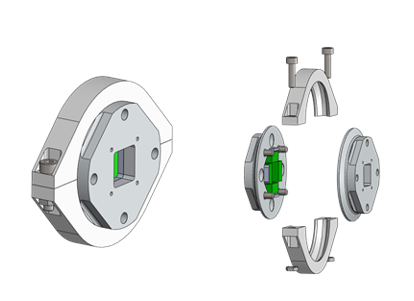
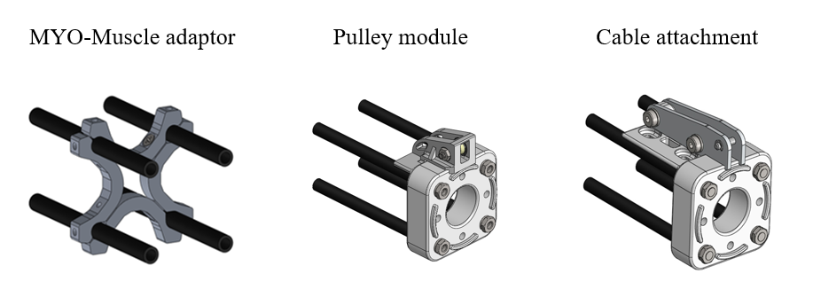
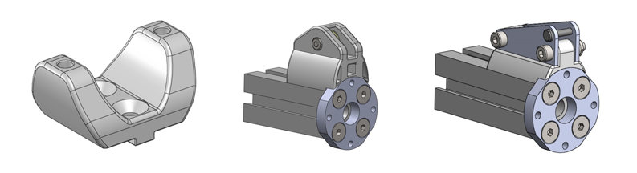
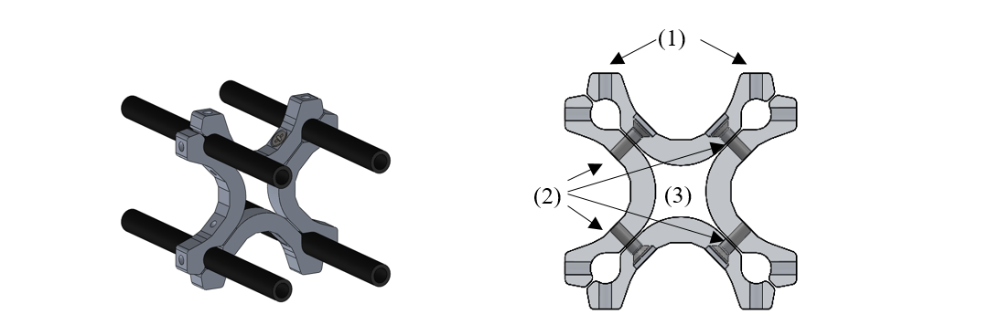
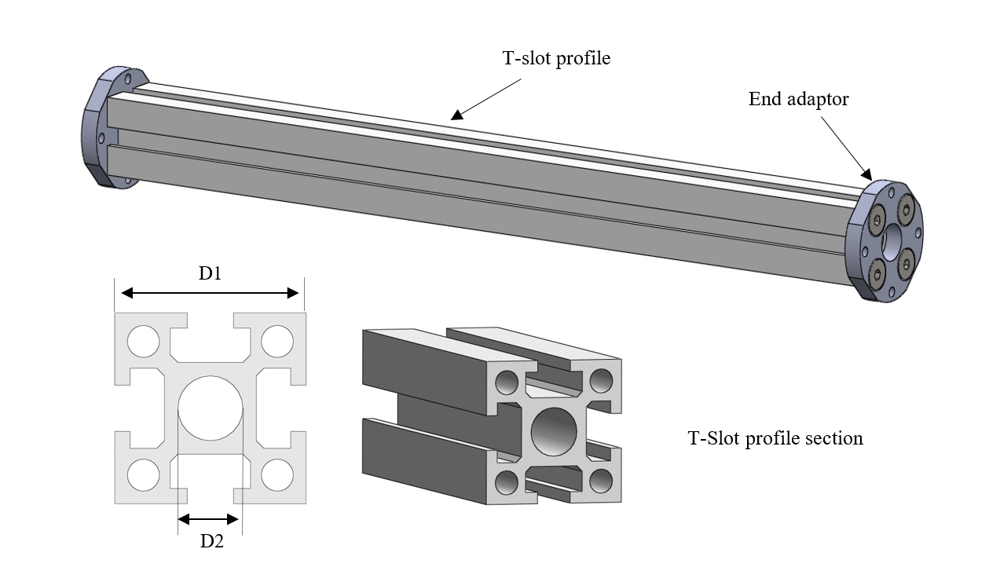
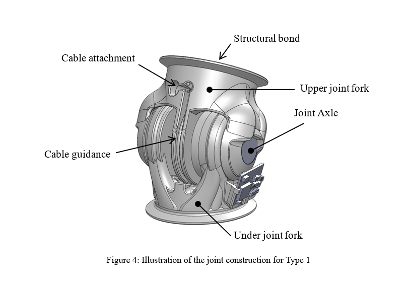

Introduction
======================

The deliverable in hand is the fourth deliverable of WP3, which aims at
developing and production of modular hardware elements, called Design
Primitives, suitable for building musculoskeletal robots. The content of
this document is grounded on the work performed so far in Tasks 3.1 to
3.6 of WP3.

This deliverable presents the Design Primitives of the 2\ :sup:`nd`
generation that were developed by Fraunhofer and delivered to the other
project partners in the context of D3.3 (the electronic modules
developed by BRL are not presented here, as they are presented in
details in Deliverable D6.4). It also gives an overview of the
techniques used for the production of the mechanical parts and the
assembly steps for each hardware module. For the sake of clarify the
detailed information about the designs (including the bill of materials,
the CAD files and drawings) are not included in this document, but made
available on the project repository.

At the end of the deliverable, other developments and designs developed
during the project but not yet included in the toolkit are also
presented.

Content of the design primitive library
=======================================

Organization and description of the library elements
----------------------------------------------------

To simplify the presentation of the library elements and provide a
framework for future extensions, the developed hardware elements are
organized, for each DP functional category, using the following
hierarchical classification:

Types        (T)    are used to distinguish the hardware elements on the basis of their design principle.
Varieties    (V)    are used, if needed, to distinguish the hardware elements based on the same design principles, on the basis of the technical implementation.

The description of each variety follows the following structure:

+----------------------------------+--------------------------------------------------------------------------------------------------------------------------------+
| Illustrations                    | regroup figure and graphics illustrating the library element and its main features                                             |
+==================================+================================================================================================================================+
| Dimensions                       | list the element’s most important dimensions                                                                                   |
+----------------------------------+--------------------------------------------------------------------------------------------------------------------------------+
| Features                         | provide a textual explanation of the element’s main features                                                                   |
+----------------------------------+--------------------------------------------------------------------------------------------------------------------------------+
| Material and fabrication         | detail the materials and fabrication methods foreseen for the various parts of the library element                             |
+----------------------------------+--------------------------------------------------------------------------------------------------------------------------------+
| Integration of the electronics   | if needed, provides more details about the embedded electronic component and their integration in the hardware element         |
+----------------------------------+--------------------------------------------------------------------------------------------------------------------------------+
| Accessories                      | lists the additional pieces of hardware usable with the library element, if any                                                |
+----------------------------------+--------------------------------------------------------------------------------------------------------------------------------+
| Implemented instances            | list the instances of the hardware elements that have been implemented so far, with their corresponding names and dimensions   |
+----------------------------------+--------------------------------------------------------------------------------------------------------------------------------+

Overview of the implemented library elements
--------------------------------------------

Mechanical couplings
~~~~~~~~~~~~~~~~~~~~

Structural Bond

Type 1: Flange clamp with conical flange

.. _D3.4_image1:

   Variety 1 (D3.4 - page 13)

Anchor Fastener

Type 1: Screw Fasteners

.. _D3.4_image3:

  Variety 1 (D3.4 - page 18)

Cable attachment

Type 1: Through hole

.. _D3.4_image4:
.. figure:: images/image4.png
  :align: center

  (D3.4 - page 19)

Type 2: Conical socket

.. _D3.4_image5:
.. figure:: images/image5.png
  :align: center

  (D3.4 - page 19)

Design Primitives
~~~~~~~~~~~~~~~~~

MYO-Bones

Type 1: Parallel Assemblies

Variety 1 (D3.4 - page 21)

.. _D3.4_image7:

  Four Round Tubes Fibres

.. _D3.4_image8:

  Accessories: 	MYO-Muscle adaptor	Pulley module	 Cable attachment

Type 2: Monolithic core

Variety 1 (D3.4 - page 31)

.. _D3.4_image11:
.. figure:: images/image11.png
  :align: center

  T-slot profile

.. _D3.4_image12:

  Accessories: 	MYO-Muscle adaptor	Pulley module	 Cable attachment

MYO-Joints

Type 1: Symmetric Hinge

.. _D3.4_image15:

  Variety 1 (D3.4 - page 35)

Type 2: Asymmetric Hinge

.. _D3.4_image16:

  Variety 1 (D3.4 - page 43)

.. _D3.4_image17:
.. figure:: images/image17.png
  :align: center

  Variety 2 (D3.4 - page 44

Type 3: Pivot

.. _D3.4_image18:
.. figure:: images/image18.png
  :align: center

  Variety 1 (D3.4 - page 50)

Type 4: Hinge-Pivot

.. _D3.4_image19:
.. figure:: images/image19.png
  :align: center

  Variety 1 (D3.4 - page 56)

Type 5: Hinge-Hinge

.. _D3.4_image20:
.. figure:: images/image20.png
  :align: center

  Variety 1 (D3.4 - page 60)

MYO-Muscles

Type 0: Passive Muscle

Variety 1 (D3.4 - page 65)

.. _D3.4_image21:
.. figure:: images/image21.png
  :align: center

  Simple spring

Type 1: Unilateral Series Elastic Actuator

Variety 1 (D3.4 - page 65)

.. _D3.4_image23:

  Compression spring

MYO-Ganglion

Type 1: ECU with FlexRay bus (page 73)

.. _D3.4_image24:
.. figure:: images/image24.png
  :align: center

Structural Bond
===============

Type 1: Flange clamp with conical flange
----------------------------------------

The structural bond is made of the following elements:

-  Two *flange plates* which include the conical flanges. The
   side-plates can be integrated in the bone or joint, on one or both
   sides.

-  One *clamp ring* which clamps the two flange plates together.

-  An e\ *lectrical interface* with spring contacts

Variety 1: Screwed Half Clamps
~~~~~~~~~~~~~~~~~~~~~~~~~~~~~~

In this implementation, the clamp ring is implemented in two parts. The
pressure of the clamp ring on the conical flanges is ensured by two
screws.

Illustrations
^^^^^^^^^^^^^

Overview:

.. _D3.4_image25:
.. figure:: images/image25.png
  :align: center

Individual elements:

.. _D3.4_image26:
.. figure:: images/image26.png
  :align: center

Dimensions

+------+----------------------------------------------------------------------------------+
| D1   | distance between the outer faces of the clamp ring                               |
+======+==================================================================================+
| D2   | diameter of the clamp ring along its short axis                                  |
+------+----------------------------------------------------------------------------------+
| D3   | diameter of the clamp ring along its long axis                                   |
+------+----------------------------------------------------------------------------------+
| D4   | radius of the square pattern of the pins                                         |
+------+----------------------------------------------------------------------------------+
| D5   | radius of the square pattern of the screws                                       |
+------+----------------------------------------------------------------------------------+
| D6   | total thickness of the flange (conical and cylindrical section)                  |
+------+----------------------------------------------------------------------------------+
| D7   | width of the flange, i.e. difference between the outer and inner flange radius   |
+------+----------------------------------------------------------------------------------+
| D8   | thickness of the cylindrical section of the flange                               |
+------+----------------------------------------------------------------------------------+
| D9   | diameter of the central hole of the flange plates                                |
+------+----------------------------------------------------------------------------------+

Implemented instances:

+--------------------------+----------------+--------+--------+
| Reference                | SB-SC2-T1-V1   |        |        |
+==========================+================+========+========+
| Corresponding DP-Class   | II             |        |        |
+--------------------------+----------------+--------+--------+
| Dimensions               | D1             | 8      | [mm]   |
+--------------------------+----------------+--------+--------+
|                          | D2             | 50     | [mm]   |
+--------------------------+----------------+--------+--------+
|                          | D3             | 62     | [mm]   |
+--------------------------+----------------+--------+--------+
|                          | D4             | 15     | [mm]   |
+--------------------------+----------------+--------+--------+
|                          | D5             | 16     | [mm]   |
+--------------------------+----------------+--------+--------+
|                          | D6             | 3      | [mm]   |
+--------------------------+----------------+--------+--------+
|                          | D7             | 4      | [mm]   |
+--------------------------+----------------+--------+--------+
|                          | D8             | 1      | [mm]   |
+--------------------------+----------------+--------+--------+
|                          | D9             | 24,5   | [mm]   |
+--------------------------+----------------+--------+--------+

Features:

Flange plates:

1) The flange plates are fixed to the joint or bone assembly using a
   square screw pattern

2) The flange plates can also be integrated in the bone or joint
   construction

3) The two flange plates are additionally connected via a set of up to
   four pins. They prevent the relative rotation of the flange plates
   along the longitudinal axis and contribute to transmit the torsion
   moment.

4) The flange plates have an octagon in their centre to fix the
   electronic interface in it

Clamp ring:

1) The clamp ring is made of two parts, joined together by two screws

Material and fabrication

+----------------+-----------------+-------------------------+
| Element name   | Material        | Fabrication processes   |
+================+=================+=========================+
| flange plate   | aluminium       | -  machining            |
+----------------+-----------------+-------------------------+
|                | polyamid (PA)   | -  laser sintering      |
+----------------+-----------------+-------------------------+
| clamp ring     | polyamid (PA)   | -  laser sintering      |
+----------------+-----------------+-------------------------+

Integration of the electronics

In order to implement power (24V) and communication (FlexRay)
connectivity, PCBs with spring loaded contacts are integrated into the
structural bonds. These circuit boards have a reverse polarity
protection and were tested on their current carrying capability and can
perform up to 20A.

.. _D3.4_image32:
.. figure:: images/image32.png
  :align: center

  Structural Bond with electronic interface

Anchor – Fastener
=================

Type 1: Screw Fasteners
-----------------------

This basic type of anchor-fastener is simply made of a set of threads
placed on a DP, on which another DP can be attached using screws.

Variety 1: Pair of Screws
~~~~~~~~~~~~~~~~~~~~~~~~~

This variety uses two screw-thread pairs, whose openings are coplanar.

Illustrations

.. _D3.4_image33:
.. figure:: images/image33.png
  :align: center

Dimensions

+------+-----------------------------------+
| D1   | screw diameter                    |
+======+===================================+
| D2   | depth of the screw hole           |
+------+-----------------------------------+
| D3   | distance between the screw hole   |
+------+-----------------------------------+

Implemented instances

+--------------------------+----------------+------+--------+
| Reference                | AF-SC2-T1-V1   |
+==========================+================+======+========+
| Corresponding DP-Class   | II             |
+--------------------------+----------------+------+--------+
| Dimensions               | D1             | M3   | -      |
+--------------------------+----------------+------+--------+
|                          | D2             | 5    | [mm]   |
+--------------------------+----------------+------+--------+
|                          | D3             | 30   | [mm]   |
+--------------------------+----------------+------+--------+

Cable attachment
================

Type 1: Through hole
--------------------

Overview

.. _D3.4_image34:
.. figure:: images/image34.png
  :align: center

Dimensions

+------+-------------------------+
| D1   | cable diameter          |
+======+=========================+
| D2   | hole chamfer distance   |
+------+-------------------------+
| D3   | hole chamfer angle      |
+------+-------------------------+

Implemented instances

+--------------------------+-------------+-------+--------+
| Reference                | CA-SC2-T1   |
+==========================+=============+=======+========+
| Corresponding DP-Class   | II          |
+--------------------------+-------------+-------+--------+
| Dimensions               | D1          | 1.6   | [mm]   |
+--------------------------+-------------+-------+--------+
|                          | D2          | 1     | [mm]   |
+--------------------------+-------------+-------+--------+
|                          | D3          | 45    | [°]    |
+--------------------------+-------------+-------+--------+

Type 2: Conical socket
----------------------

In this type, the cable-end and the corresponding socket, have a conical
shape.

Overview

.. _D3.4_image35:
.. figure:: images/image35.png
  :align: center

Dimensions

+------+----------------------------------+
| D1   | cable diameter                   |
+======+==================================+
| D2   | end connector maximum diameter   |
+------+----------------------------------+
| D3   | end connector length             |
+------+----------------------------------+
| D4   | end connector minimum diameter   |
+------+----------------------------------+

Implemented instances

+--------------------------+-------------+-------+--------+
| Reference                | CA-SC2-T2   |                |
+==========================+=============+=======+========+
| Corresponding DP-Class   | II          |                |
+--------------------------+-------------+-------+--------+
| Dimensions               | D1          | 2     | [mm]   |
+--------------------------+-------------+-------+--------+
|                          | D2          | 6     | [mm]   |
+--------------------------+-------------+-------+--------+
|                          | D3          | 10    | [mm]   |
+--------------------------+-------------+-------+--------+
|                          | D4          | 4,8   | [mm]   |
+--------------------------+-------------+-------+--------+

Features

1) The cable-end has a conical shape to allow a better distribution of
   the transmitted force.

2) The cable runs through the cylindrical channel of the cable-end.

3) To fix the cable to the cable-end, a knot is made at the end of the
   cable, which is melted to prevent the knot to loosen. This knot is
   larger than the cylindrical channel and therefore applies the cable
   force on the internal cylindrical surface of the cable-end.

4) The conical cable-end can be secured in a cylindrical socket built in
   one of the Design Primitives

Material and fabrication

+----------------+----------------------+------------------------------------+
| Element name   | Material             | Fabrication processes              |
+================+======================+====================================+
| cable-end      | aluminium or brass   | -  standard component, machining   |
+----------------+----------------------+------------------------------------+

.. _D3.4_image36:
.. figure:: images/image36.png
  :align: center

Conical socket with HPPE cable

MYO-Bone
========

Type 1: Parallel Assemblies
---------------------------

This bone type implements the design principle “Parallel assemblies”.
The bone is designed as an assembly made of three types of elements (see
:numref:`D3.4_image37`):

-  Elongated structural profiles, hereafter called *fibres*, form the
   main structural element.

-  Transverse *spacers* bind the fibres together and increase the
   assembly stiffness and strength. The spacers are shaped to allow the
   compact integration of other DPs and the electric cabling.

-  *End-spacers* are spacers placed on each end of the bone, which
   provide additional interfaces.

Together, the fibres and the spacers are making up the bone
core, while the end-spacers play the role of the bone ends.

.. _D3.4_image37:
.. figure:: images/image37.png
  :align: center

  Illustration of the bone construction Type 1 – “Parallel Assemblies”

Variety 1: Four Round Tube Fibres
~~~~~~~~~~~~~~~~~~~~~~~~~~~~~~~~~

This variety takes inspiration of the *ThorLabs Cage System*
[Web-ThorLabs]. A rigid cage system used to align optical components
along a common optical axis. Four tubes with round cross sections are
used as fibres and they are placed so that the intersections of the
fibre longitudinal axes with the transverse plane are located at the
vertex of a square.

Illustrations

Overview:

.. _D3.4_image38:

.. _D3.4_image39:

Individual elements:

.. _D3.4_image40:
.. figure:: images/image40.png
  :align: center

Dimensions

+------+--------------------------------------------+
| D1   | Diameter of the round tubes.               |
+======+============================================+
| D2   | Distance between two adjacent fibres.      |
+------+--------------------------------------------+
| D3   | Distance between two successive spacers.   |
+------+--------------------------------------------+

Implemented instances

+--------------------------+------------------+-------+--------+
| Reference                | BONE-SC2-T1-V1   |                |
+==========================+==================+=======+========+
| Corresponding DP-Class   | II               |                |
+--------------------------+------------------+-------+--------+
| Dimensions               | D1               | 6     | [mm]   |
+--------------------------+------------------+-------+--------+
|                          | D2               | 30    | [mm]   |
+--------------------------+------------------+-------+--------+
|                          | D3               | 50    | [mm]   |
+--------------------------+------------------+-------+--------+
|                          | M                | 188   | [g]    |
+--------------------------+------------------+-------+--------+

Features

Fibres:

1) The fibres are implemented with standard tubes with a round section.

2) Each fibre is terminated with two inserts equipped with screw
   threads.

3) The inserts are glued to or pressed in each of the tube.

Spacers:

4) The spacers are attached to the fibres using flexure clamps.

5) The spacers are shaped to allow the integration of the muscle, close
   to the central axis on the four lateral sides of the bone.

6) The spacers have a central hole to let the electric cables run
   through them.

End-spacers:

7) The fixation of the fibres to the end-spacers is achieved via a screw
   connection.

8) The end-spacers also have a central hole to let the electric cables
   run through them.

Attachment points:

9) Each end-spacer has a screw pattern to attach one side of a SB.

10) Each section of fibre between two successive spacers can be used to
   attach one or more anchor carriers (see Accessories).

Material and fabrication

+----------------+----------------------+------------------------------------+
| Element name   | Material             | Fabrication processes              |
+================+======================+====================================+
| tube           | steel or composite   | -  purchase (standard component)   |
|                |                      |                                    |
|                |                      | -  cut to length                   |
+----------------+----------------------+------------------------------------+
| insert         | steel                | -  standard component              |
+----------------+----------------------+------------------------------------+
| spacers        | aluminium            | -  water-jet cutting               |
|                |                      |                                    |
|                |                      | -  machining                       |
+----------------+----------------------+------------------------------------+
|                | PA                   | -  laser sintering                 |
+----------------+----------------------+------------------------------------+
| end-spacers    | PA                   | -  laser sintering                 |
+----------------+----------------------+------------------------------------+

Accessories

MYO-Muscle adaptor

.. _D3.4_image41:

Features:

1) The adaptor implements four anchor points of type AF-SCX-T1-V1, one
   on each of the four sides of the bone core.

2) The four parts making up the carrier are fixed to each other with
   screws.

3) Like the spacers, the carrier is shaped to allow the compact
   integration of the muscles and has a hole in the middle to let the
   electric cables run through.

Pulley module

.. _D3.4_image42:
.. figure:: images/image42.png
  :align: center

Features:

1) The pulley module includes a closed profile to keep the cable in
   place.

2) The guide sleeve has a shape that aligns the cable. Additionally its
   supporting shaft has two ball bearings to minimize the friction.

3) The pulley is shaped to allow a fast attachment to the parallel
   fibres.

4) The connector allows a secure lock of up to four pulleys. It has a
   hole in the middle to let the electric cables run through and an
   opening to allow an easy insertion.

Cable attachment

.. _D3.4_image43:
.. figure:: images/image43.png
  :align: center

 Features:

1) The end of the tendon cable is secured with a pin that can be quickly
mounted or unmounted

2) The construction includes two aluminium plates that can be easily
exchanged to adjust the pin position with respect to the end of the
MYO-Bone

3) The cable attachment is shaped to allow a fast mounting to the
parallel fibres and is fixed to them by clamping (using another cable
attachment on the opposite side of the MYO-Bone)

4) Up to four cable attachments can be mounted at the end of the
MYO-Bone, while leaving sufficient space in the middle to let the
electric cables run through.

In-house production manual

Production of the fibers

Step 1: Cut fibres to the desired length

.. _D3.4_image44:
.. figure:: images/image44.png
  :align: center

Cut the fibres to the desired length.

Tips:
-	Lathe can create a precise cut and avoids damaging the tube

Step 2: Mill the tube ends

.. _D3.4_image45:
.. figure:: images/image45.png
  :align: center

Mill the inside hole of both tube ends in order to create a rough surface for gluing.

Tips:
-	Use a round moulding cutter with an automatic screwdriver
-	Use gloves to protect you from dust

Step 3: Positioning of the tube length

.. _D3.4_image46:
.. figure:: images/image46.png
  :align: center

Insert the tubes in the tube holding-support and position the tubes with the distance support. Fix the tubes with the screws.

Step 4: Gluing threaded pin in tube ends

.. _D3.4_image47:
.. figure:: images/image47.png
  :align: center

Add glue evenly to the threaded pin and hole. Use the distances according to the MYO-Bone class

Tips:
-	While drying, use a fixture to keep the thread pin and fibre centred and at the correct distance
-	Wear protective gloves

Step 5: Remove the leftover glue

.. _D3.4_image48:
.. figure:: images/image48.png
  :align: center

Remove the glue with a cutter knife. Consider the hardening-time of the glue.

Production of spacers

Step 1: Water-jet

.. _D3.4_image49:
.. figure:: images/image49.png
  :align: center

Order water-jet cut part shape (aluminium)

Step 2: Drilling and threading of holes

.. _D3.4_image50:
.. figure:: images/image50.png
  :align: center

Drill and thread the holes of the flexure clamps.

Tips:
-	Put small fibers in the flexure clamps to avoid deformation caused by the pressure exerted by the drill bit

Production of the other parts

.. _D3.4_image51:
.. figure:: images/image51.png
  :align: center

End Spacer:
-	Selective Laser Sintering (Polyamide)

SB Flange plate:
-	Machining (Aluminium)
-	Selective Laser Sintering  (Polyamide)

Screws, nuts and washers are standard parts

Assembly

.. _D3.4_image52:

Material needed
4 x 	CFRP tubes with threaded ends

4 x 	spacers
16 x 	M2.5x10 countersunk head screw (DIN 965)

2 x 	end spacer
8 x 	M4 thin nut (DIN 39)
8 x 	M4 spring washer (DIN 127)

2 x 	SB flange plates
8 x 	M3x25 countersunk head screw (DIN 7991)
8 x 	M3 thin nut (DIN 39)
8 x 	M3 spring washer (DIN 6798)

Step 1: Assemble fibres and spacers

.. _D3.4_image53:

Slide the fibres (1) in the flexure clamps (2) of the spacers.

Tips:
-	Slide one fibre through all spacers, and then go on with the next fibre
-	Flexure clamp screws should be loose
-	In preparation for next step, regroup the spacers next to each other

Step 2: Plug fibres in the end-spacer

.. _D3.4_image54:
.. figure:: images/image54.png
  :align: center

Plug each fibre in one of the holes of the end-spacer.

Tips:
-	Apply sufficient pressure so that the end of the cfc tube is in contact with the shoulder at the bottom of the hole
-	Do not press the fibers firmly into the holes

Step 3: Screw fibres to the end spacer

.. _D3.4_image55:
.. figure:: images/image55.png
  :align: center

Screw each of the fibers to the end-spacer using the M4 nuts and the large spring washers.

Tips:
-	Screw the nut until the spring washer is nearly flat, not more
-	(if you screw further, you may pull the threaded pin out of the tube)

Step 4: Attach the other end-spacer

.. _D3.4_image56:

Repeat steps 2 & 3 for the other end-spacer.

Tips:
-	Make sure the end-spacers are as much as possible:
-	Parallel to each other
-	Perpendicular to the fibres
-	Lay the bone on the table to ensure that it is not twisted

Step 5: Adjust the spacers

.. _D3.4_image57:
.. figure:: images/image57.png
  :align: center

Arrange the spacers equidistantly between the two end-spacers.

Tips:
-	Distance between spacers: 51 to 52 mm
-	Ensure that the spacers are perpendicular to the fibres

Step 6: Check straightness

.. _D3.4_image58:
.. figure:: images/image58.png
  :align: center

Check that the MYO-Bone is straight and that both end-spacers are parallel to each other.

If necessary proceed to adjustments.

Step 7: Attach the SB flange plates

.. _D3.4_image59:
.. figure:: images/image59.png
  :align: center

Screw the SB flange plates to the end-spacers with the M3 screws.

Use the small spring washers together with the M3 nuts (backside).

Type 2 – Monolithic core
------------------------

This bone type implements the design principle “Monolithic core”. The
bone is designed as a solid aluminium profile with an *end adaptor* on
each side of the bone.

Variety 1 – T-slot profile
~~~~~~~~~~~~~~~~~~~~~~~~~~~

In this variant, a T-slot profile is used, enabling the easy fixation of
design primitives or accessories on the MYO-Bone structure using nuts
fitting in the T-slot.

.. _D3.4_image60:

Dimensions

+------+--------------------------------+
| D1   | Width of the profile section   |
+======+================================+
| D2   | Diameter of the centre hole    |
+------+--------------------------------+

Implemented instances

+--------------------------+------------------+-------+--------+
| Reference                | BONE-SC2-T2-V1   |                |
+==========================+==================+=======+========+
| Corresponding DP-Class   | II               |                |
+--------------------------+------------------+-------+--------+
| Dimensions               | D1               | 25    | [mm]   |
+--------------------------+------------------+-------+--------+
|                          | D2               | 8.5   | [mm]   |
+--------------------------+------------------+-------+--------+
|                          | M                | 255   | [g]    |
+--------------------------+------------------+-------+--------+

Features

Aluminium profile:

1) The profile is standard aluminium T-slot profile with a square
   section. According to the shape of profile, it is possible to fix the
   muscle in any place along the profile.

2) The profile has a high stiffness against torsion and bending.

3) The channel in the centre of the profile can host the electric cables
   running through the bone. A hole must be drilled at the desired
   position to let the electrical cables in and out.

Adaptor:

1) The end adaptor is screwed to the aluminium profile using the four
   peripheral holes that can easily be threaded

2) The end adaptor has a central hole to let the electric cables run
   through it.

3) The end adaptor has a screw pattern to attach one side of a SB

Material and fabrication

+------------------+-------------+---------------------------------+
| Element name     | Material    | Fabrication processes           |
+==================+=============+=================================+
| T-slot profile   | aluminium   | -  purchase                     |
|                  |             |                                 |
|                  |             | -  cut to length                |
+------------------+-------------+---------------------------------+
| End adaptor      | aluminium   | -  water-jet cutting            |
|                  |             |                                 |
|                  |             | -  post-processing: machining   |
+------------------+-------------+---------------------------------+

Accessories

MYO-Muscle Adaptor

.. _D3.4_image61:

Features:

1) Each adaptor implements one anchor point of type AF-SCX-T1-V1.

2) Two adaptors are required to attach one MYO-Muscle.

3) Each adaptor is attached with two screws on one of the four sides of
   the T-Slot profile.

Pulley module

.. _D3.4_image62:

Features:

1) The pulley module includes a closed profile to keep the cable in
   place.

2) The guide sleeve has a shape that aligns the cable. Additionally its
   supporting shaft has two ball bearings to minimize the friction.

3) The pulley module is shaped to allow a fast attachment with one screw
   to the profile.

Cable attachment

.. _D3.4_image63:
.. figure:: images/image63.png
  :align: center

Features:

1) The end of the tendon cable is secured with a pin that can be quickly
   mounted or unmounted

2) The construction includes two aluminium plates that can be easily
   exchanged to adjust the pin position with respect to the end of the
   MYO-Bone

3) The cable attachment is shaped to allow a fast attachment with two
   screws to the profile.

In-house production manual

Profile

Step 1: Cut profiles to the desired length

.. _D3.4_image64:
.. figure:: images/image64.png
  :align: center

Cut the profiles to the desired length.

Tips:
-	Using circular saw creates a suitable cut and provides a good surface.

Step 2: Thread the holes at both ends of the profile

.. _D3.4_image65:
.. figure:: images/image65.png
  :align: center

•	Drill first the holes with a ∅ 4,2 mm bit
•	Thread with a M5 tap

Adaptor

Step 1: Order water-jet cut parts

.. _D3.4_image66:
.. figure:: images/image66.png
  :align: center

Order water-jet cut part shape

Step 2: Countersinking of holes

.. _D3.4_image67:
.. figure:: images/image67.png
  :align: center

Countersink the M5 clearance holes for the fixation to the profile

**Assembly**

.. _D3.4_image68:
.. figure:: images/image68.png
  :align: center

**Material needed**

1X       Aluminum profile with threaded ends

2X       Adaptor

8X       M5 countersunk head screw (DIN 965)

2X       SB flange plates

8X       M3x25 countersunk head screw (DIN 7991)

8X       M3 thin nut (DIN 31)

8X       M3 spring washer (DIN 6798)

**Step 1: Assemble profile and adaptors**

.. _D3.4_image69:

Screw the adaptors at the end of the profile with the M5 screws.

 **Step 2: Attach the SB flange plates**

.. _D3.4_image70:

Screw the SB flange plates to the adaptors with the M3 screws and nuts.
Tips:
•	Use the small spring washers together with the M3 nuts (backside)

**Step 3: Drill the profile for electric cables outlet (if necessary)**

.. _D3.4_image71:
.. figure:: images/image71.png
 :align: center

Drill an outlet for the electric cables at the suitable position.

MYO-Joint
=========

Type 1: Symmetric Hinge
-----------------------

This joint type provides 1 DoF of rotation along an axis parallel to the
joint end planes. The provided angular range of rotation is *symmetric*
with respect to the axis perpendicular to its interface plane provided
by the structural bond. This DoF is provided by a combination of axle
and rotational bearings. The basic structure of the joint is illustrated
in Figure 4.

Both joint ends are shaped as forks (the *upper-* and *under joint*
*forks*) and provide an interface for the structural bond. The
electrical interfaces on both joint ends are embedded in the structural
bonds and the space between the upper and under fork is used for the
electrical cabling. The attachment and guidance for the cable
transmission are placed centrally for a symmetrical application of the
force on the bearings.

.. _D3.4_image72:

 Illustration of the joint construction for Type 1

Variety 1
~~~~~~~~~

This implementation uses two axles placed on each side of the joint,
supported by ball bearings to reduce the friction and increase the
efficiency of the joint. Between the two axles, a disk-like structure is
used to guide the cable while insuring a constant lever arm with respect
to the joint rotation axis. The absolute position of the joint is
measured using a Hall-effect sensor, comprising a magnet embedded in one
of the axles and an electronic board located inside the joint. The
corresponding sensor interface module (SIM) is located on the outside of
the joint to be easily accessible for configuration purpose.

**Illustrations**

.. _D3.4_image73:
.. figure:: images/image73.png
 :align: center

.. _D3.4_image74:
.. figure:: images/image74.png
:align: center

**Dimensions**

+-----+-------------------------------------+
| H   | Distance between joint end planes   |
+=====+=====================================+
| W   | Maximal width of the joint          |
+-----+-------------------------------------+
| T   | Maximal thickness of the joint      |
+-----+-------------------------------------+
| X   | Height of the tilt axis             |
+-----+-------------------------------------+
| Θ   | Motion range of the joint           |
+-----+-------------------------------------+

**Implemented instances**

+--------------------------+-------------------+-------+--------+
| Reference                | JOINT-SC2-T1-V1   |                |
+==========================+===================+=======+========+
| Corresponding DP-Class   | II                |                |
+--------------------------+-------------------+-------+--------+
| Dimensions               | H                 | 60    | [mm]   |
+--------------------------+-------------------+-------+--------+
|                          | W                 | 55    | [mm]   |
+--------------------------+-------------------+-------+--------+
|                          | T                 | 36    | [mm]   |
+--------------------------+-------------------+-------+--------+
|                          | X                 | 29    | [mm]   |
+--------------------------+-------------------+-------+--------+
|                          | Θ                 | 140   | [°]    |
+--------------------------+-------------------+-------+--------+
|                          | M                 | 70    | [g]    |
+--------------------------+-------------------+-------+--------+

**Features**

Under joint fork:

1) Both bearings are implemented in the under joint fork.

2) Two mechanical stoppers limit the motion range of the joint.

3) The structural bond (SB) is integrated on the under joint fork.

4) The topology of the force transmitting volume from the SB to the
   joint axis is optimised.

5) A holding device allows attaching a SIM-board on the side.

Upper joint fork:

6) Two cable attachments (CA-SC2-T2), allowing the bidirectional
   actuation of the joint, and a continuous guide for the cables are
   implemented.

7) The SB is integrated on the upper joint fork.

8) The topology of the force transmitting volume from the SB to the
   joint axis is optimised

9) The “neck” of the upper joint fork features a location to add an
   extension, providing if necessary additional CA on the joint.

10) Both shafts of the joint are implemented with interference fit.

Sensor and electrical interfaces:

11) The sensor board and its protection cap can be easily fixed on the
   under joint fork.

12) To measure the movement between the joint parts, the magnet element
   of the sensor is mounted in the shaft.

13) The electrical interfaces are small PCBs which are embedded in the
   structural bonds.

14) Openings and cable channels are implemented to enable the electrical
   cabling between sensor and SIM-board (described in Deliverable 4.1)
   and between the electrical interfaces of the structural bonds on both
   sides of the joint.

**Material and fabrication**

+--------------------+------------------+------------------------------------+
| Element name       | Material         | Fabrication processes              |
+====================+==================+====================================+
| Upper hinge part   | Polyamide (PA)   | -  laser sintering                 |
|                    |                  |                                    |
| Lower hinge part   |                  |                                    |
|                    |                  |                                    |
| Sensor cap         |                  |                                    |
+--------------------+------------------+------------------------------------+
| Shaft              | Aluminium        | -  machining                       |
+--------------------+------------------+------------------------------------+
| Bearing            | Steel            | -  purchase (standard component)   |
+--------------------+------------------+------------------------------------+

**Assembly Procedure**

.. _D3.4_image75:

:align: center

Material needed:

1 x Upper hinge part

1 x Lower hinge part

1 x Sensor cap

2 Bearings 625 5x16x5 mm

1 x shaft left side

1 x shaft sensor side

4 data wires 0,25 mm\ :sup:`2`

2 power wires highly flexible silicon 1,5 mm\ :sup:`2`

2 x connector boards, four spring contacts

8 x M1,6 x 6

+-----------------------------------+--------------------------------------------------------------------------------+
| **Step 1: Mount sensor board **   |                                                                                |
+===================================+================================================================================+
| |image84|                         | Push the sensor cables through the cable channel.                              |
|                                   |                                                                                |
|                                   | Place the sensor board on the pins and glue on two points.                     |
|                                   |                                                                                |
|                                   | Tips:                                                                          |
|                                   |                                                                                |
|                                   | -  for pre fixation of the board melt the plastic pins with a soldering iron   |
+-----------------------------------+--------------------------------------------------------------------------------+

+-----------------------------------+-----------------------------------------------------------+
| **Step 2: Glue sensor cap**       |
+===================================+===========================================================+
| |image85|                         | Put glue on the sensor cap and screw it on the housing.   |
|                                   |                                                           |
|                                   | Tips:                                                     |
|                                   |                                                           |
|                                   | -  just a small amount of glue is needed                  |
+-----------------------------------+-----------------------------------------------------------+
| **Step 3: Mount Ball Bearings**   |                                                           |
+-----------------------------------+-----------------------------------------------------------+
| |image86|                         | Put the ball bearings in the housing on both sides.       |
+-----------------------------------+-----------------------------------------------------------+

+---------------------------------------------------+-----------------------------------------------------+
| **Step 4: Assemble upper and under hinge part**   |
+===================================================+=====================================================+
| |image87|                                         | Assemble the upper and under hinge part.            |
|                                                   |                                                     |
|                                                   | Plug in the shafts to fix the joint parts.          |
|                                                   |                                                     |
|                                                   | Tips:                                               |
|                                                   |                                                     |
|                                                   | - The shaft with magnet must on the sensor side     |
|                                                   |                                                     |
|                                                   | - For better fixation put lock tide on the shafts   |
+---------------------------------------------------+-----------------------------------------------------+

+-------------------------------------------+----------------------------------------------------------+
| **Step 5: Connect cables to the board**   |
+===========================================+==========================================================+
| |image88|                                 | Prepare cable tree on connector boards                   |
|                                           |                                                          |
|                                           | Cut on 15 cm length:                                     |
|                                           |                                                          |
|                                           | 4 data wires 0,25 mm\ :sup:`2`                           |
|                                           |                                                          |
|                                           | 2 power wires highly flexible silicon 1,5 mm\ :sup:`2`   |
+-------------------------------------------+----------------------------------------------------------+

+------------------------+-------------------------------------+
| **Step 6: Cabling**    |
+========================+=====================================+
| |image89|\ |image90|   | Place PCB carrier in SB             |
|                        |                                     |
|                        | Push cable tree through the joint   |
+------------------------+-------------------------------------+

+--------------------------------------------------+------------------------------------------------------------------------------------------------------------------------+
| **Step 7: Connect cables to the second board**   |
+==================================================+========================================================================================================================+
| |image91|                                        | Skinning all cables long till the SB-pocket.                                                                           |
|                                                  |                                                                                                                        |
|                                                  | Pull cables through connector board and solder from top. Screw both connector boards to joint with four M1,6 screws.   |
|                                                  |                                                                                                                        |
|                                                  | Tips:                                                                                                                  |
|                                                  |                                                                                                                        |
|                                                  | -  Turn Joint in the position of the longest cable path!                                                               |
|                                                  |                                                                                                                        |
|                                                  | -  Avoid cable crossovers by connecting to board                                                                       |
+--------------------------------------------------+------------------------------------------------------------------------------------------------------------------------+

Type 2: Asymmetric Hinge
------------------------

This joint type provides 1 DoF of rotation along an axis parallel to the
joint end planes. In contrast to the symmetric hinge, the provided
angular range of rotation is *asymmetric* with respect to the axis
perpendicular to its interface plane provided by the structural bond.
Following Principle II, this DoF is provided by a combination of axle
and rotational bearings. The basic structure of the joint is illustrated
in Figure 4.

Both joint ends are shaped as forks (the *upper-* and *under joint*
*forks*) and provide an interface for the structural bond. The
electrical interfaces on both joint ends are embedded in the structural
bonds and the space between the upper and under fork is used for the
electrical cabling. The attachment and guidance for the cable
transmission are placed centrally for a symmetrical application of the
force on the bearings.

|image92|

Variety 1 [obsolete]
~~~~~~~~~~~~~~~~~~~~

This implementation uses a joint axle to the under joint fork and
supported on each side by ball bearings mounted on the upper joint fork
and secured with side covers. The absolute position of the joint is
measured using a Hall-effect sensor, comprising a magnet embedded in the
joint axle and an electronic board located on the side of the joint,
together with its corresponding sensor interface module (SIM). The
electronic boards are integrated in one of the side covers.

|image93|

Given the constraint of asymmetric angular range, it was not possible to
use the same mechanism for cable guidance as for the symmetric hinge
joint, while preserving a compact joint design. Instead, the cable of
the extension muscle is redirected by a guiding pulley (located on the
under joint fork) towards the cable attachment (located on the upper
joint fork) implemented using a pin mounted transversally to the cable
direction.

This cable guidance implementation does not insure a constant lever arm
length, which significantly decreases as the joint flexes, as shown in
Figure 7. Tests performed by ETH showed that this pronounced decrease of
the lever arm length was prejudicial in applications. For that reason
another asymmetric hinge variety was developed, which is described in
the next section.

|image94|

Variety 2
~~~~~~~~~~

This variety has the same basic construction as variety 1 regarding the
joint axle and bearing, as well as the implementation and location of
the absolute position sensing.

The main difference with variety 1 lies in the implementation of the
cable guidance. The guiding pulley and the cable attachment are both
mounted on two metal sheets attached to the sides of the under and upper
joint forks respectively. This construction has two benefits: (1) the
decrease of the lever arm length as the joint flexes can be
significantly reduced and (2) the lever arm length can be easily
adjusted by exchanging the metal sheets. On the other hand, this
configuration increases the risk that the cable jumps out of the guiding
pulley. To prevent this, two mechanisms were devised to centre the cable
attachment (cable centring mechanism) and to keep the cable running on
the pulley (cable catching mechanisms).

|image95|

|image96|
Illustrations
^^^^^^^^^^^^^

|image97|

Dimensions
^^^^^^^^^^

+-----+-------------------------------------+
| H   | Distance between joint end planes   |
+=====+=====================================+
| W   | Maximal width of the joint          |
+-----+-------------------------------------+
| T   | Maximal thickness of the joint      |
+-----+-------------------------------------+
| X   | Height of the rotation axis         |
+-----+-------------------------------------+
| Θ   | Angular range of the joint          |
+-----+-------------------------------------+

|image98|
Implemented instances
^^^^^^^^^^^^^^^^^^^^^

+--------------------------+-------------------+---------+--------+
| Reference                | JOINT-SC2-T2-V2   |
+==========================+===================+=========+========+
| Corresponding DP-Class   | II                |
+--------------------------+-------------------+---------+--------+
| Dimensions               | H                 | 80      | [mm]   |
+--------------------------+-------------------+---------+--------+
|                          | W                 | 66,25   | [mm]   |
+--------------------------+-------------------+---------+--------+
|                          | T                 | 84      | [mm]   |
+--------------------------+-------------------+---------+--------+
|                          | X                 | 40      | [mm]   |
+--------------------------+-------------------+---------+--------+
|                          | Θ                 | 140     | [°]    |
+--------------------------+-------------------+---------+--------+
|                          | M                 | 224     | [g]    |
+--------------------------+-------------------+---------+--------+

Features
^^^^^^^^

Under joint fork:

1) The joint axle is pressed through the under joint fork, while
   relative rotation is prevented via a chamfer

2) The axle is axially secured with one circlip on each of its sides

3) Two mechanical stoppers on each side of the under joint fork limit
   the extension of the joint

4) The structural bond (SB) is integrated on the under joint fork

5) M2 brass inserts are embedded in the under joint fork as fixation
   points for the metal sheets holding the guiding pulley

6) A M2 brass insert is embedded in the top part of the under joint fork
   as fixation point for the cable catching mechanism

Upper joint fork:

1) The ball bearings are mounted in the upper joint fork

2) The bearings are axially secured on the medial side by the upper
   joint fork itself and on the lateral side by the two side covers
   screwed on the upper joint fork

3) Two mechanical stoppers on each side of the upper joint fork limit
   the flexion of the joint

4) The SB is integrated on the under joint fork

5) M2 brass inserts are embedded in the upper joint fork as fixation
   points for the metal sheets holding the cable attachment for the
   extensor muscle cable

Flexor muscle cable guidance and attachment:

1) The cable attachment is implemented as a transversal parallel pin
   around which the end of the cable is attached. The pin is pressed in
   the upper joint fork

2) A pulley equipped with ball bearing is fixed on the under joint fork
   to guide the cable when the joint is close to most extended position

Extensor muscle cable guidance and attachment:

1) The cable attachment is implemented as a transversal parallel pin
   around which the end of the cable is attached. The pin is supported
   by the two metal sheets inserted in the upper joint fork structure
   and additionally fixed to it with four screws

2) To prevent that the cable slides laterally, a part (“cable centring
   clip”) is clipped on the pin to constraint the position of the cable
   to its centre

3) The cable guidance is implemented as a roller born by a transversal
   parallel pin supported by the two metal sheets screwed to the under
   joint fork

4) A part (“cable catching mechanism”) is fixed to top part of the under
   joint fork to prevent the cable to jump out of the roller when the
   joint extends while there is no tension in the cable. This part is
   shaped so as to deform in order to let the cable attachment pin pass
   under it and close afterwards when the joint extends or closes.

Sensor and electrical interfaces:

1) A magnet is glued to the joint axle

2) The rotation of the magnet is measured by a Hall-effect sensor
   implemented in an IC mounted on the sensor board

3) The signal provided by the sensor board is conditioned and
   transmitted by the SIM-board (described in Deliverable 4.1). Both
   boards are housed in one of the side covers.

4) Openings and cable channels are implemented to enable the electrical
   cabling between sensor and SIM-board and between the electrical
   interfaces of the structural bonds on both sides of the joint.

Material and fabrication
^^^^^^^^^^^^^^^^^^^^^^^^

+-----------------------------------------------------+------------------+---------------------------------+
| Element name                                        | Material         | Fabrication processes           |
+=====================================================+==================+=================================+
| Upper joint fork                                    | Polyamide (PA)   | laser sintering                 |
|                                                     |                  |                                 |
| Under joint fork                                    |                  |                                 |
|                                                     |                  |                                 |
| Side covers                                         |                  |                                 |
|                                                     |                  |                                 |
| Guiding pulleys                                     |                  |                                 |
|                                                     |                  |                                 |
| Cable centering clip                                |                  |                                 |
|                                                     |                  |                                 |
| Cable catching mechanism                            |                  |                                 |
+-----------------------------------------------------+------------------+---------------------------------+
| Shaft                                               | Aluminium        | machining                       |
+-----------------------------------------------------+------------------+---------------------------------+
| Bearings                                            | Steel            | purchase (standard component)   |
+-----------------------------------------------------+------------------+---------------------------------+
| Metal sheets                                        | Aluminium        | water jet cutting               |
+-----------------------------------------------------+------------------+---------------------------------+
| Parallel pins (cable attachment and pulley axles)   | Steel            | purchase (standard component)   |
+-----------------------------------------------------+------------------+---------------------------------+

Assembly Procedure
^^^^^^^^^^^^^^^^^^

+-------------------------+---------------------------------+---------------------------------+
| |image99|\ |image100|   | Material needed:                | 2x lock washer DIN 6799 5mm     |
|                         |                                 |                                 |
|                         | 1x upper joint fork             | 2x lock washer DIN 6799 3mm     |
|                         |                                 |                                 |
|                         | 1x under joint fork             | 2x bearings 625 6x19x6 mm       |
|                         |                                 |                                 |
|                         | 2x upper metal sheets           | 5x cylinder screw M2            |
|                         |                                 |                                 |
|                         | 2x under metal sheets           | 2x circlip DIN 471 - 9 x 1      |
|                         |                                 |                                 |
|                         | 1x joint axle                   | 2x circlip DIN 471 -6 x 0.7     |
|                         |                                 |                                 |
|                         | 1x side covers-R                | 5x M2 brass inserts             |
|                         |                                 |                                 |
|                         | 1x side covers-L                | 4x M3 brass inserts             |
|                         |                                 |                                 |
|                         | 1x cable catching mech.         | 4x M3 brass inserts with head   |
|                         |                                 |                                 |
|                         | 1x guiding pulley               | 1x roller                       |
|                         |                                 |                                 |
|                         | 1x cable centering clip         | 1x magnet                       |
|                         |                                 |                                 |
|                         | 1x hinge pin 45x6 mm            | 1x hall-effect sensor           |
|                         |                                 |                                 |
|                         | 1x hinge pin 25x4 mm            | 1x SIM-board                    |
|                         |                                 |                                 |
|                         | 1x hinge pin 25x3 mm            |                                 |
|                         |                                 |                                 |
|                         | 2x lock washer DIN 6799 3.2mm   |                                 |
+=========================+=================================+=================================+
+-------------------------+---------------------------------+---------------------------------+

+------------------------------------------------------+---------------------------------------------------------------------------------------------+
| **Step 1: Mount metal sheets on upper joint fork**   |
+======================================================+=============================================================================================+
| |image101|                                           | -  Press the four M2 brass inserts into the upper joint fork using pliers or a bench vise   |
|                                                      |                                                                                             |
| |image102|                                           | -  Screw the two upper metal sheets on the sides with M2 screws                             |
+------------------------------------------------------+---------------------------------------------------------------------------------------------+
| **Step 2: Mount the cable catching**                 |
+------------------------------------------------------+---------------------------------------------------------------------------------------------+
| |image103|                                           | -  Press the M2 brass insert into the upper joint fork on the top side                      |
|                                                      |                                                                                             |
| |image104|                                           | -  Fix the cable catching mechanism with M2 screws                                          |
+------------------------------------------------------+---------------------------------------------------------------------------------------------+

+--------------------------------------------------------------+-----------------------------------------------------------------------------------------------------------------------------------------------------+
| **Step 3: Mount the guiding pulley**                         |
+==============================================================+=====================================================================================================================================================+
| |image105|                                                   | -  (if needed) adjust the diameter of the mounting holes for the pulley axle (hinge pin 25x4 mm)                                                    |
|                                                              |                                                                                                                                                     |
| |image106|                                                   | -                                                                                                                                                   |
|                                                              |                                                                                                                                                     |
|                                                              | |image107|                                                                                                                                          |
|                                                              |                                                                                                                                                     |
|                                                              | -  Mount the pulley and the axle                                                                                                                    |
|                                                              |                                                                                                                                                     |
|                                                              | -  Secure the axle on both sides with the lock washers                                                                                              |
+--------------------------------------------------------------+-----------------------------------------------------------------------------------------------------------------------------------------------------+
| **Step 4: Mount the metal sheets on the under joint fork**   |
+--------------------------------------------------------------+-----------------------------------------------------------------------------------------------------------------------------------------------------+
| |image108|                                                   | -  Insert the M3 brass inserts in the holes on the inner side (inserts with heads) and outer side (inserts without heads) of the under joint fork   |
|                                                              |                                                                                                                                                     |
| |image109|                                                   | -  Insert the under metal sheets in the appropriate slots and fix them with M3 screws                                                               |
+--------------------------------------------------------------+-----------------------------------------------------------------------------------------------------------------------------------------------------+

+--------------------------------------------+-----------------------------------------------------------------------------------------------------------+
| **Step 5: Mount the cable fixation pin**   |
+============================================+===========================================================================================================+
| |image110|                                 | -  (if needed) adjust the diameter of the mounting holes for the cable fixation pin (hinge pin 45x6 mm)   |
|                                            |                                                                                                           |
|                                            | -  Mount the pin                                                                                          |
|                                            |                                                                                                           |
|                                            | -  Secure the pin on both sides with the lock washers                                                     |
|                                            |                                                                                                           |
|                                            | -  Clip on it the cable centring clip                                                                     |
+--------------------------------------------+-----------------------------------------------------------------------------------------------------------+

+-----------------------------------------+----------------------------------------------------+
| **Step 6: Mount the guiding pulley **   |
+=========================================+====================================================+
| |image111| |image112|                   | -  Press the ball bearing into the pulley          |
|                                         |                                                    |
| |image113|                              | -  Insert the axle pin in the ball bearing         |
|                                         |                                                    |
|                                         | -  Mount the assembly in to the upper joint fork   |
+-----------------------------------------+----------------------------------------------------+

+------------------------------------------------+------------------------------------------------------------------------+
| **Step 7: Assemble the joint axle (part 1)**   |
+================================================+========================================================================+
| |image114|                                     | -  Mount on one side of the joint axle:                                |
|                                                |                                                                        |
| |image115|                                     |    -  one of the large circlips (DIN 471 - 9 x 1)                      |
|                                                |                                                                        |
|                                                |    -  one ball bearing                                                 |
|                                                |                                                                        |
|                                                |    -  one of the small circlips (DIN 471 -6 x 0.7)                     |
|                                                |                                                                        |
|                                                | -  Insert the joint axle through the upper and under joint forks       |
|                                                |                                                                        |
|                                                | -  Mount the other large circlip on the other side of the joint axle   |
+------------------------------------------------+------------------------------------------------------------------------+
| **Step 8: Assemble the joint axle (part 2)**   |
+------------------------------------------------+------------------------------------------------------------------------+
| |image116|                                     | -  Mount the other ball bearing                                        |
|                                                |                                                                        |
| |image117|                                     | -  Mount the other small circlip                                       |
|                                                |                                                                        |
|                                                | -  Glue the sensor magnet (use only a small drop of glue!)             |
|                                                |                                                                        |
|                                                | -  Secure the joint axle with the countersunk M3 screw                 |
|                                                |                                                                        |
|                                                | Note: the magnet can also be glued before mounting the joint axle      |
+------------------------------------------------+------------------------------------------------------------------------+

+-------------------------------------+------------------------------------------------------------------------------------------------------------------------+
| **Step 9: Mount the side covers**   |
+=====================================+========================================================================================================================+
| |image118|                          | -  Assemble the sensor and SIM boards and the circular space in the larger side cover (glue the boards to the cover)   |
|                                     |                                                                                                                        |
|                                     | -  Screw the side covers on the under joint fork                                                                       |
+-------------------------------------+------------------------------------------------------------------------------------------------------------------------+

+---------------------------------------------------------------------+----------------------------------------------------------+
| **Step 10: Solder the cables on one of the SB connection boards**   |
+=====================================================================+==========================================================+
| |image119|                                                          | Prepare cable tree on connector boards                   |
|                                                                     |                                                          |
|                                                                     | Cut on 15 cm length:                                     |
|                                                                     |                                                          |
|                                                                     | 4 data wires 0,25 mm\ :sup:`2`                           |
|                                                                     |                                                          |
|                                                                     | 2 power wires highly flexible silicon 1,5 mm\ :sup:`2`   |
+---------------------------------------------------------------------+----------------------------------------------------------+

+----------------------------------------------------------------------------------------------------+----------------------------------------------------------------------------------------------------------------------------+
| **Step 11: Guide the cables through the joint and solder them to the other SB connection board**   |
+====================================================================================================+============================================================================================================================+
| |image120|                                                                                         | Strip all cables until the SB-pocket.                                                                                      |
|                                                                                                    |                                                                                                                            |
|                                                                                                    | Pull cables through the connector board and solder from top. Screw both connector boards to joint with four M1,6 screws.   |
|                                                                                                    |                                                                                                                            |
|                                                                                                    | Tips:                                                                                                                      |
|                                                                                                    |                                                                                                                            |
|                                                                                                    | -  Put the joint in the position of the longest cable path!                                                                |
|                                                                                                    |                                                                                                                            |
|                                                                                                    | -  Avoid cable crossovers by connecting to board                                                                           |
+----------------------------------------------------------------------------------------------------+----------------------------------------------------------------------------------------------------------------------------+

Type 3 – Pivot
--------------

This joint type provides 1 DoF of rotation along an axis perpendicular
to the joint end planes. Following Principle II, this DoF is provided by
a combination of axle and rotational bearings. The basic structure of
the joint is illustrated in Figure 10. One side of the joint includes
the joint axle and is called the *pivot shaft*. This part includes the
cable attachments. The other side of the joint carries one or multiple
bearings and is made of a *barrel-shaped housing* and a *lid*. The pivot
shaft and the lid have each an interface for a structural bond. The
electrical interfaces on both joint ends are embedded in the structural
bonds and the electric cabling joining them is guided through the joint.

|image121|

Figure 10: Illustration of the joint construction for Type 2

Variety 1
~~~~~~~~~

This implementation provides a large symmetrical range of rotation of
the joint. To reduce the friction and increase the efficiency of the
joint, two ball bearings are used to support the joint axle.

|image122|\ Illustrations
^^^^^^^^^^^^^^^^^^^^^^^^^

Dimensions
^^^^^^^^^^^

+-----+-------------------------------------+
| H   | Distance between joint end planes   |
+=====+=====================================+
| W   | Maximal width of the joint          |
+-----+-------------------------------------+
| T   | Maximal thickness of the joint      |
+-----+-------------------------------------+
| Θ   | Motion range of the joint           |
+-----+-------------------------------------+

Implemented instances
^^^^^^^^^^^^^^^^^^^^^

+--------------------------+-------------------+--------+--------+
| Reference                | JOINT-SC2-T3-V1   |
+==========================+===================+========+========+
| Corresponding DP-Class   | II                |
+--------------------------+-------------------+--------+--------+
| Dimensions               | H                 | 65     | [mm]   |
+--------------------------+-------------------+--------+--------+
|                          | W                 | 66,8   | [mm]   |
+--------------------------+-------------------+--------+--------+
|                          | T                 | 50     | [mm]   |
+--------------------------+-------------------+--------+--------+
|                          | Θ                 | 164    | [°]    |
+--------------------------+-------------------+--------+--------+
|                          | M                 | 115    | [g]    |
+--------------------------+-------------------+--------+--------+

Features
^^^^^^^^

Barrel-shaped housing:

1) The barrel-shaped housing contains a reservoir for the electrical
   cables, into which the electric cable can freely move when the joint
   is rotating.

2) On the outside of the housing, two holding devices are embedded for
   the pulleys redirecting the cable transmission.

3) A holding bay in the housing allows attaching a SIM-board (described
   in Deliverable 4.1) on the side.

4) Two mechanical stoppers limit the motion range of the joint.

Pivot shaft:

1) The bearing on the extremity of the shaft is fixed by a nut screwed
   on the pivot shaft.

2) Two cable attachments (CA-SC2-T2), allowing the bidirectional
   actuation of the joint, and a continuous guide are implemented on the
   pivot shaft.

3) The SB is integrated on the pivot shaft.

4) To measure the rotation of the joint, an magnetic absolute position
   sensor is integrated in the joint. Its magnet element is mounted in
   the shaft.

Lid:

1) The lid is screwed to the barrel-shaped housing and its position
   secured by four pins.

2) The SB is integrated on the screw-on lid.

3) The position sensor board is fixed on the inside of the lid.

Material and fabrication
^^^^^^^^^^^^^^^^^^^^^^^^

+-------------------------+------------------+------------------------------------+
| Element name            | Material         | Fabrication processes              |
+=========================+==================+====================================+
| Barrel-shaped housing   | Polyamide (PA)   | -  laser sintering                 |
|                         |                  |                                    |
| Lid                     |                  |                                    |
|                         |                  |                                    |
| Pivot shaft             |                  |                                    |
+-------------------------+------------------+------------------------------------+
| Bearing                 | Steel            | -  purchase (standard component)   |
|                         |                  |                                    |
| Securing pins           |                  |                                    |
|                         |                  |                                    |
| Shaft screw             |                  |                                    |
+-------------------------+------------------+------------------------------------+
| Pulleys                 | Polymer          | -  purchase (standard component)   |
+-------------------------+------------------+------------------------------------+

Assembly Procedure
^^^^^^^^^^^^^^^^^^

|image123|

Material needed

1 x Barrel-shaped housing

1x Lid; 1x Pivot shaft

2x Bearings 3802 15x24x7 mm

2x Securing pins 3mm x 8 mm

1 x Flat shaft screw M12 x 1

4 data wires 0,25 mm2

2 power wires highly flexible silicon 1,5 mm2

2 x connector boards, four spring contacts

8 x M1,6 x 6

+----------------------------------------+--------------------------------------------------------------------------------+
| **Step 1: Mount sensor board **        |                                                                                |
+========================================+================================================================================+
| |image124|                             | (1) Push the sensor cables through the cable channel.                          |
|                                        |                                                                                |
|                                        | (2) Place the sensor board on the pins and glue on two points.                 |
|                                        |                                                                                |
|                                        | Tips:                                                                          |
|                                        |                                                                                |
|                                        | -  for pre fixation of the board melt the plastic pins with a soldering iron   |
+----------------------------------------+--------------------------------------------------------------------------------+
| **Step 2: Mount pulleys and magnet**   |                                                                                |
+----------------------------------------+--------------------------------------------------------------------------------+
| |image125|                             | (1) Put in the two pulleys                                                     |
|                                        |                                                                                |
|                                        | (2) Fix them with the pins.                                                    |
|                                        |                                                                                |
|                                        | (3) Glue the magnet into the pivot shaft.                                      |
+----------------------------------------+--------------------------------------------------------------------------------+

+------------------------------------------------------+---------------------------------------------------------------------------+
| **Step 3: Place the bearings into the housing**      |
+======================================================+===========================================================================+
| |image126|                                           | Place the two bearings into the barrel-shaped housing from below.         |
+------------------------------------------------------+---------------------------------------------------------------------------+
| **Step 4: screw the pivot shaft into the housing**   |
+------------------------------------------------------+---------------------------------------------------------------------------+
| |image127|                                           | Put the pivot shaft into the barrel-shaped housing and tighten the nut.   |
+------------------------------------------------------+---------------------------------------------------------------------------+
| **Step 5: screw lid on barrel-shaped housing**       |
+------------------------------------------------------+---------------------------------------------------------------------------+
| |image128|                                           | Screw the lid on the barrel-shaped housing and put in the security pin.   |
+------------------------------------------------------+---------------------------------------------------------------------------+

+-----------------------------------------------------------+---------------------------------------------------------------+
| **Step 6: Solder cables to the board**                    |
+===========================================================+===============================================================+
| |image129|                                                | Prepare cable tree on connector boards                        |
|                                                           |                                                               |
|                                                           | Cut on 15 cm length:                                          |
|                                                           |                                                               |
|                                                           | 4 data wires 0,25 mm\ :sup:`2`                                |
|                                                           |                                                               |
|                                                           | 2 power wires highly flexible silicon 1,5 mm\ :sup:`2`        |
+-----------------------------------------------------------+---------------------------------------------------------------+
| **Step 7: Cable and solder cables to the second board**   |
+-----------------------------------------------------------+---------------------------------------------------------------+
| |image130|                                                | Place PCB carrier in SB                                       |
|                                                           |                                                               |
|                                                           | Solder cables to the second board (from below)                |
|                                                           |                                                               |
|                                                           | Push cable tree through the joint                             |
|                                                           |                                                               |
|                                                           | Screw both connector boards to joint with four M1,6 screws.   |
+-----------------------------------------------------------+---------------------------------------------------------------+

Type 4: Hinge-Pivot
-------------------

This joint type provides 2 DoFs of rotation: one along an axis parallel
to the proximal joint end plane (hinge) and one along an axis
perpendicular to the distal joint end plane (pivot). The angular range
of rotation of the hinge is symmetric with respect to the axis
perpendicular to the structural bond. Both DoFs are implemented using a
combination of axles and rotational bearings.

Variety 1
~~~~~~~~~

This implementation uses ball bearings for the hinge and pivot to reduce
the friction and increase the efficiency of the joint. The tendon cables
actuating the pivot part (in red hereunder) are running through the
centre of the axles of the hinge part. The absolute joint angles are
measured using Hall-effect sensors and magnet rings.

Illustrations
^^^^^^^^^^^^^

|image131|

Figure 11: Illustration of the Hinge-Pivot joint construction

|image132|

Dimensions
^^^^^^^^^^

+-----+-------------------------------------+----+-------------------+-----------------------------+
| H   | Distance between joint end planes   |    | Θ\ :sub:`hinge`   | Motion range of the hinge   |
+=====+=====================================+====+===================+=============================+
| W   | Maximal width of the joint          |    | Θ\ :sub:`pivot`   | Motion range of the pivot   |
+-----+-------------------------------------+----+-------------------+-----------------------------+
| T   | Maximal thickness of the joint      |    |                   |                             |
+-----+-------------------------------------+----+-------------------+-----------------------------+
| X   | Height of the hinge rotation axis   |    |                   |                             |
+-----+-------------------------------------+----+-------------------+-----------------------------+

Implemented instances
^^^^^^^^^^^^^^^^^^^^^

+--------------------------+-------------------+--------+--------+
| Reference                | JOINT-SC2-T4-V1   |
+==========================+===================+========+========+
| Corresponding DP-Class   | II                |
+--------------------------+-------------------+--------+--------+
| Dimensions               | H                 | 95     | [mm]   |
+--------------------------+-------------------+--------+--------+
|                          | W                 | 142    | [mm]   |
+--------------------------+-------------------+--------+--------+
|                          | T                 | 78,5   | [mm]   |
+--------------------------+-------------------+--------+--------+
|                          | X                 | 47,5   | [mm]   |
+--------------------------+-------------------+--------+--------+
|                          | Θ\ :sub:`hinge`   | 140    | [°]    |
+--------------------------+-------------------+--------+--------+
|                          | Θ\ :sub:`pivot`   | 180    | [°]    |
+--------------------------+-------------------+--------+--------+
|                          | M                 | ~300   | [g]    |
+--------------------------+-------------------+--------+--------+

Features
^^^^^^^^

Base:

1) It holds the bearings for the hinge.

2) Two mechanical stoppers limit the motion range of the hinge by
   contacting the ring mount

3) The structural bond (SB) is integrated on the proximal side of the
   Base.

4) It provides a fixation point on each side to screw a pulley-support.

*Pulley-support*

1) This part holds a pulley redirecting one of the tendon cables
   actuating the pivot through the hinge axle.

Ring mount:

1) Two cable attachments (CA-SC2-T2) are provided, allowing the
   bidirectional actuation of the hinge.

2) It holds two angular ball bearings for the pivot.

3) It holds two pulleys that guide the tendon-cables for the pivot
   actuation towards the cable winch

4) It holds the two axles of the hinge, which are inserted with
   interference fit.

5) The shafts are axially secured with steel sheets.

6) Each steel sheet is secured with a cover clipped on the ring mount.

7) A half magnet is mounted on its right side for the measurement of the
   hinge absolute position

8) The electronic board with the sensor measuring the absolute position
   of the pivot is mounted on its back

*Cable winch:*

1) Two tendon cable attachments are provided for the bidirectional
   actuation of the pivot and the round shape of the cable insures a
   constant lever arm.

2) A magnet ring is mounted on the cable winch to measure the pivot
   absolute position.

*Output shaft:*

1) The output shaft is mounted in the two angular ball bearings.

2) The structural bond (SB) is integrated on the distal end of the
   output shaft.

3) The cable winch is fixed to the output shaft with a screw with inner
   hole, allowing the passage of the electric cables

*Bearing cover:*

1) The bearing cover covers the two angular ball bearings.

2) A mechanical stopper limits the motion range of the pivot.

3) It is assembled with four screws on the ring mount.

*Sensor and electrical interfaces:*

1) The sensor board for the hinge is attached on a pulley-support.

2) The sensor board for the pivot movement is attached on the HX-ring
   mount.

3) The cables routing (for the sensors) is supported by mounting clamps

4) The cables between the electrical interfaces of the structural bonds
   are guided through the output shaft

Material and fabrication
^^^^^^^^^^^^^^^^^^^^^^^^

+--------------------------+------------------+------------------------------------+
| Element name             | Material         | Fabrication processes              |
+==========================+==================+====================================+
| proximal base            | Polyamide (PA)   | -  laser sintering                 |
|                          |                  |                                    |
| ring mount               |                  |                                    |
|                          |                  |                                    |
| distal output shaft      |                  |                                    |
|                          |                  |                                    |
| cable winch              |                  |                                    |
|                          |                  |                                    |
| bearing cover            |                  |                                    |
|                          |                  |                                    |
| pulley support           |                  |                                    |
|                          |                  |                                    |
| axle cover               |                  |                                    |
|                          |                  |                                    |
| safety cable cover       |                  |                                    |
|                          |                  |                                    |
| cable cover              |                  |                                    |
|                          |                  |                                    |
| pulley external          |                  |                                    |
|                          |                  |                                    |
| pulley internal          |                  |                                    |
+--------------------------+------------------+------------------------------------+
| axle                     | Aluminium        | -  machining                       |
+--------------------------+------------------+------------------------------------+
| Sheet metal axle cover   | Steel            | -  water jet cutting               |
+--------------------------+------------------+------------------------------------+
| Bearing                  | Steel            | -  purchase (standard component)   |
+--------------------------+------------------+------------------------------------+
| screws                   | Steel            | -  purchase (standard component)   |
+--------------------------+------------------+------------------------------------+
| Parallel pins            | Steel            | -  purchase (standard component)   |
+--------------------------+------------------+------------------------------------+

Type 5: Hinge-Hinge
-------------------

The joint type is a combination of two hinge joints using a combination
of axle and rotational bearing (principle II). It is provides 2 DoFs of
rotation along two axes: the first parallel to the proximal joint end
plane (proximal axis), the second parallel to the distal joint end plane
(distal axis).

Variety 1: Universal Joint
~~~~~~~~~~~~~~~~~~~~~~~~~~

The two rotation axes intersect and are perpendicular. The joint is
composed of three load carrying components: the proximal, middle and
distal parts. The proximal and distal parts can be mounted to other
toolkit elements via the modular structural bond. The middle part
connects both sides and defines the plane for both axes. Each rotation
axis is implemented using two symmetrical axles, which are made up of a
screw, a plain washer, a nut and a bearing. The rotation around the
proximal axis is actuated by two tendon cables fixed to screws on the
middle part. The tendon cables that actuate the distal axis are guided
by two ceramic bushes placed on each sides of the proximal part and
their ends are attached on the distal part. Both rotations can be
actuated independently and each tendon cable has an almost constant
lever arm with respect to the rotation axis it actuates. The two
absolute angles are measured with a position sensor located in the
intersection point of both axes.

|image133|

**Illustrations:**

*Overview:*

|image134|

|image135|

|image136|

*
*

*Individual elements:*

|image137|

|image138|

**Dimensions:**

H Distance between joint end planes

W Maximal width of the joint

T Maximal thickness of the joint

X Height of the proximal axis

Θ\ :sub:`prox` Motion range of proximal rotation

Θ\ :sub:`dist` Motion range of distal rotation

**Implemented instances:**

+--------------------------+-------------------+---------+--------+
| Reference                | JOINT-SC2-T5-V1   |
+==========================+===================+=========+========+
| Corresponding DP-Class   | II                |
+--------------------------+-------------------+---------+--------+
| Dimensions               | H                 | 115     | [mm]   |
+--------------------------+-------------------+---------+--------+
|                          | W                 | 131,2   | [mm]   |
+--------------------------+-------------------+---------+--------+
|                          | T                 | 86      | [mm]   |
+--------------------------+-------------------+---------+--------+
|                          | X                 | 55      | [mm]   |
+--------------------------+-------------------+---------+--------+
|                          | Θ\ :sub:`prox`    | 140     | [°]    |
+--------------------------+-------------------+---------+--------+
|                          | Θ\ :sub:`dist`    | 110     | [°]    |
+--------------------------+-------------------+---------+--------+
|                          | M                 | ~320    | [g]    |
+--------------------------+-------------------+---------+--------+

**Features:**

*Proximal part:*

1)  Two bearings and two screws are implemented in the proximal part.

2)  Two ceramic bushes are implemented on the proximal axis of the
    proximal part.

3)  The proximal structural bond (SB) is integrated on the proximal
    part.

4)  The topology of the part from the SB to the joint axis and the
    ceramic bushes is optimized to the expected loads.

5)  A bridge for attaching the position sensor (originally a joystick
    sensor) is located in the center of both rotation axes.

6)  The cables coming from the proximal SB connection board are guided
    through a tunnel to the center of the joint.

7)  The cables from the sensor are guided through a tunnel to the SIM
    board.

8)  The part includes an emplacement on the side to attach the SIM
    board.

9)  Mechanical stoppers, which collide with (17), limit the motion of
    range of the proximal rotation.

10) Mechanical stoppers, which collide with (23), limit the motion of
    range of the distal rotation.

*Middle part:*

1) The middle part holds the four axles (implemented using screws)
   together.

2) Hexagonal openings allow the insertion of nuts to screw the axles in
   place.

3) Cable attachments for the tendon cables actuating the rotation around
   the proximal axis are provided on the middle part, in the form of
   screws around which the tendon cables can be knotted.

4) The tendon cables are guided on a circular arc centered on the
   proximal axis with a constant lever arm to the MYO-Muscle.

5) Two aluminum sheets on each side of the circular arc reinforce the
   middle part, so that it is able to cope with the high forces applied
   by the tendon cables. Two distance spacers embedded in the middle
   part are used to screw the aluminum sheets.

6) Rings and walls inside the middle part guide the electric cables from
   the proximal part to the distal part

7) Mechanical stoppers, which collide with (9), limit the motion of
   range of the proximal rotation.

*Distal Part:*

1) Two bearings and two screws are implemented in the distal part.

2) The distal structural bond (SB) is integrated on the distal part.

3) A bar directed towards the center of the joint allows the attachment
   of the magnet used with the position sensor. The distance between the
   magnet and position sensor is constant.

4) Two cable attachments (CA-T2-DPX), allowing the bidirectional
   actuation of the rotation around the distal axis, and guides for the
   tendon cables are implemented.

5) Rings and tunnels guide the electric cables coming from the middle
   part to distal SB connection board.

6) Mechanical stoppers, which collide with (10), limit the motion of
   range of the distal rotation.

**Material and fabrication:**

+--------------------+------------------------------+-------------------------------------+
| Element name       | Material                     | Fabrication processes               |
+====================+==============================+=====================================+
| Proximal part      | Polyamid (PA)                |     laser sintering                 |
|                    |                              |                                     |
| Middle part        |                              |                                     |
|                    |                              |                                     |
| Distal part        |                              |                                     |
+--------------------+------------------------------+-------------------------------------+
| Aluminium sheets   | Aluminium                    |     water-jet cutting               |
+--------------------+------------------------------+-------------------------------------+
| Bearing            | Stainless Steel              |     purchase (standard component)   |
|                    |                              |                                     |
| Screw              |                              |                                     |
|                    |                              |                                     |
| Nut                |                              |                                     |
|                    |                              |                                     |
| Plain washer       |                              |                                     |
+--------------------+------------------------------+-------------------------------------+
| Ceramic bush       | Ceramic (polished surface)   |     purchase                        |
+--------------------+------------------------------+-------------------------------------+
| Position sensor    |                              |     purchased                       |
|                    |                              |                                     |
| Magnet             |                              |                                     |
+--------------------+------------------------------+-------------------------------------+

MYO-Muscle
==========

Type 0: Passive Muscle
----------------------

In some cases, it is sufficient to have a passive muscle (i.e. without a
motor to contact the muscle) acting as antagonist to an active muscle,
in order to reduce the weight or the cost of the robot.

Variety 1 - Simple spring
~~~~~~~~~~~~~~~~~~~~~~~~~

This is the simplest variant of the passive muscle. It consists of an
attachment point, provided by a yoke (1) holding a pin to which a
extension spring can be fixed, directly or indirectly via a tendon
cable. The yoke if fixed to a threaded rod (2) so that the position of
the attachment point with respect to the base (3) of the passive muscle
can be adjusted by tightening or losing a single nut (4). This allows to
adjust easily the length of the tendon cable and/or to adjust the joint
position at which the spring starts to be loaded.

Ilustrations\ |image139|
^^^^^^^^^^^^^^^^^^^^^^^^

Type 1: Unilateral Series Elastic Actuator
------------------------------------------

This type of actuator is mainly made of the following elements:

-  a *mechanical base* to attach the actuator module to the bone

-  a geared *DC motor*

-  a *series elastic element*

-  a *cable* transmitting the force to the skeleton

Variety 1: Compression Spring
~~~~~~~~~~~~~~~~~~~~~~~~~~~~~

This implementation builds on the hardware developments achieved in the
ROBOY project [Web-Roboy], in which the MYOROBOTICS consortium members
TUM and ETH are contributing. The series elastic element is a linear
compression spring combined with a set of pulleys, to reproduce the
characteristics of a non-linear progressive spring. The origin of this
idea can be tracked back to [Hyodo1993] and has been implemented in
different forms in various SEA and variable stiffness actuators.

Illustrations
^^^^^^^^^^^^^

|image140|\ Overview:

Individual elements:

|image141|\ |image142|

|image143|

Integration to BONE-SC2-T1-V1:

|image144|\ |image145|

Dimensions
^^^^^^^^^^

+------+------------------------------------------------------------------------------+
| D1   | Total length of the actuator                                                 |
+======+==============================================================================+
| D2   | Total height of the actuator                                                 |
+------+------------------------------------------------------------------------------+
| D3   | Lever arm of the tension force in the cable w.r.t. the bone section centre   |
+------+------------------------------------------------------------------------------+

Implemented instances
^^^^^^^^^^^^^^^^^^^^^

+--------------------------+----------------------+-------+--------+
| Reference                | MUSCLE-T1-V1-P100W   |
+==========================+======================+=======+========+
| Corresponding DP-Class   | II & III             |
+--------------------------+----------------------+-------+--------+
| Motor power              | 100 W                |
+--------------------------+----------------------+-------+--------+
| Dimensions               | D1                   | 192   | [mm]   |
+--------------------------+----------------------+-------+--------+
|                          | D2                   | 60    | [mm]   |
+--------------------------+----------------------+-------+--------+
|                          | D3                   | 32    | [mm]   |
+--------------------------+----------------------+-------+--------+

Features
^^^^^^^^

Mechanical base:

1) The mechanical base is connected to the bone using multiple anchor
   carriers developed for the BONE-SC2-T1-V1 (“Anchors circular pattern
   for vis-à-vis attachment”, described in page 7). As this
   implementation is based on an already existing hardware, it was not
   straightforward to directly use the available adaptor. For that
   reason one part of the adaptor was directly integrated in the
   mechanical base. Using the other parts of the anchor carrier
   (represented in green), the mechanical base can be fixed to the bone.

2) The mechanical base contains a set of pulleys that redirect the cable
   transmission, from the motor reel, via the series elastic element, to
   come out parallel to the bone longitudinal axis.

DC motor:

1) The DC motor is fixed to the mechanical base by a set of screws. It
   is equipped with an optical incremental encoder.

2) A cable reel is attached to the DC motor shaft to wind up the cable.
   It has a cable attachment (of type CA-SC2-T1) to attach one side of
   the cable and is supported by a bearing at its extremity.

3) The motor driver board (see hereunder) is fixed on one side of the
   mechanical base.

Series elastic element:

1) The series elastic element is based on a compression steel coil
   spring.

2) The spring compression is guided by a cylindrical plastic part, two
   bearings to slide linearly and a guide roller that prevents any
   twists. The other side of the spring is fixed using a spacer sleeve,
   a knurled nut and a nut witch are screwed together to a threaded rod
   witch is concentric to the cylindrical plastic part.

3) To measure the deflection of the spring, a hall sensor in combination
   with a magnetic strip is used. It measures the linear displacement of
   the cylindrical plastic part. The sensor board (described in
   Deliverable 4.1) is fixed with a wedge-shaped clip that has a spring
   lock mechanism.

Cable:

Cables made of high performance polyethylene fibres (HPPE), also
commercially referred to as Dyneema\ :sup:`®`, were selected for their
high strength, light weight, low stretch and flexibility

 Material and fabrication
^^^^^^^^^^^^^^^^^^^^^^^^^

+----------------------+----------------------------+---------------------------------+
| Element name         | Material                   | Fabrication processes           |
+======================+============================+=================================+
| Mechanical base      | Polyamid (PA)              | laser sintering                 |
+----------------------+----------------------------+---------------------------------+
| DC motor             |                            | purchase (standard component)   |
|                      |                            |                                 |
| Bearings             |                            |                                 |
|                      |                            |                                 |
| Pulleys              |                            |                                 |
+----------------------+----------------------------+---------------------------------+
| Reel                 | Aluminium                  | machining                       |
+----------------------+----------------------------+---------------------------------+
| Compression Spring   | Steel                      | purchase (standard component)   |
+----------------------+----------------------------+---------------------------------+
| Cylindrical part     | POM                        | machining                       |
+----------------------+----------------------------+---------------------------------+
| Cable                | Dyneema\ :sup:`®` (HPPE)   | purchase (standard component)   |
+----------------------+----------------------------+---------------------------------+

Integration of the electronics
^^^^^^^^^^^^^^^^^^^^^^^^^^^^^^

Motor driver board (MDB):

This driver board is based on the dsPIC33FJ128MC802 from Microchip, a
micro-controller particularly suited for motor control applications. The
MDB includes a sensor for the motor current and inputs for additional
sensors, such as the spring displacement. The MDB can communicate with
the MYO-Ganglion via SPI and also has a CAN interface for stand-alone
applications, debugging and configuration. More information about the
MDB can be found in Deliverable 4.1.

Accessories
^^^^^^^^^^^

Spring adaptors

The mechanical base of the muscle was designed to allow the usage of
various springs, as long as their dimensions are compatible with the
spring guidance mechanism. The interface between the mechanical base and
the spring guidance mechanism on one side and the spring on the other
side is achieved by *spring adaptors*. The adaptors designed so far
allow the usage of four springs with different stiffness and maximal
forces selected from the catalogue of Gutekunst Feder
(www.federnshop.com).

+--------------------+----------+--------------+------------+------------+
| Reference          | D-311    | VD-339A-01   | VD-361     | VD-364P    |
+====================+==========+==============+============+============+
| Stiffness          | 30,682   | 64,301       | 63,636     | 127,805    |
|                    |          |              |            |            |
| R(N/mm)            |          |              |            |            |
+--------------------+----------+--------------+------------+------------+
| Maximal force      | 664,58   | 813,639      | 1191,193   | 1337,561   |
|                    |          |              |            |            |
| F\ :sub:`n`\ (N)   |          |              |            |            |
+--------------------+----------+--------------+------------+------------+

|image146|

Adaptors for VD-361

|image147|

Adaptors for VD-339A-01

|image148|

Adaptors for VD-361

|image149|

Adaptors for VD-364P

Assembly Procedure MYO-Muscle
^^^^^^^^^^^^^^^^^^^^^^^^^^^^^

|image150|

+---------------------------------------------------------------------------------------+----+
| **Step 1: Mount the plain bearings into the housing**                                 |    |
+=======================================================================================+====+
| |image151|                                                                            |
+---------------------------------------------------------------------------------------+----+
| Put the **plain bearing (1)** and the **clip plain bearings (2)** into the housing.   |
|                                                                                       |
| Put the two **M2** **inserts (3)** in the holes of the housing.                       |
+---------------------------------------------------------------------------------------+----+

+------------------------------------------------------------------------------------------------------------------------------------------------------------------------------------------------------+----+
| **Step 2: Assemble the pulley yoke and the spring guide shaft**                                                                                                                                      |    |
+======================================================================================================================================================================================================+====+
| |image152|                                                                                                                                                                                           |
+------------------------------------------------------------------------------------------------------------------------------------------------------------------------------------------------------+----+
| Put screw glue into the screw thread of the **pulley yoke** **(1)** and connect it with the **threaded rod (2).**                                                                                    |
|                                                                                                                                                                                                      |
| Stick the **magnetic strip (3)** in the longitudinal groove in the **spring guide shaft (4)**. The magnetic strip should be as near as possible to the pulley yoke as you can see in the example).   |
|                                                                                                                                                                                                      |
| Slide the pulley yoke with the threaded rod from the right through the clip plain bearings (5) and put it in position.                                                                               |
|                                                                                                                                                                                                      |
| Slide the spring guide shaft from the left through the clip plain bearings so that the threaded rod passes in its middle. Fix the rod on the shaft with the **nut and washer** (6).                  |
+------------------------------------------------------------------------------------------------------------------------------------------------------------------------------------------------------+----+

+-----------------------------------------------------------------------------------------------------------+----+
| **Step 3: Assemble the cross-guide**                                                                      |    |
+===========================================================================================================+====+
| |image153|                                                                                                |
+-----------------------------------------------------------------------------------------------------------+----+
| Insert the **plain bearings** (1) into the **guide-roller** (2) and insert the **cylindrical pin** (3).   |
|                                                                                                           |
| Mount the **cross-guide** (4) into the housing.                                                           |
+-----------------------------------------------------------------------------------------------------------+----+

+-----------------------------------------------------------------------------------+----+
| **Step 4: Mount the cross-guide**                                                 |    |
+===================================================================================+====+
| |image154|                                                                        |
+-----------------------------------------------------------------------------------+----+
| Mount the cross-guide on the housing.                                             |
|                                                                                   |
| Fix the cross-guide with the **screws (1)** and the **spring washers** **(2)**.   |
+-----------------------------------------------------------------------------------+----+

+----------------------------------------------------------------------------------------------------------------------------------------------------------------------+----+
| **Step 5: Assemble the cover**                                                                                                                                       |    |
+======================================================================================================================================================================+====+
| |image155|                                                                                                                                                           |
+----------------------------------------------------------------------------------------------------------------------------------------------------------------------+----+
| Press the three **M3 inserts (1)** into the **cover (2)**.                                                                                                           |
|                                                                                                                                                                      |
| Insert the **plain bearings (3)** in the cover and place the printed **pulley (4**) between the plain bearings.                                                      |
|                                                                                                                                                                      |
| Fix the printed pulley to the cover by inserting the **cylindrical pin (5)** through both the pulley and the plain bearing. The pin must be pressed in the pulley.   |
+----------------------------------------------------------------------------------------------------------------------------------------------------------------------+----+

+---------------------------------------------------------------------------------------------------------------------------------------------------+----+
| **Step 6: Mount the cover and the pulleys on the housing**                                                                                        |    |
+===================================================================================================================================================+====+
| |image156|                                                                                                                                        |
+---------------------------------------------------------------------------------------------------------------------------------------------------+----+
| Insert the **screws (2) and (4)** from the back of the housing in holes (a), (b) and (c). The **black screw (4)** must be in hole (a).            |
|                                                                                                                                                   |
| Use the screw in hole (c) as axle for the **brass pulley (1)** and the black screw in hole (a) as axle for the **ball-bearing pulley** **(3).**   |
|                                                                                                                                                   |
| Mount the **cover (5)** on the housing and tighten all screws. Make sure that the brass pulley can still rotate freely.                           |
+---------------------------------------------------------------------------------------------------------------------------------------------------+----+

+-------------------------------------------------------------------------------------------------------------------------+----+
| **Step 7: Mount the spring**                                                                                            |    |
+=========================================================================================================================+====+
| |image157|                                                                                                              |
+-------------------------------------------------------------------------------------------------------------------------+----+
| Slide first the **spring (1)** then the **spacer sleeve (2)** from the left over the **spring guide shaft (4)** axle.   |
|                                                                                                                         |
| Use the **knurled nut (3)** to push the spacer sleeve until it starts to preload the spring.                            |
+-------------------------------------------------------------------------------------------------------------------------+----+

+--------------------------------------------------------------------------------+----+
| **Step 8: Mount the reel on the motor shaft**                                  |    |
+================================================================================+====+
| |image158|                                                                     |
+--------------------------------------------------------------------------------+----+
| Put screw glue on the **setscrew (2)**.                                        |
|                                                                                |
| Mount the **reel (1)** using the setscrew on the shaft of the **motor (3)**.   |
+--------------------------------------------------------------------------------+----+

+-------------------------------------------------------------------+
| **Step 9: Mount the motor and the motor driver board**            |
+===================================================================+
| |image159|                                                        |
+-------------------------------------------------------------------+
| Use the three **screws (1)** to mount the motor to the housing.   |
|                                                                   |
| Connect the motor to the **motor driver board** **(2)**.          |
|                                                                   |
| Mount the board with the **screws** **(3)** to the housing.       |
+-------------------------------------------------------------------+

 MYO-Ganglion
=============

Type1: ECU with FlexRay bus
----------------------------

The MYO-Ganglia are main control and signal processing units,
distributed along the robots links. They are based on the TMS570LS20216,
a 32-bit floating point digital signal processor from Texas Instruments.
Together with the appropriate motor drivers, a MYO-Ganglion is able to
control up to four actuators. Fully transparent access to motor and
sensor data from MYODE is possible through the integrated 10Mbit/s
FlexRay interface, using a ’FlexRay typical’ 1ms control loop.

More information about the MYO-Ganglion (including the circuit diagram)
and the overall control architecture can be found in Deliverable 6.4.

Integration the Electronics
===========================

Integration of the MYO-Ganglion
-------------------------------

The MYO-Ganglion, the essential embedded electronics module, can be
mounted on the outside of the MYO-Bone using a mechanical interface
integrated in the MYO-Ganglion module.

Integration of the cabling and connectivity
-------------------------------------------

The bone and joint designs presented above allow to run the power and
communication cables through the bones and joints. The distribution of
the power and communication signals to the individual electronic boards
is described in details in Deliverables 4.1 and 6.4. They also document
the connections between the MDB, MYO-Ganglion and the SIMs (MYO-Muscle
spring displacement sensor and MYO-Joint angle).

Other developments
==================

Alternative concept for the MYO-Bone design
-------------------------------------------

In the Deliverable D3.1 – 7.1.2 *Catalogue of design principles*,
different promising directions regarding the design of the MYO-Bone
structure were highlighted. In particular, the direction referred *as
Bionic structure (+ biotensegrity)* was explored after the completion of
the MYO-Bone – Type 1 design.

In this endeavour, a new MYO-Bone design was developed, which was
composed of a monolithic 3D-printed core and peripheral tensile elements
(see Figure 1).

The tensile elements were implemented with Dyneema cables running in
parallel to longitudinal axis of the bone and are fixed at its two ends.
With the cables, the stresses in the core due to bending loads could be
reduced to approx. 50% of the stresses experienced without the cables.

The monolithic core was made of a repetition of identical segments with
openings which (1) allowed to access the electric cables running in the
centre of the construction and (2) provided slots to attach MYO-Muscle
or accessories on the MYO-Bone. The shape of the segment was
topologically optimized to reduce the stress in the core in the two
different modes of loading, i.e. bending and torsion.

|image160|

Figure 12: Alternative concept for MYO-Bone design implementing the
*Bionic structure (+biotensegrity)* concept

To evaluate the performances of the new design regarding resistance and
stiffness (with respect to both bending and stiffness), prototypes with
weight and size comparable to the MYO-Bone – Type 1 design were built.
Tests showed that new design could support the expected loads and that,
in comparison with Type 1, it had a lower bending stiffness but a
significantly higher torsional stiffness.

Unfortunately, prolonged testing revealed a severe problem: under
constant loads the monolithic core experienced severe creep due to the
nature of the 3D-printed material, which led to permanent deformations.
For that reason, the development of this design was abandoned.

 Ball-and-socket joint
----------------------

Sensor principle
~~~~~~~~~~~~~~~~

To ensure accurate movement and control of this type of joint (3 degrees
of freedom), the challenge is to determine the exact 3D-position in the
ball-and-socket joint. The initial steps towards the development of a
ball-and-socket joint sensor are shown. This approach is based on an
optical sensor system which is integrated in the base of the
ball-and-socket-joint. The sensor shall detect a unique pattern on the
spheroid surface of the ball. This pattern contains information which is
used to exactly determine the absolute orientation and position in the
joint. Using an optical method to determine the absolute pose of a
joint-socket, with a unique pattern, gives two possibilities. The first
one is to recognize a complex marker. (A pattern consists of multiple
markers, Figure 13 - right) This requires an expensive camera. The other
possibility, which is novel, uses multiple simple markers detected by
two very cheap sensors. This can be seen in Figure 13.

|image161|

Figure 13: Principle scheme *(left)*, Single code-disk *(middle)*,
pattern consitting of disk-codes *(right)*

Known optical orientation systems, and their pattern, require a
comparatively high number of pixels. To recognize fine structures or
distances e.g. a rectangle (barcode) requires a lot of pixels,
presupposed the edges are not aligned with the pixel rows and lines. In
three degrees of freedom systems, the rotary orientation of a target to
the sensor is arbitrary. The code-disks (orientation points) in the
pattern are specially designed for the mouse-sensor, considering the low
resolution and variable rotation of the Images. A single code-disk can
be seen in Figure 13 - middle. The circular shaped code-disk is all
around uniformly arranged. This means that the appearance is independent
of the rotation. A rotation of the code-disk does not change the content
of the frame. In the right drawing a pattern area consisting of
different code-disks is shown. From the perspective of the sensor, the
frame is horizontal and can always be fitted in a code-disk. This
applies independent of the position or rotation of the sensor view,
respectively the pattern. The horizontal frame may be located anywhere
in the sensor view, whereas the alignment is fixed, that means always
horizontal referred to the sensor view. Reading from left to right
through the center of the code-disk enables to read the specific code in
a convenient/pixel-saving way. To increase the definite recognition of a
code-disk a method is used. A specific code cannot just be found in a
pixel row from left to right, but also from right to left or from top to
down or from down to top in a code-disk. As soon as minimum two of four
of the codes are found, the possibility of a correct specific code
corresponding to a code-disk are truly high. To guarantee that the found
codes belong to one code-disk, the code-disk-center is used. Reading
from the outside to the inside of the code-disk, the last pixel of the
specific code is always located in the centre. As soon as the pixel
position matches, the specific codes can be collated to the code-disk.

|image162|

Figure 14: Test Set up

The test setup of one sensor can be seen in Figure 14.The sensitivity of
both systems is quite low (20 - 30 %). But possibilities for the
improvement are considered. Besides an important characteristic, the
Positive Predictive Value is high (85 -95 %), which shows the
reliability of the system.

Mechanical design
~~~~~~~~~~~~~~~~~

Although the sensing principle presented in the previous section showed
promising results, open challenges remains regarding the integration of
the pattern on the ball part of the joint. Therefore, the first
prototype of the mechanical concept for the ball-and-socket joint was
based on another sensing concept using two absolute sensors. It has a
large rotation ranges for all 3 DoF: 110° for both “hinge” axes and 180°
for the “pivot” axis. Those three degrees of freedom are reflected by a
combination of a carriage, pivot and hinge joint-system. This structure
increases the stability of the 3D joint and keeps the ball-socket into
position. On both ends of the ball-socket joint, standardised
electromechanical interfaces (structural bond) for other modules are
implemented. The basic structure of the prototype, as illustrated in
Figure 2, has a weight of about 315 grams and an overall dimension of
115x156x125 mm.

|image163|

The ball-socket joint is actuated by three pairs of antagonistic tendon
cables (see Figure 3). Their attachment points are located centrally for
a symmetrical application of the force. The moveable cable transmission
systems are able to redirect the cables and provide returning forces for
the whole motion space of the ball-socket joint.

|image164|

Figure 16: Cable transmission and assembly of the ball-and-socket joint

Two different sensors that are located inside of the joint for
protection reasons generate the three absolute angle positions (see
Figure 4). One sensor (using a magnet ring) is placed on the upper pivot
joint and the other one (using a 2 DoF joystick sensor) inside of the
ball-socket. Both sensors are based on a contactless, magnetic
measurement principle.

|image165|

Alternative concept for MYO-Muscle design using leaf spring
-----------------------------------------------------------

A new variety of MYO-Muscle Type 1 was developed as alternative to the
existing design based on compression spring. In this new design
(represented in Figure 2), the series elastic element is implemented
with two leaf springs, mounted symmetrically on the sides of the DC
motor. Instead of a single tendon cable, two tendon cables are used in
parallel to transmit the tendon force and are wrapping around the motor
reel following the Do-Helix principle. In this way the radial forces
applied by the tendon cables on the reel are balanced and no additional
bearing is required to support the reel on the side opposite to the
motor. Each tendon cable leaving the motor reel towards the load is
passing through a set of three redirecting pulleys, the middle one being
fixed to a leaf spring. When a tension force is applied in the cable, an
outward force is applied on that pulley causing the deflection of the
spring. In that way, elastic energy can be stored in the series elastic
element. As the middle pulley moves outwards, the intensity of the
lateral force component resulting from the tendon cable tension
decreases, until it drops to zero when the tendon cable runs in a
straight line between to two outer, fixed pulleys.

This new design has multiple benefits compared to the implementation
using the compression spring. First the implementation of the series
elastic element is more compact, as it is located on the sides of the
motor rather than on top. This allows for example to position other
modules on top of a MYO-Muscle (this was exploited for the development
of the bi-articular actuation module, presented in the next section).
Also, the leaf springs do not require a guiding system and springs with
higher energy storage than steel (e.g. fiberglass), which can
potentially reduce the weight of the module. Finally, the non-linearity
of the series elastic element is more pronounced than in the previous
due to the different geometry of the three redirecting pulleys
locations. This allows a larger range of stiffness variation via
co-contraction of two antagonistic MYO-Muscles.

|image166|

Figure 18: Alternative implementation of the MYO-Muscle – Type 1 using
leaf springs as series elastic elements

A first prototype of this promising concept was built as
proof-of-concept (see Figure 2) and points where further developments
are required were identified. These include the dimensioning of the leaf
springs and the adaptation of the redirecting pulleys dimensions. In
addition a concept for the sensing of the tendon cable tension is still
required.

Bi-articular muscle modules
---------------------------

In parallel to the development of the new MYO-Muscle design presented in
the previous section, the work on the design of a *bi-articular muscle
module* started. The purpose of this module is to convert a MYO-Muscle,
designed to actuate a single joint (i.e. as mono-articular muscle), into
a bi-articular muscle.

As mono-articular and bi-articular muscles have different roles, it is
generally desirable to be able to implement both of them. This poses a
practical challenge because (1) the space available on the MYO-Bone is
limited and (2) the tendon cables of the multiple muscles actuating the
same joint should be interfere. The new MYO-Muscle design was selected
as reference actuator for the bi-articular module development because of
its greater compactness. As it was still under development, the
MYO-Muscle was only summarily modelled.

|image167|

Figure 19: Bi-articular muscle module. In the middle picture: (a)
bi-articular module block and pulley cable, (b) output tendon cable from
bi-articular module towards distal joint (here extension of asymmetric
hinge joint), (c) output tendon cable from mono-articular MYO-Muscle and
(d) output tendon cable from bi-articular module towards proximal joint
(here flexion of asymmetric hinge joint)

The developed module is represented in Figure 6. It is composed of a
main casing ((2) on the top part of the figure) that can be fixed on the
MYO-Bone structure and fit above a MYO-Muscle (which acts as the
mono-articular muscle of the next MYO-Joint, numbered as 2 in the
figure). On top of the casing, another MYO-Muscle can be mounted. The
latter actuate a system of blocks and pulleys shown as (1) on the top
part of Figure 3 and represented in more details on the bottom part of
the same figure. When the MYO-Muscle contracts, blocks A and B are
pulled together and the overall distance between the tendon cable
attachments on the joints 1 and 2 shorten. When the A and B blocks move
together, the length of the bi-articular muscle stays constant and the
motion of both joints is coupled.

For the integration of the module, the adaptation of one of the
MYO-Joint was required to provide sufficient attachment points for the
multiple tendon cables. The asymmetric hinge joint was selected for this
purpose and the module was integrated to mimic the Gastrocnemius muscle,
which is the knee flexor - ankle extensor bi-articular muscle in the
human leg.

A physical prototype from this construction was built (see Figure 7),
where the MYO-Muscle modules were replaced by extension springs.

|image168|

Figure 20: Prototype of the bi-articular muscle module

Scaling of selected design primitives
-------------------------------------

The issue of scaling the design primitives to other size classes was
considered for one type of each design primitives, namely:

-  the MYO-Muscle Type 1 – Variety 1

-  the MYO-Joint Type 2 – Variety

-  the MYO-Muscle Type 1 – Variety 1

The resulting prototypes for the joint and muscle design primitives are
shown in Figure 8 and Figure 9 respectively. In both cases, the
dimensions have been reduced significantly in comparison to joints of
the size class II (see in both figures the size of the module compared
to a 1 Euro coin).

|image169|

Figure 21: Prototype of the asymmetric hinge joint for the small size
class

|image170|

Figure 22: Prototype of the muscle module for the small size class

Injection Moulding
------------------

Finally, preliminary investigations were performed towards using
injecting moulding instead of 3D.printing for the production of the
plastic parts of the toolkit. The design of various toolkit parts (see
Figure 10) was adapted in order to be producible using injection
moulding.

|image171|

Figure 23: Toolkit parts adapted for injection moulding, from top left
to bottom right: base of the MYO-Muscle - T1 - V1, upper and under joint
forks of the MYO-Joint - T2 - V2, end-spacer of the MYO-Bone - T1- V1,
clamping ring of the structural bond

Different types of moulding technologies were considered. A relatively
new method, coined *Rapid Tooling*, turned out to be the most promising
for our investigations. It uses a 3D printed mould produced with
stereolithography (the 3D printing technology with the highest
resolution) and made of thermoset plastic. It can be used to mould parts
made of thermoplastic such as PE, PP, PS, ABS and TPE. However, the
mould degrades quickly and it can only resist from 100 to 200 injection
cycles. Nevertheless, given the low cost of the printed mould, we found
out that it is the most cost-effective production method from a few tens
up to one thousand pieces. Hence this production technique allows to
nicely “close the gap” between prototyping and series production.

|image172|

Figure 24: CAD design of the mould and mechanical adaptor (left) and
moulded clamping rings (right)

Initial testing with this production technique was performed using
in-house injection moulding machine. Given limitations on the total
injection volume (to 12 cc), the clamping ring was chosen for the first
test. The mould and the adaptors for mounting on the machine were
designed (see Figure 11) and a first series of 100 pieces was produced,
which confirmed the feasibility of the approach. Further work is
required to investigate the tolerances of the produced parts (and
especially their evolution during the production, as the mould degrades)
as well as the mechanical properties of the parts compared to those of
parts produced with laser sintering.

.. |image0| image:: media/image1.png
   :width: 2.97917in
   :height: 0.97917in
.. |image1| image:: media/image2.png
   :width: 1.02708in
   :height: 1.22014in
.. |image2| image:: media/image3.png
   :width: 0.97361in
   :height: 1.60694in
.. |image3| image:: media/image4.png
   :width: 1.58681in
   :height: 1.03333in
.. |image4| image:: media/image5.png
   :width: 1.56806in
   :height: 1.12431in
.. |image5| image:: media/image6.png
   :width: 1.25347in
   :height: 1.16667in
.. |image6| image:: media/image7.png
   :width: 1.04028in
   :height: 0.77986in
.. |image7| image:: media/image8.png
   :width: 3.63158in
   :height: 1.51142in
.. |image8| image:: media/image9.png
   :width: 1.41042in
   :height: 1.17917in
.. |image9| image:: media/image10.png
   :width: 1.34233in
   :height: 1.18110in
.. |image10| image:: media/image11.png
   :width: 1.22968in
   :height: 1.18110in
.. |image11| image:: media/image12.png
   :width: 3.87368in
   :height: 1.12767in
.. |image12| image:: media/image13.png
   :width: 1.47174in
   :height: 1.18110in
.. |image13| image:: media/image14.png
   :width: 1.20472in
   :height: 1.18110in
.. |image14| image:: media/image15.png
   :width: 1.67561in
   :height: 1.18110in
.. |image15| image:: media/image16.png
   :width: 1.20000in
   :height: 1.27986in
.. |image16| image:: media/image17.png
   :width: 1.50000in
   :height: 1.37986in
.. |image17| image:: media/image18.png
   :width: 1.41319in
   :height: 1.42014in
.. |image18| image:: media/image19.png
   :width: 1.21319in
   :height: 1.47361in
.. |image19| image:: media/image20.png
   :width: 2.61198in
   :height: 2.30120in
.. |image20| image:: media/image21.png
   :width: 2.10843in
   :height: 2.48556in
.. |image21| image:: media/image22.png
   :width: 1.77165in
   :height: 1.18110in
.. |image22| image:: media/image23.png
   :width: 1.90458in
   :height: 1.18110in
.. |image23| image:: media/image24.png
   :width: 4.54028in
   :height: 1.52014in
.. |image24| image:: media/image25.png
   :width: 4.02715in
   :height: 1.58947in
.. |image25| image:: media/image26.png
   :width: 2.12569in
   :height: 3.50000in
.. |image26| image:: media/image27.png
   :width: 0.87500in
   :height: 2.84236in
.. |image27| image:: media/image28.png
   :width: 2.10556in
   :height: 2.51319in
.. |image28| image:: media/image29.png
   :width: 1.87500in
   :height: 1.21111in
.. |image29| image:: media/image30.png
   :width: 2.75000in
   :height: 2.21875in
.. |image30| image:: media/image31.png
   :width: 2.09028in
   :height: 2.08681in
.. |image31| image:: media/image32.png
   :width: 0.40000in
   :height: 2.00764in
.. |image32| image:: media/image33.png
   :width: 4.60833in
   :height: 2.52431in
.. |image33| image:: media/image34.png
   :width: 3.02500in
   :height: 1.96667in
.. |image34| image:: media/image35.jpeg
   :width: 5.58333in
   :height: 1.96389in
.. |image35| image:: media/image37.png
   :width: 1.85069in
   :height: 1.71181in
.. |image36| image:: media/image38.png
   :width: 1.87500in
   :height: 1.40278in
.. |image37| image:: media/image40.png
   :width: 1.75000in
   :height: 1.12153in
.. |image38| image:: media/image41.png
   :width: 2.69792in
   :height: 0.91667in
.. |image39| image:: media/image43.png
   :width: 5.16742in
   :height: 2.32530in
.. |image40| image:: media/image44.png
   :width: 6.23056in
   :height: 2.01389in
.. |image41| image:: media/image45.png
   :width: 6.40556in
   :height: 1.50347in
.. |image42| image:: media/image47.png
   :width: 6.44722in
   :height: 3.18889in
.. |image43| image:: media/image48.png
   :width: 2.55278in
   :height: 1.99306in
.. |image44| image:: media/image49.png
   :width: 2.20278in
   :height: 2.07708in
.. |image45| image:: media/image10.png
   :width: 2.50347in
   :height: 2.20278in
.. |image46| image:: media/image50.png
   :width: 3.13264in
   :height: 2.65069in
.. |image47| image:: media/image51.jpeg
   :width: 6.38889in
   :height: 2.43125in
.. |image48| image:: media/image53.jpeg
   :width: 2.25208in
   :height: 2.00694in
.. |image49| image:: media/image54.jpeg
   :width: 3.31458in
   :height: 1.48958in
.. |image50| image:: media/image57.jpeg
   :width: 3.74028in
   :height: 1.72569in
.. |image51| image:: media/image58.jpeg
   :width: 2.39861in
   :height: 1.99306in
.. |image52| image:: media/image59.png
   :width: 3.18889in
   :height: 1.76944in
.. |image53| image:: media/image60.jpeg
   :width: 2.35694in
   :height: 2.06319in
.. |image54| image:: media/image61.jpeg
   :width: 2.50347in
   :height: 1.87431in
.. |image55| image:: media/image62.png
   :width: 2.60139in
   :height: 2.34931in
.. |image56| image:: media/image63.png
   :width: 2.72500in
   :height: 2.66875in
.. |image57| image:: media/image64.png
   :width: 2.64306in
   :height: 2.39167in
.. |image58| image:: media/image65.jpeg
   :width: 2.43845in
   :height: 2.14019in
.. |image59| image:: media/image66.jpeg
   :width: 2.65069in
   :height: 2.42639in
.. |image60| image:: media/image67.png
   :width: 1.18125in
   :height: 1.00417in
.. |image61| image:: media/image68.png
   :width: 2.58056in
   :height: 2.60139in
.. |image62| image:: media/image69.jpeg
   :width: 2.55278in
   :height: 2.11875in
.. |image63| image:: media/image70.jpeg
   :width: 2.82500in
   :height: 2.58056in
.. |image64| image:: media/image71.jpeg
   :width: 2.62222in
   :height: 2.32153in
.. |image65| image:: media/image72.jpeg
   :width: 6.38947in
   :height: 4.04211in
.. |image66| image:: media/image75.jpeg
   :width: 6.12632in
   :height: 2.34737in
.. |image67| image:: media/image80.jpeg
   :width: 6.12632in
   :height: 2.83158in
.. |image68| image:: media/image84.jpeg
   :width: 6.12569in
   :height: 2.83125in
.. |image69| image:: media/image88.jpeg
   :width: 2.85239in
   :height: 2.13913in
.. |image70| image:: media/image89.jpeg
   :width: 2.85238in
   :height: 2.13913in
.. |image71| image:: media/image60.jpeg
   :width: 2.60748in
   :height: 2.28250in
.. |image72| image:: media/image92.jpeg
   :width: 2.92246in
   :height: 2.18750in
.. |image73| image:: media/image93.jpeg
   :width: 3.11068in
   :height: 2.81250in
.. |image74| image:: media/image94.jpeg
   :width: 1.55208in
   :height: 1.33333in
.. |image75| image:: media/image95.jpeg
   :width: 1.55208in
   :height: 1.33073in
.. |image76| image:: media/image96.jpeg
   :width: 1.55208in
   :height: 1.47917in
.. |image77| image:: media/image97.jpeg
   :width: 1.47917in
   :height: 1.47917in
.. |image78| image:: media/image98.jpeg
   :width: 2.29167in
   :height: 1.50483in
.. |image79| image:: media/image99.png
   :width: 5.26111in
   :height: 3.22569in
.. |image80| image:: media/image100.png
   :width: 6.67500in
   :height: 2.15556in
.. |image81| image:: media/image104.png
   :width: 6.96944in
   :height: 2.24167in
.. |image82| image:: media/image110.png
   :width: 3.07917in
   :height: 3.14931in
.. |image83| image:: media/image111.png
   :width: 2.65903in
   :height: 2.62917in
.. |image84| image:: media/image115.png
   :width: 2.27292in
   :height: 2.48264in
.. |image85| image:: media/image117.png
   :width: 2.34236in
   :height: 2.00694in
.. |image86| image:: media/image118.jpeg
   :width: 2.46165in
   :height: 2.28681in
.. |image87| image:: media/image119.jpeg
   :width: 2.67153in
   :height: 2.00000in
.. |image88| image:: media/image120.jpeg
   :width: 2.73403in
   :height: 2.01389in
.. |image89| image:: media/image121.png
   :width: 1.31528in
   :height: 1.86875in
.. |image90| image:: media/image122.png
   :width: 1.62500in
   :height: 1.62500in
.. |image91| image:: media/image123.png
   :width: 2.22361in
   :height: 2.90903in
.. |image92| image:: media/image124.png
   :width: 6.50347in
   :height: 3.45764in
.. |image93| image:: media/image124.png
   :width: 6.24931in
   :height: 3.45764in
.. |image94| image:: media/image125.png
   :width: 7.07569in
   :height: 3.16528in
.. |image95| image:: media/image127.png
   :width: 6.24931in
   :height: 3.78542in
.. |image96| image:: media/image129.png
   :width: 6.24931in
   :height: 3.69514in
.. |image97| image:: media/image131.jpeg
   :width: 6.30694in
   :height: 5.61042in
.. |image98| image:: media/image135.png
   :width: 6.29028in
   :height: 8.69792in
.. |image99| image:: media/image140.jpeg
   :width: 2.15442in
   :height: 1.93684in
.. |image100| image:: media/image142.jpeg
   :width: 2.15789in
   :height: 1.96172in
.. |image101| image:: media/image143.jpeg
   :width: 2.32292in
   :height: 1.75781in
.. |image102| image:: media/image144.jpeg
   :width: 2.32292in
   :height: 1.79167in
.. |image103| image:: media/image145.jpeg
   :width: 2.39583in
   :height: 1.89583in
.. |image104| image:: media/image146.jpeg
   :width: 2.37500in
   :height: 1.98958in
.. |image105| image:: media/image147.jpeg
   :width: 1.86622in
   :height: 1.76842in
.. |image106| image:: media/image148.jpeg
   :width: 1.87368in
   :height: 1.60000in
.. |image107| image:: media/image149.jpeg
   :width: 2.38542in
   :height: 1.78906in
.. |image108| image:: media/image150.jpeg
   :width: 2.39583in
   :height: 1.71875in
.. |image109| image:: media/image151.jpeg
   :width: 2.38542in
   :height: 1.71875in
.. |image110| image:: media/image152.jpeg
   :width: 2.38542in
   :height: 1.78906in
.. |image111| image:: media/image153.jpeg
   :width: 1.82325in
   :height: 0.77379in
.. |image112| image:: media/image154.jpeg
   :width: 1.11579in
   :height: 1.83158in
.. |image113| image:: media/image155.jpeg
   :width: 2.36458in
   :height: 2.13542in
.. |image114| image:: media/image156.jpeg
   :width: 2.34375in
   :height: 1.75781in
.. |image115| image:: media/image157.jpeg
   :width: 2.30769in
   :height: 1.73077in
.. |image116| image:: media/image158.jpeg
   :width: 2.25000in
   :height: 1.68750in
.. |image117| image:: media/image159.jpeg
   :width: 2.24172in
   :height: 1.68160in
.. |image118| image:: media/image160.jpeg
   :width: 2.28125in
   :height: 1.76042in
.. |image119| image:: media/image120.jpeg
   :width: 2.73403in
   :height: 2.01389in
.. |image120| image:: media/image161.jpeg
   :width: 2.66667in
   :height: 2.36458in
.. |image121| image:: media/image162.png
   :width: 6.67083in
   :height: 3.39306in
.. |image122| image:: media/image164.png
   :width: 7.52337in
   :height: 8.44158in
.. |image123| image:: media/image171.png
   :width: 2.30069in
   :height: 2.48194in
.. |image124| image:: media/image174.png
   :width: 1.87431in
   :height: 1.96528in
.. |image125| image:: media/image175.png
   :width: 3.32847in
   :height: 2.28681in
.. |image126| image:: media/image176.jpeg
   :width: 2.45486in
   :height: 1.83889in
.. |image127| image:: media/image177.jpeg
   :width: 2.42639in
   :height: 1.80417in
.. |image128| image:: media/image178.jpeg
   :width: 2.31458in
   :height: 1.76944in
.. |image129| image:: media/image120.jpeg
   :width: 2.73403in
   :height: 2.01389in
.. |image130| image:: media/image179.png
   :width: 1.75000in
   :height: 2.00000in
.. |image131| image:: media/image20.png
   :width: 3.23736in
   :height: 2.85217in
.. |image132| image:: media/image180.png
   :width: 6.23871in
   :height: 7.01290in
.. |image133| image:: media/image194.png
   :width: 5.46087in
   :height: 3.57985in
.. |image134| image:: media/image21.png
   :width: 6.36522in
   :height: 2.27932in
.. |image135| image:: media/image195.png
   :width: 5.23478in
   :height: 2.25935in
.. |image136| image:: media/image196.png
   :width: 5.37857in
   :height: 2.23320in
.. |image137| image:: media/image197.png
   :width: 6.44508in
   :height: 3.92595in
.. |image138| image:: media/image198.png
   :width: 3.01806in
   :height: 4.11250in
.. |image139| image:: media/image199.jpeg
   :width: 6.39252in
   :height: 3.28972in
.. |image140| image:: media/image201.png
   :width: 6.42569in
   :height: 2.12569in
.. |image141| image:: media/image210.png
   :width: 1.98542in
   :height: 1.65347in
.. |image142| image:: media/image211.png
   :width: 0.69375in
   :height: 1.61389in
.. |image143| image:: media/image212.png
   :width: 1.94306in
   :height: 1.26736in
.. |image144| image:: media/image213.png
   :width: 1.62986in
   :height: 2.63750in
.. |image145| image:: media/image214.png
   :width: 4.11875in
   :height: 2.67153in
.. |image146| image:: media/image215.png
   :width: 3.93681in
   :height: 1.28403in
.. |image147| image:: media/image216.png
   :width: 3.93681in
   :height: 1.34236in
.. |image148| image:: media/image217.png
   :width: 3.93681in
   :height: 1.34236in
.. |image149| image:: media/image218.png
   :width: 3.92986in
   :height: 1.37083in
.. |image150| image:: media/image219.png
   :width: 6.50359in
   :height: 3.34375in
.. |image151| image:: media/image220.jpeg
   :width: 4.16806in
   :height: 3.16111in
.. |image152| image:: media/image221.jpeg
   :width: 4.59444in
   :height: 2.80417in
.. |image153| image:: media/image222.png
   :width: 3.97917in
   :height: 2.11875in
.. |image154| image:: media/image223.jpeg
   :width: 4.24444in
   :height: 2.09139in
.. |image155| image:: media/image224.jpeg
   :width: 4.88125in
   :height: 2.83889in
.. |image156| image:: media/image225.jpeg
   :width: 4.99306in
   :height: 3.23750in
.. |image157| image:: media/image226.jpeg
   :width: 4.56667in
   :height: 2.63303in
.. |image158| image:: media/image227.jpeg
   :width: 4.11319in
   :height: 2.10208in
.. |image159| image:: media/image228.jpeg
   :width: 5.39167in
   :height: 3.19583in
.. |image160| image:: media/image229.emf
   :width: 6.39759in
   :height: 4.98795in
.. |image161| image:: media/image232.png
   :width: 6.29907in
   :height: 1.64486in
.. |image162| image:: media/image234.png
   :width: 6.30252in
   :height: 1.89076in
.. |image163| image:: media/image236.png
   :width: 5.42292in
   :height: 2.83056in
.. |image164| image:: media/image237.png
   :width: 5.64744in
   :height: 3.08974in
.. |image165| image:: media/image238.png
   :width: 6.30303in
   :height: 3.81061in
.. |image166| image:: media/image239.png
   :width: 6.29907in
   :height: 4.37383in
.. |image167| image:: media/image242.png
   :width: 6.30252in
   :height: 6.88235in
.. |image168| image:: media/image245.png
   :width: 5.90461in
   :height: 2.97500in
.. |image169| image:: media/image246.png
   :width: 6.30000in
   :height: 3.54167in
.. |image170| image:: media/image248.png
   :width: 6.33333in
   :height: 4.94167in
.. |image171| image:: media/image252.png
   :width: 6.29545in
   :height: 4.04508in
.. |image172| image:: media/image258.jpeg
   :width: 6.29545in
   :height: 2.38636in
