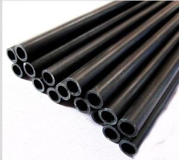

.. _myoBone-assembly-fourRoundTubeFibres:

MyoBone 'Parallel Assemblies' - Four Round Tube Fibres
-----------------------------------------------------------------

Prepare parts
~~~~~~~~~~~~~~~~~~

Step 1: Cut fibres to the desired length
++++++++++++++++++++++++++++++++++++++++++++++

.. _D3.4_image44:

Tips:

-	Lathe can create a precise cut and avoids damaging the tube

Step 2: Mill the tube ends
++++++++++++++++++++++++++++++++++++++++++++++

.. _D3.4_image45:

Mill the inside hole of both tube ends in order to create a rough surface for gluing.

Tips:

-	Use a round moulding cutter with an automatic screwdriver

-	Use gloves to protect you from dust

Step 3: Positioning of the tube length
++++++++++++++++++++++++++++++++++++++++++++++

.. _D3.4_image46:

Insert the tubes in the tube holding-support and position the tubes with the distance support. Fix the tubes with the screws.

Step 4: Gluing threaded pin in tube ends
++++++++++++++++++++++++++++++++++++++++++++++

.. _D3.4_image47:
.. figure:: images/image47.jpg
    :align: center

Add glue evenly to the threaded pin and hole. Use the distances according to the MYO-Bone class.

Tips:

-	While drying, use a fixture to keep the thread pin and fibre centred and at the correct distance

-	Wear protective gloves

Step 5: Remove the leftover glue
++++++++++++++++++++++++++++++++++++++++++++++

.. _D3.4_image48:

Remove the glue with a cutter knife. Consider the hardening-time of the glue.

*Production of spacers*

Step 1: Water-jet
++++++++++++++++++++++++++++++++++++++++++++++

.. _D3.4_image49:
.. figure:: images/image49.jpg
    :align: center

Order water-jet cut part shape (aluminium).

Step 2: Drilling and threading of holes
++++++++++++++++++++++++++++++++++++++++++++++

.. _D3.4_image50:

Drill and thread the holes of the flexure clamps.

Tips:

-	Put small fibers in the flexure clamps to avoid deformation caused by the pressure exerted by the drill bit

Production of end plates and flanges
++++++++++++++++++++++++++++++++++++++++++++++

.. _D3.4_image51:

**End Spacer:**

-	Selective Laser Sintering (Polyamide)

**SB Flange plate:**

-	Machining (Aluminium)

-	Selective Laser Sintering  (Polyamide)

**Screws, nuts and washers are standard parts.**

Assembly
~~~~~~~~~

.. _D3.4_image52:
.. figure:: images/image52.png
    :align: center

*Material needed*

4 x 	CFRP tubes with threaded ends

4 x 	spacers

16 x 	M2.5x10 countersunk head screw (DIN 965)

2 x 	end spacer

8 x 	M4 thin nut (DIN 39)

8 x 	M4 spring washer (DIN 127)

2 x 	SB flange plates

8 x 	M3x25 countersunk head screw (DIN 7991)

8 x 	M3 thin nut (DIN 39)

8 x 	M3 spring washer (DIN 6798)

Step 1: Assemble fibres and spacers
++++++++++++++++++++++++++++++++++++++++++++++

.. _D3.4_image53:
.. figure:: images/image53.png
    :align: center

Slide the fibres (1) in the flexure clamps (2) of the spacers.

Tips:

-	Slide one fibre through all spacers, and then go on with the next fibre

-	Flexure clamp screws should be loose

-	In preparation for the next step, regroup the spacers next to each other

Step 2: Plug fibres in the end-spacer
++++++++++++++++++++++++++++++++++++++++++++++

.. _D3.4_image54:

Plug each fibre in one of the holes of the end-spacer.

Tips:

-	Apply sufficient pressure so that the end of the cfc tube is in contact with the shoulder at the bottom of the hole

-	Do not press the fibers firmly into the holes

Step 3: Screw fibres to the end spacer
++++++++++++++++++++++++++++++++++++++++++++++

.. _D3.4_image55:

Screw each of the fibers to the end-spacer using the M4 nuts and the large spring washers.

Tips:

-	Screw the nut until the spring washer is nearly flat, not more

-	(if you screw further, you may pull the threaded pin out of the tube)

Step 4: Attach the other end-spacer
++++++++++++++++++++++++++++++++++++++++++++++

.. _D3.4_image56:
.. figure:: images/image56.png
    :align: center

Repeat steps 2 & 3 for the other end-spacer.

Tips:

-	Make sure the end-spacers are as much as possible:

  -	Parallel to each other
  -	Perpendicular to the fibres
  -	Lay the bone on the table to ensure that it is not twisted

Step 5: Adjust the spacers
++++++++++++++++++++++++++++++++++++++++++++++

.. _D3.4_image57:

Arrange the spacers equidistantly between the two end-spacers.

Tips:

-	Distance between spacers: 51 to 52 mm

-	Ensure that the spacers are perpendicular to the fibres

Step 6: Check straightness
++++++++++++++++++++++++++++++++++++++++++++++

.. _D3.4_image58:

Check that the MYO-Bone is straight and that both end-spacers are parallel to each other.

If necessary proceed to adjustments.

Step 7: Attach the SB flange plates
++++++++++++++++++++++++++++++++++++++++++++++

.. _D3.4_image59:

Screw the SB flange plates to the end-spacers with the M3 screws.

Use the small spring washers together with the M3 nuts (backside).
