Other developments
==================

Alternative concept for the MYO-Bone design
-------------------------------------------

An alternative, bio-inspired MYO-Bone design was developed,
composed of a monolithic 3D-printed core and peripheral tensile elements
(see :numref:`D3.4_image147`).

The tensile elements were implemented with Dyneema cables running in
parallel to longitudinal axis of the bone and are fixed at its two ends.
With the cables, the stresses in the core due to bending loads could be
reduced to approx. 50% of the stresses experienced without the cables.

The monolithic core was made of a repetition of identical segments with
openings which (1) allowed to access the electric cables running in the
centre of the construction and (2) provided slots to attach MYO-Muscle
or accessories on the MYO-Bone. The shape of the segment was
topologically optimized to reduce the stress in the core in the two
different modes of loading, i.e. bending and torsion.

.. _D3.4_image147:
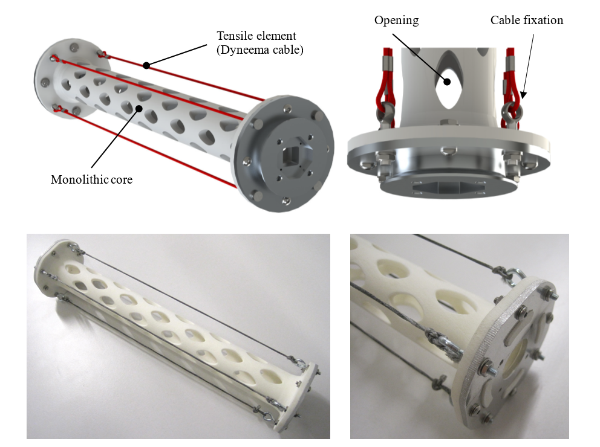

    Alternative concept for MYO-Bone design implementing the
    *Bionic structure (+biotensegrity)* concept.

To evaluate the performances of the new design regarding resistance and
stiffness (with respect to both bending and stiffness), prototypes with
weight and size comparable to the MYO-Bone – Type 1 design were built.
Tests showed that new design could support the expected loads and that,
in comparison with Type 1, it had a lower bending stiffness but a
significantly higher torsional stiffness.

Unfortunately, prolonged testing revealed a severe problem: under
constant loads the monolithic core experienced severe creep due to the
nature of the 3D-printed material, which led to permanent deformations.
For that reason, the development of this design was abandoned.

Ball-and-socket joint
----------------------

Sensor principle
~~~~~~~~~~~~~~~~

To ensure accurate movement and control of this type of joint (3 degrees
of freedom), the challenge is to determine the exact 3D-position in the
ball-and-socket joint. The initial steps towards the development of a
ball-and-socket joint sensor are shown. This approach is based on an
optical sensor system which is integrated in the base of the
ball-and-socket-joint. The sensor shall detect a unique pattern on the
spheroid surface of the ball. This pattern contains information which is
used to exactly determine the absolute orientation and position in the
joint. Using an optical method to determine the absolute pose of a
joint-socket, with a unique pattern, gives two possibilities. The first
one is to recognize a complex marker (a pattern consists of multiple
markers, :numref:`D3.4_image148` - right), which requires an expensive camera. The other
possibility, which is novel, uses multiple simple markers detected by
two very cheap sensors, that can be seen in :numref:`D3.4_image148`.

.. _D3.4_image148:
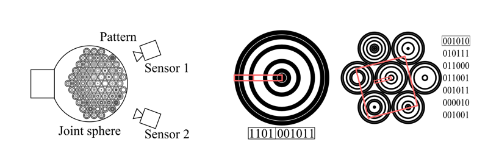

    Principle scheme *(left)*, Single code-disk *(middle)*, pattern consitting of disk-codes *(right)*.

Known optical orientation systems, and their pattern, require a
comparatively high number of pixels. To recognize fine structures or
distances e.g. a rectangle (barcode) requires a lot of pixels,
presupposed the edges are not aligned with the pixel rows and lines. In
three degrees of freedom systems, the rotary orientation of a target to
the sensor is arbitrary. The code-disks (orientation points) in the
pattern are specially designed for the mouse-sensor, considering the low
resolution and variable rotation of the Images. A single code-disk can
be seen in :numref:`D3.4_image148` - middle. The circular shaped code-disk is all
around uniformly arranged. This means that the appearance is independent
of the rotation. A rotation of the code-disk does not change the content
of the frame. In the right drawing a pattern area consisting of
different code-disks is shown. From the perspective of the sensor, the
frame is horizontal and can always be fitted in a code-disk. This
applies independent of the position or rotation of the sensor view,
respectively the pattern. The horizontal frame may be located anywhere
in the sensor view, whereas the alignment is fixed, that means always
horizontal referred to the sensor view. Reading from left to right
through the center of the code-disk enables to read the specific code in
a convenient/pixel-saving way. To increase the definite recognition of a
code-disk a method is used. A specific code cannot just be found in a
pixel row from left to right, but also from right to left or from top to
down or from down to top in a code-disk. As soon as minimum two of four
of the codes are found, the possibility of a correct specific code
corresponding to a code-disk are truly high. To guarantee that the found
codes belong to one code-disk, the code-disk-center is used. Reading
from the outside to the inside of the code-disk, the last pixel of the
specific code is always located in the centre. As soon as the pixel
position matches, the specific codes can be collated to the code-disk.

.. _D3.4_image149:
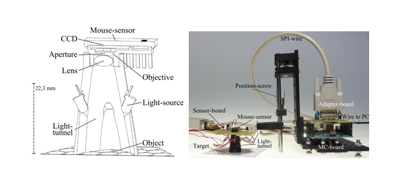

    Test Set up

The test setup of one sensor can be seen in :numref:`D3.4_image149`. The sensitivity of
both systems is quite low (20 - 30 %). But possibilities for the
improvement are considered. Besides an important characteristic, the
Positive Predictive Value is high (85 - 95 %), which shows the
reliability of the system.

Mechanical design
~~~~~~~~~~~~~~~~~

Although the sensing principle presented in the previous section showed
promising results, open challenges remains regarding the integration of
the pattern on the ball part of the joint. Therefore, the first
prototype of the mechanical concept for the ball-and-socket joint was
based on another sensing concept using two absolute sensors. It has a
large rotation ranges for all 3 DoF: 110° for both “hinge” axes and 180°
for the “pivot” axis. Those three degrees of freedom are reflected by a
combination of a carriage, pivot and hinge joint-system. This structure
increases the stability of the 3D joint and keeps the ball-socket into
position. On both ends of the ball-socket joint, standardised
electromechanical interfaces (structural bond) for other modules are
implemented. The basic structure of the prototype, as illustrated in
:numref:`D3.4_image150`, has a weight of about 315 grams and an overall dimension of
115x156x125 mm.

.. _D3.4_image150:
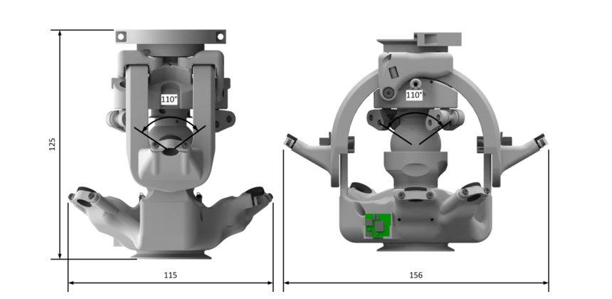

    Main dimensions of the ball-and-socket joint prototype

The ball-socket joint is actuated by three pairs of antagonistic tendon
cables (see :numref:`D3.4_image151`). Their attachment points are located centrally for
a symmetrical application of the force. The moveable cable transmission
systems are able to redirect the cables and provide returning forces for
the whole motion space of the ball-socket joint.

.. _D3.4_image151:
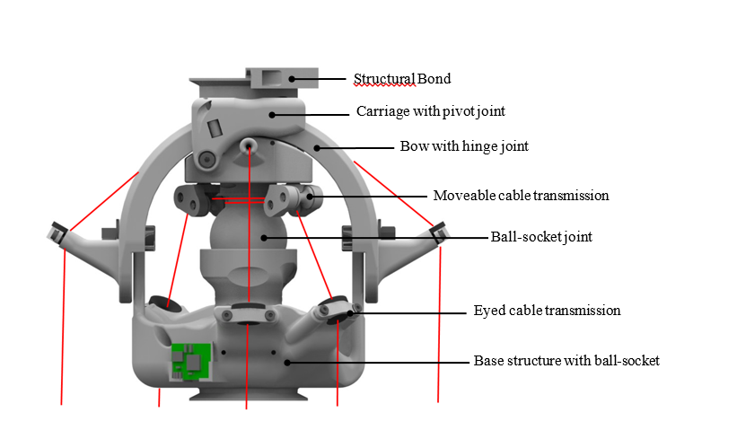

    Cable transmission and assembly of the ball-and-socket joint

Two different sensors that are located inside of the joint for
protection reasons generate the three absolute angle positions (see
:numref:`D3.4_image152`). One sensor (using a magnet ring) is placed on the upper pivot
joint and the other one (using a 2 DoF joystick sensor) inside of the
ball-socket. Both sensors are based on a contactless, magnetic
measurement principle.

.. _D3.4_image152:
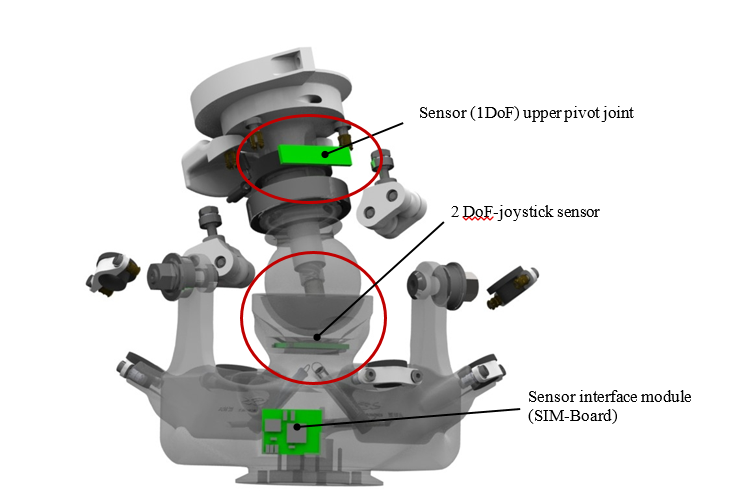

    Absolute position sensors for the measure of the three joint angles

Alternative concept for MYO-Muscle design using leaf spring
-----------------------------------------------------------

A new variety of MYO-Muscle Type 1 was developed as alternative to the
existing design based on compression spring. In this new design
(represented in :numref:`D3.4_image153`), the series elastic element is implemented
with two leaf springs, mounted symmetrically on the sides of the DC
motor. Instead of a single tendon cable, two tendon cables are used in
parallel to transmit the tendon force and are wrapping around the motor
reel following the Do-Helix principle. In this way the radial forces
applied by the tendon cables on the reel are balanced and no additional
bearing is required to support the reel on the side opposite to the
motor. Each tendon cable leaving the motor reel towards the load is
passing through a set of three redirecting pulleys, the middle one being
fixed to a leaf spring. When a tension force is applied in the cable, an
outward force is applied on that pulley causing the deflection of the
spring. In that way, elastic energy can be stored in the series elastic
element. As the middle pulley moves outwards, the intensity of the
lateral force component resulting from the tendon cable tension
decreases, until it drops to zero when the tendon cable runs in a
straight line between to two outer, fixed pulleys.

This new design has multiple benefits compared to the implementation
using the compression spring. First the implementation of the series
elastic element is more compact, as it is located on the sides of the
motor rather than on top. This allows for example to position other
modules on top of a MYO-Muscle (this was exploited for the development
of the bi-articular actuation module, presented in the next section).
Also, the leaf springs do not require a guiding system and springs with
higher energy storage than steel (e.g. fiberglass), which can
potentially reduce the weight of the module. Finally, the non-linearity
of the series elastic element is more pronounced than in the previous
due to the different geometry of the three redirecting pulleys
locations. This allows a larger range of stiffness variation via
co-contraction of two antagonistic MYO-Muscles.

.. _D3.4_image153:
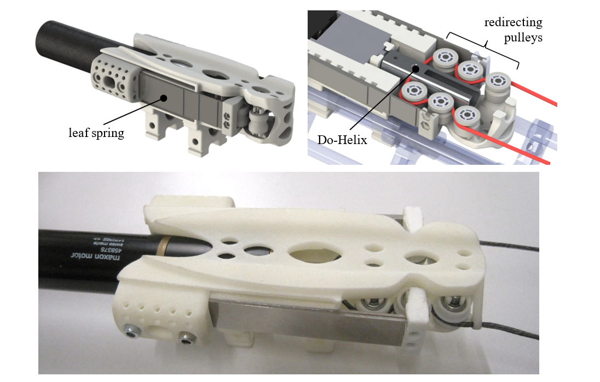

    Alternative implementation of the MYO-Muscle – Type 1 using leaf springs as series elastic elements

A first prototype of this promising concept was built as
proof-of-concept (see :numref:`D3.4_image153`) and helped identify where further developments
are required. These include the dimensioning of the leaf
springs and the adaptation of the redirecting pulleys dimensions. In
addition, a concept for the sensing of the tendon cable tension is still
required.

Bi-articular muscle modules
---------------------------

In parallel to the development of the new MYO-Muscle design presented in
the previous section, the work on the design of a *bi-articular muscle
module* started. The purpose of this module is to convert a MYO-Muscle,
designed to actuate a single joint (i.e. as mono-articular muscle), into
a bi-articular muscle.

As mono-articular and bi-articular muscles have different roles, it is
generally desirable to be able to implement both of them. This poses a
practical challenge because (1) the space available on the MYO-Bone is
limited and (2) the tendon cables of the multiple muscles actuating the
same joint should not interfere. The new MYO-Muscle design was selected
as reference actuator for the bi-articular module development because of
its greater compactness. As it was still under development, the
MYO-Muscle was only summarily modelled.

.. _D3.4_image154:
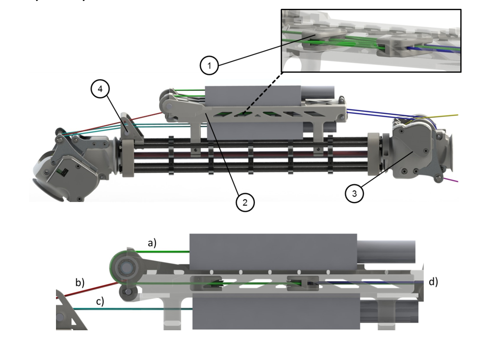

.. _D3.4_image155:
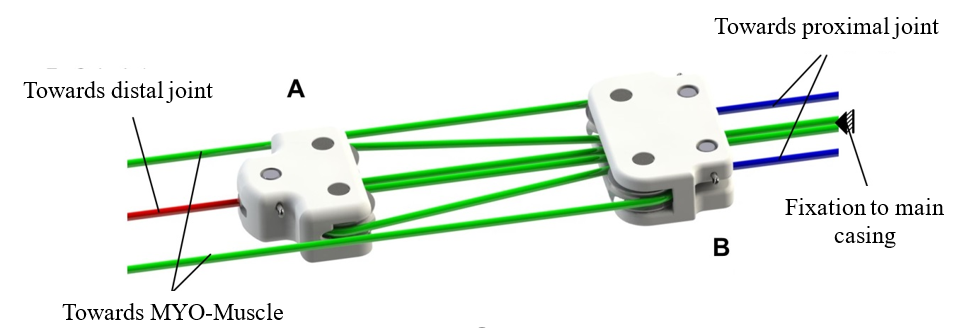

    Bi-articular muscle module. In the middle picture: (a)
    bi-articular module block and pulley cable, (b) output tendon cable from
    bi-articular module towards distal joint (here extension of asymmetric
    hinge joint), (c) output tendon cable from mono-articular MYO-Muscle and
    (d) output tendon cable from bi-articular module towards proximal joint
    (here flexion of asymmetric hinge joint)

The developed module is represented in :numref:`D3.4_image155`. It is composed of a
main casing ((2) on the top part of the figure) that can be fixed on the
MYO-Bone structure and fit above a MYO-Muscle (which acts as the
mono-articular muscle of the next MYO-Joint, numbered as 2 in the
figure). On top of the casing, another MYO-Muscle can be mounted. The
latter actuate a system of blocks and pulleys shown as (1) on the top
part of Figure 3 and represented in more details on the bottom part of
the same figure. When the MYO-Muscle contracts, blocks A and B are
pulled together and the overall distance between the tendon cable
attachments on the joints 1 and 2 shorten. When the A and B blocks move
together, the length of the bi-articular muscle stays constant and the
motion of both joints is coupled.

For the integration of the module, the adaptation of one of the
MYO-Joint was required to provide sufficient attachment points for the
multiple tendon cables. The asymmetric hinge joint was selected for this
purpose and the module was integrated to mimic the Gastrocnemius muscle,
which is the knee flexor - ankle extensor bi-articular muscle in the
human leg.

A physical prototype from this construction was built (see :numref:`D3.4_image153`),
where the MYO-Muscle modules were replaced by extension springs.

.. _D3.4_image156:
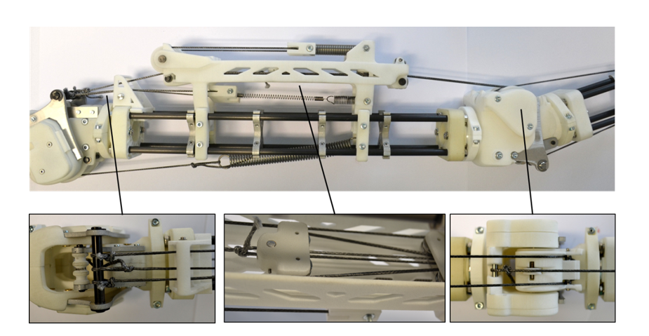

    Prototype of the bi-articular muscle module

Scaling of selected design primitives
-------------------------------------

The issue of scaling the design primitives to other size classes was
considered for one type of each design primitives, namely:

-  the MYO-Muscle Type 1 (:numref:`D3.4_image23`)

-  the MYO-Joint Type 2 (:numref:`D3.4_image16`)

The resulting prototypes for the joint and muscle design primitives are
shown in :numref:`D3.4_image157` and :numref:`D3.4_image158` respectively. In both cases, the
dimensions have been reduced significantly in comparison to joints of
the size class II (see in both figures the size of the module compared
to a 1 Euro coin).

.. _D3.4_image157:
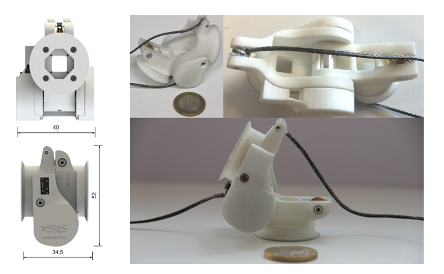

    Prototype of the asymmetric hinge joint for the small size class

.. _D3.4_image158:
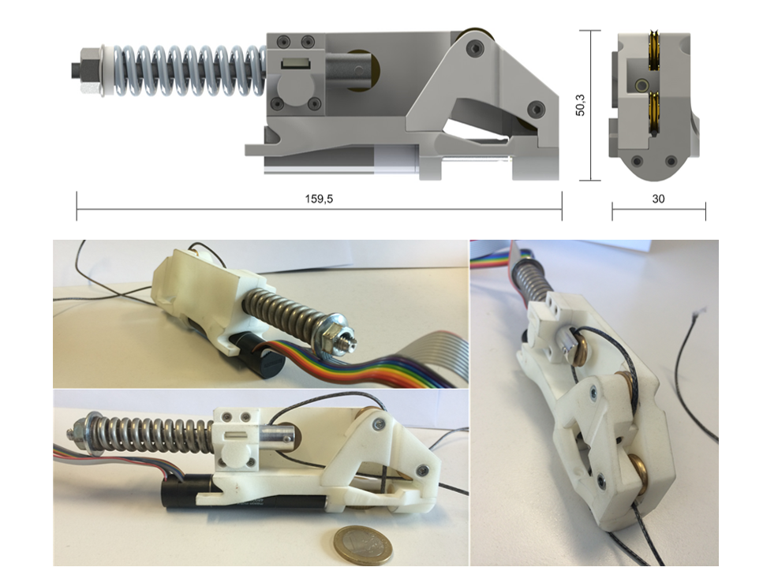

    Prototype of the muscle module for the small size class

Injection Moulding
------------------

Finally, preliminary investigations were performed towards using
injecting moulding instead of 3D printing for the production of the
plastic parts of the toolkit. The design of various toolkit parts (see
:numref:`D3.4_image159`) was adapted in order to be producible using injection
moulding.

.. _D3.4_image159:
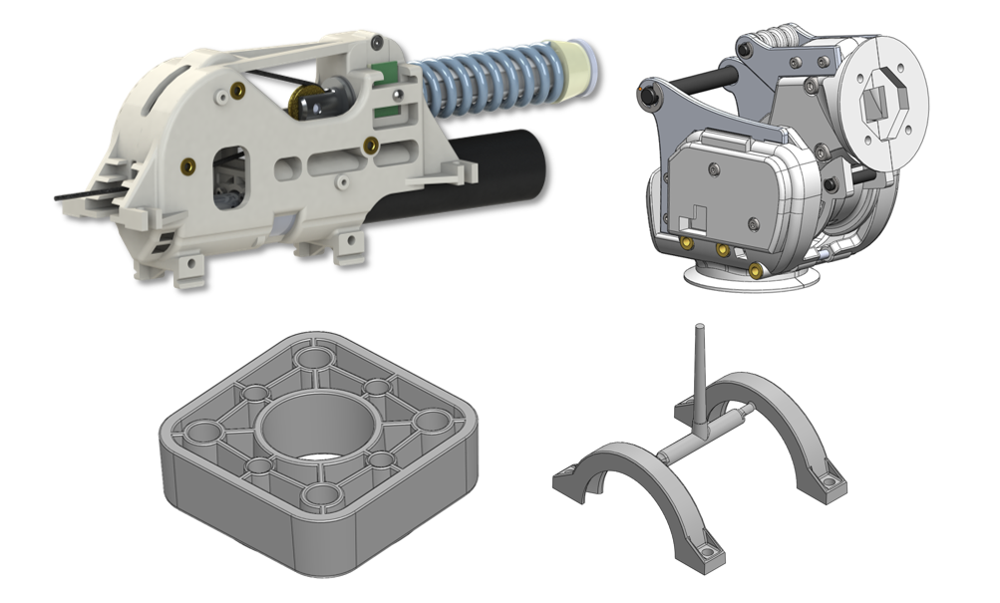

    Toolkit parts adapted for injection moulding, from top left
    to bottom right: base of the MYO-Muscle - T1 - V1, upper and under joint
    forks of the MYO-Joint - T2 - V2, end-spacer of the MYO-Bone - T1- V1,
    clamping ring of the structural bond

Different types of moulding technologies were considered. A relatively
new method, coined *Rapid Tooling*, turned out to be the most promising
for our investigations. It uses a 3D printed mould produced with
stereolithography (the 3D printing technology with the highest
resolution) and made of thermoset plastic. It can be used to mould parts
made of thermoplastic such as PE, PP, PS, ABS and TPE. However, the
mould degrades quickly and it can only resist from 100 to 200 injection
cycles. Nevertheless, given the low cost of the printed mould, we found
out that it is the most cost-effective production method from a few tens
up to one thousand pieces. Hence this production technique allows to
nicely “close the gap” between prototyping and series production.

.. _D3.4_image160:
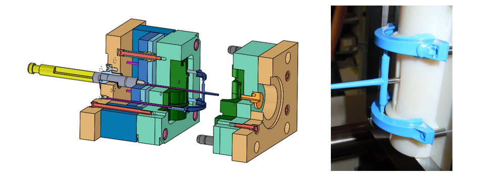

    CAD design of the mould and mechanical adaptor (left) and
    moulded clamping rings (right)

Initial testing with this production technique was performed using
in-house injection moulding machine. Given limitations on the total
injection volume (to 12 cc), the clamping ring was chosen for the first
test. The mould and the adaptors for mounting on the machine were
designed (see :numref:`D3.4_image160`) and a first series of 100 pieces was produced,
which confirmed the feasibility of the approach. Further work is
required to investigate the tolerances of the produced parts (and
especially their evolution during the production, as the mould degrades)
as well as the mechanical properties of the parts compared to those of
parts produced with laser sintering.
