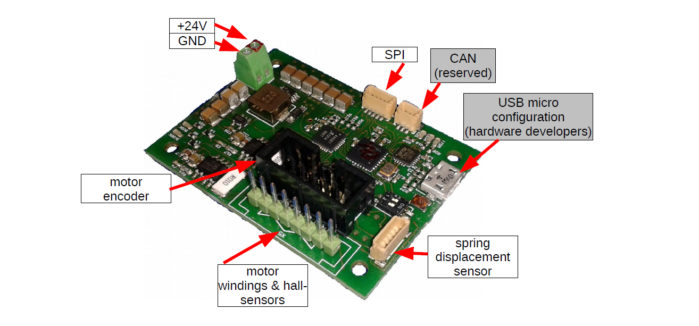
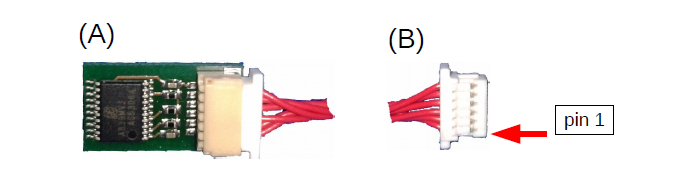
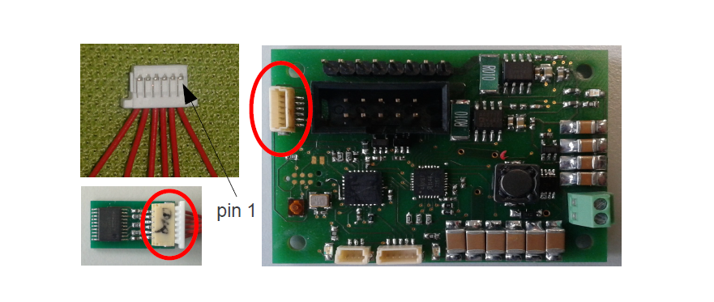
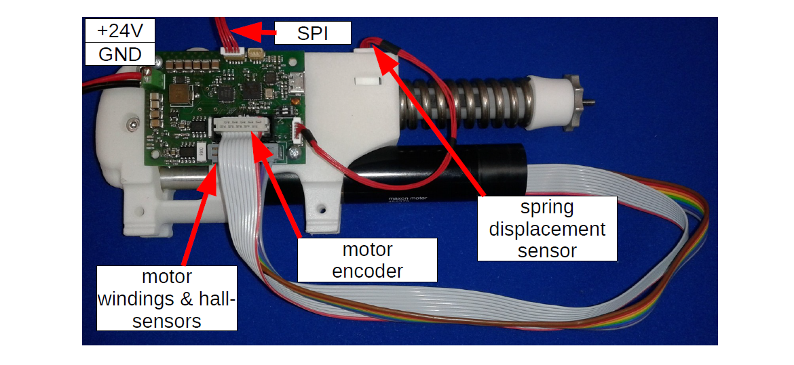
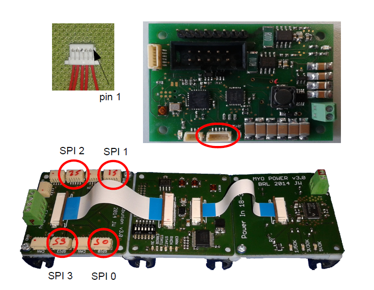

.. _EAESS_fifth-section:

Motor Driver
============

In order to drive the MYO-Muscles, a motor driver board is provided.
This is illustrated in :numref:`EAESS_our-figure`. The motor driver
board is supplied with 24V and communicates with the MYO-Ganglion via a
5MHz SPI connection. It provides sockets to connect the MYO-Muscle motor
as well as a further connection for the spring-displacement sensor. For
further hardware developments and other extensions, there is also a CAN
interface and a micro-USB connection. However, they are not required
when building a Myorobot.

.. _EAESS_our-figure:

   The Myorobotics motor driver board.

Spring Displacement Sensor
--------------------------

To measure the displacement of the spring (a proxy for tendon force), a
spring displacement sensor is connected to the motor driver board. The
sensor is supplied via the motor driver board and connected via a 6-pin
JST connector [1]_ as depicted in :numref:`EAESS_their-figure`.

.. _eaess-sds-cs:

Wiring Scheme: Spring Displacement Sensor - Motor Driver Board
~~~~~~~~~~~~~~~~~~~~~~~~~~~~~~~~~~~~~~~~~~~~~~~~~~~~~~~~~~~~~~

**This cable is NOT symmetric.**

+----------------------------------+-------+--------+--------+-----+-------+-------+
| **Signal Name**                  | GND   | EncA   | EncB   | O   | Idx   | +5V   |
+==================================+=======+========+========+=====+=======+=======+
| **Displacement Sensor, pin #**   | 1     | 2      | 3      | 4   | 5     | 6     |
+----------------------------------+-------+--------+--------+-----+-------+-------+
| **Motor Driver Board, pin #**    | 5     | 3      | 2      | 1   | 4     | 6     |
+----------------------------------+-------+--------+--------+-----+-------+-------+

.. _EAESS_their-figure:

   The spring displacement sensor and connector: Please note that **the connector
   cable is not symmetric.** Consequently, one end of the connector cable (marked with S or D)
   is plugged into the sensor board (A) and the other end (B) (marked with M) is plugged into
   the motor driver board (:numref:`EAESS_our-figure`)
   The connectivity of the cable is described in :numref:`eaess-sds-cs` .

.. _EAESS_the-figure:

    Cables and connectors to connect the spring displacement sensor with the motor
    driver board; red circles mark the applicable connectors on the printed circuit boards.

Driver Board Mounting
----------------------

To illustrate how a motor driver board is mounted on the MYO-Muscle
please refer to :numref:`EAESS_a-figure`. The connector for the
spring displacement sensor should be facing the spring. Two screws are
sufficient to mount the motor driver board on the MYO-Muscle as shown in
:numref:`EAESS_a-figure`.

.. _EAESS_a-figure:

    Motor driver board mounted on MYO-Muscle

Connectivity
------------

The motor driver board has to be connected to the MYO-Ganglion board
using the 5-pin JST connectors [2]_ . Depending where the motor driver
board is plugged in (SPI0, SPI1, SPI2 or SPI3) the associate MYO-Muscle
can be addressed with the corresponding index the flexrayusbinterface. In other words,
the **address of a motor driver board (and therefore the MYO-Muscle) is
dependent upon the SPI connector it is connected to** (see :numref:`EAESS_atable`).

.. _EAESS_atable:

.. table:: Motor driver addressing scheme

    +------------------+-----------------------+
    | SPI Connection   | Address / C++ index   |
    +==================+=======================+
    | SPI0             | [0]                   |
    +------------------+-----------------------+
    | SPI1             | [1]                   |
    +------------------+-----------------------+
    | SPI2             | [2]                   |
    +------------------+-----------------------+
    | SPI3             | [3]                   |
    +------------------+-----------------------+

Wiring Scheme SPI Connector: Ganglion Distribution Board - Motor Driver Board
~~~~~~~~~~~~~~~~~~~~~~~~~~~~~~~~~~~~~~~~~~~~~~~~~~~~~~~~~~~~~~~~~~~~~~~~~~~~~~~~~~~~~~~~~~~~~~~~~~~~~~~~

+-----------------------------------------+--------+--------+-------+------+-------+
| **Signal Name**                         | SOMI   | SIMO   | Clk   | SS   | Gnd   |
+=========================================+========+========+=======+======+=======+
| **Ganglion Distribution Board, pin#**   | 1      | 2      | 3     | 4    | 5     |
+-----------------------------------------+--------+--------+-------+------+-------+
| **Motor Driver Board, pin #**           | 1      | 2      | 4     | 3    | 5     |
+-----------------------------------------+--------+--------+-------+------+-------+

.. _EAESS_one-figure:

    Cables and connectors to connect the SPI of the distribution board with the
    motor driver board; red circles mark the applicable connectors on the printed circuit boards.

.. [1]
   The 6-way JST SH series connectors are available from Farnell
   Components, Farnell-number 1679112; connecting wires with pre-crimped
   connectors are available via RS components (300mm RS-number 311-6675,
   150mm RS-number 311-6653).

.. [2]
  The 5-way JST SH series connectors are available from Farnell
  Components, Farnell-number 169111; connecting wires with pre-crimped
  connectors are available via RS components (300mm RS-number 311-6675,
  150mm RS-number 311-6653).
