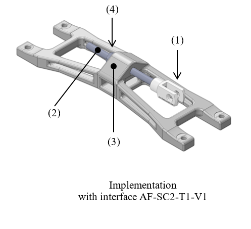
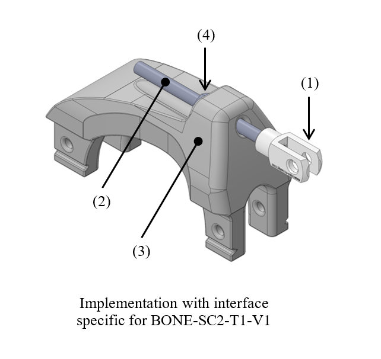
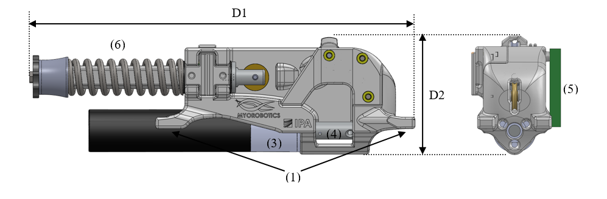
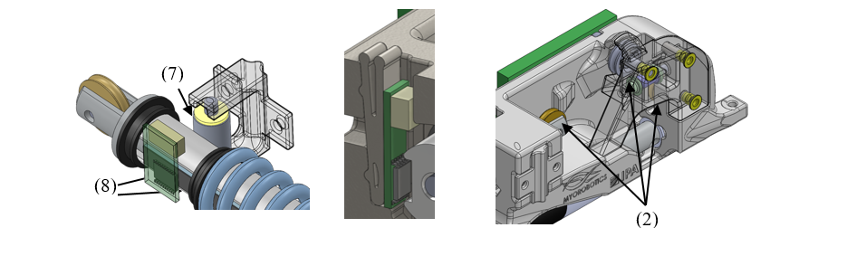
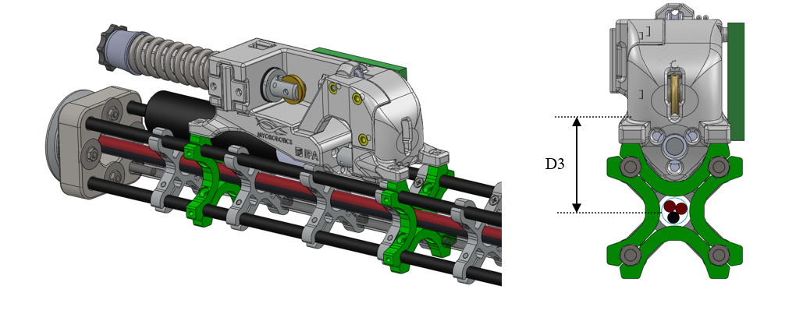
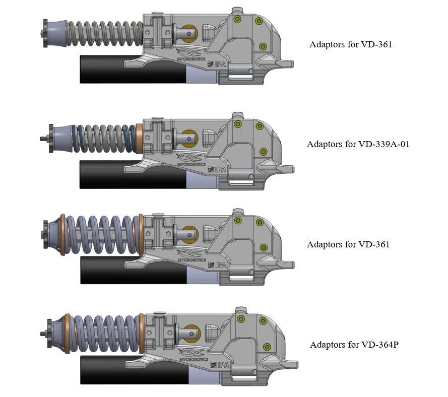

MYO-Muscle
==========

Type 0: Passive Muscle
----------------------

In some cases, it is sufficient to have a passive muscle (i.e. without a
motor to contact the muscle) acting as antagonist to an active muscle,
in order to reduce the weight or the cost of the robot.

Variety 1 - Simple spring
~~~~~~~~~~~~~~~~~~~~~~~~~

This is the simplest variant of the passive muscle. It consists of an
attachment point, provided by a yoke (1) holding a pin to which a
extension spring can be fixed, directly or indirectly via a tendon
cable. The yoke if fixed to a threaded rod (2) so that the position of
the attachment point with respect to the base (3) of the passive muscle
can be adjusted by tightening or losing a single nut (4). This allows to
adjust easily the length of the tendon cable and/or to adjust the joint
position at which the spring starts to be loaded.

**Illustrations**

.. _D3.4_image131:

.. _D3.4_image132:

Type 1: Unilateral Series Elastic Actuator
------------------------------------------

This type of actuator is mainly made of the following elements:

-  a *mechanical base* to attach the actuator module to the bone

-  a geared *DC motor*

-  a *series elastic element*

-  a *cable* transmitting the force to the skeleton

Variety 1: Compression Spring
~~~~~~~~~~~~~~~~~~~~~~~~~~~~~

This implementation builds on the hardware developments achieved in the `Roboy project <http://www.roboy.org/>`_, in which the MYOROBOTICS consortium members
TUM and ETH are contributing. The series elastic element is a linear
compression spring combined with a set of pulleys, to reproduce the
characteristics of a non-linear progressive spring. The origin of this
idea can be tracked back to [Hyodo1993] and has been implemented in
different forms in various SEA and variable stiffness actuators.

**Illustrations**

Overview:

.. _D3.4_image133:

Individual elements:

.. _D3.4_image134:

Integration to BONE-SC2-T1-V1 (see :numref:`D3.4_BONE`):

.. _D3.4_image135:

**Dimensions**

D1 Total length of the actuator

D2 Total height of the actuator

D3 Lever arm of the tension force in the cable w.r.t. the bone section centre

**Implemented instances**

+--------------------------+----------------------+-------+--------+
| Reference                | MUSCLE-T1-V1-P100W                    |
+==========================+======================+=======+========+
| Corresponding DP-Class   | II & III                              |
+--------------------------+----------------------+-------+--------+
| Motor power              | 100 W                                 |
+--------------------------+----------------------+-------+--------+
|                          | D1                   | 192   | [mm]   |
+                          +----------------------+-------+--------+
|        Dimensions        | D2                   | 60    | [mm]   |
+                          +----------------------+-------+--------+
|                          | D3                   | 32    | [mm]   |
+--------------------------+----------------------+-------+--------+

**Features**

*Mechanical base:*

1) The mechanical base is connected to the bone using multiple anchor carriers developed for the BONE-SC2-T1-V1 (“Anchors circular pattern for vis-à-vis attachment”, see :numref:`D3.4_BONE`). As this implementation is based on an already existing hardware, it was not straightforward to directly use the available adaptor. For that reason one part of the adaptor was directly integrated in the mechanical base. Using the other parts of the anchor carrier (represented in green), the mechanical base can be fixed to the bone.

2) The mechanical base contains a set of pulleys that redirect the cable transmission, from the motor reel, via the series elastic element, to come out parallel to the bone longitudinal axis.

*DC motor:*

3) The DC motor is fixed to the mechanical base by a set of screws. It is equipped with an optical incremental encoder.

4) A cable reel is attached to the DC motor shaft to wind up the cable. It has a cable attachment (of type CA-SC2-T1) to attach one side of the cable and is supported by a bearing at its extremity.

5) The motor driver board (see hereunder) is fixed on one side of the mechanical base.

*Series elastic element:*

6) The series elastic element is based on a compression steel coil spring.

7) The spring compression is guided by a cylindrical plastic part, two bearings to slide linearly and a guide roller that prevents any twists. The other side of the spring is fixed using a spacer sleeve, a knurled nut and a nut witch are screwed together to a threaded rod witch is concentric to the cylindrical plastic part.

8) To measure the deflection of the spring, a hall sensor in combination with a magnetic strip is used. It measures the linear displacement of the cylindrical plastic part. The sensor board is fixed with a wedge-shaped clip that has a spring lock mechanism.

*Cable:*

Cables made of high performance polyethylene fibres (HPPE), also
commercially referred to as Dyneema\ :sup:`®`, were selected for their
high strength, light weight, low stretch and flexibility.

**Material and fabrication**

+----------------------+----------------------------+---------------------------------+
| Element name         | Material                   | Fabrication processes           |
+======================+============================+=================================+
| Mechanical base      | Polyamid (PA)              | laser sintering                 |
+----------------------+----------------------------+---------------------------------+
| DC motor             |                            | purchase (standard component)   |
|                      |                            |                                 |
| Bearings             |                            |                                 |
|                      |                            |                                 |
| Pulleys              |                            |                                 |
+----------------------+----------------------------+---------------------------------+
| Reel                 | Aluminium                  | machining                       |
+----------------------+----------------------------+---------------------------------+
| Compression Spring   | Steel                      | purchase (standard component)   |
+----------------------+----------------------------+---------------------------------+
| Cylindrical part     | POM                        | machining                       |
+----------------------+----------------------------+---------------------------------+
| Cable                | Dyneema\ :sup:`®` (HPPE)   | purchase (standard component)   |
+----------------------+----------------------------+---------------------------------+

**Integration of the electronics**

*Motor driver board (MDB):*

This driver board is based on the dsPIC33FJ128MC802 from Microchip, a
micro-controller particularly suited for motor control applications. The
MDB includes a sensor for the motor current and inputs for additional
sensors, such as the spring displacement. The MDB can communicate with
the MYO-Ganglion via SPI and also has a CAN interface for stand-alone
applications, debugging and configuration.

**Accessories**

*Spring adaptors*

The mechanical base of the muscle was designed to allow the usage of
various springs, as long as their dimensions are compatible with the
spring guidance mechanism. The interface between the mechanical base and
the spring guidance mechanism on one side and the spring on the other
side is achieved by *spring adaptors*. The adaptors designed so far
allow the usage of four springs with different stiffness and maximal
forces selected from the catalogue of `Gutekunst Feder
<http://www.federnshop.com/>`_.

+--------------------+----------+--------------+------------+------------+
| Reference          | D-311    | VD-339A-01   | VD-361     | VD-364P    |
+====================+==========+==============+============+============+
| Stiffness          | 30,682   | 64,301       | 63,636     | 127,805    |
|                    |          |              |            |            |
| R (N/mm)           |          |              |            |            |
+--------------------+----------+--------------+------------+------------+
| Maximal force      | 664,58   | 813,639      | 1191,193   | 1337,561   |
|                    |          |              |            |            |
| F \ :sub:`n`\  (N) |          |              |            |            |
+--------------------+----------+--------------+------------+------------+

.. _D3.4_image136:

