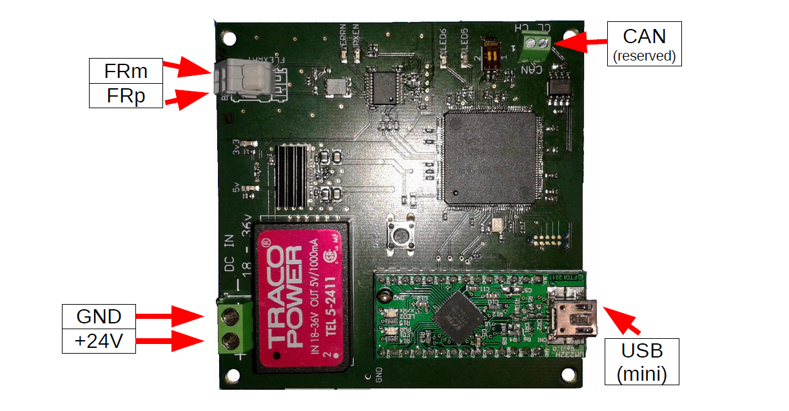
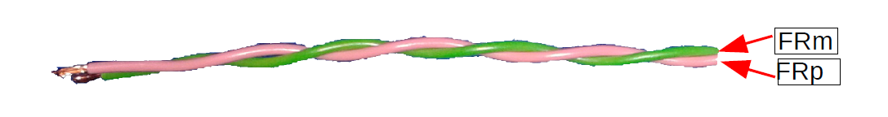

.. _EAESS-forth-section:

USB-FlexRay Bridge
==================

In order to connect ROS with a Myorobot, a USB-FlexRay bridge is
provided. This system is illustrated in :numref:`EAESS_his-figure`. To
connnect to the PC, a mini-USB lead is necessary. The bridge board is
also supplied with 24V, which should be the same voltage source that
supplies the Myorobot to establish a common ground connection. The
connection to the Myorobot, i.e., via the MYO-Ganglions, is established
through a 2-wire FlexRay interface.

.. _EAESS_his-figure:

   The Myorobotics USB-FlexRay Bridge

FlexRay is a differential serial bus and the FlexRay cables used for a
Myorobot are a simple twisted pair wires, such as the dedicated Flexray cable `FLR09YS-YW`_. The two FlexRay signal lines
are referred to as **FRp** (FlexRay Plus, the positive signal) and
**FRm** (FlexRay Minus, the negative signal). The FlexRay cable provided
with your Myorobotic system is shown in :numref:`EAESS_its-figure`. The
pink cable is used for the FRp and the green cable for the FRm signal.
The MYO-Ganglions feature two pairs of FlexRay connections
(see :numref:`EAESS_your-figure`) which affords easy daisy-chaining of
multiple MYO-Ganglions.

.. _EAESS_its-figure:

   The FlexRay cable used for Myorobotic system: green is the FRm signal, pink
   the FRp signal, i.e. model `FLR09YS-YW`_.

.. _FLR09YS-YW: https://roboy.open-aligni.com/part/show/568
